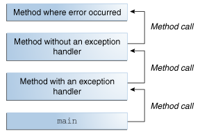

## Checked vs Unchecked Exceptions in Java

### Exception in Java

#### What is an Exception?

---
**Definition:** An exception is an event, which occurs during the execution of a program, that disrupts the normal flow of the program's instructions.  
The general meaning of an exception is the breaching of predefined assumption of the application.  

---

In Java, all errors and exceptions are represented with **Throwable** class. When an error occurs within a method, the method creates an object (of any subtype of Throwable) and hands it off to the runtime system. The object, called an **exception object**, contains information about the error, including its type and the state of the program when the error occurred. Creating an exception object and handing it to the runtime system is called **throwing an exception**.

#### Call Stack

After a method throws an exception, the runtime system attempts to find something to handle it. The set of possible "somethings" to handle the exception is the ordered list of methods that had been called to get to the method where the error occurred. The list of methods is known as the **call stack** (see the next figure).  

  

#### Exception Handler

The runtime system searches the call stack for a method that contains a block of code that can handle the exception. This block of code is called an exception handler. The search begins with the method in which the error occurred and proceeds through the call stack in the reverse order in which the methods were called. When an appropriate handler is found, the runtime system passes the exception to the handler. An exception handler is considered appropriate if the type of the exception object thrown matches the type that can be handled by the handler.  

The exception handler chosen is said to catch the exception. If the runtime system exhaustively searches all the methods on the call stack without finding an appropriate exception handler, as shown in the next figure, the runtime system (and, consequently, the program) terminates.  

  

#### Exception Handling

When an exception object is created in application, there are two choices:  

- Either handle it within method  
- Or pass it to the caller method to handle.  

In reality, there are 3 basic options to react when a exception occurs at runtime:  
- **Ignore the exception** and let it move up the call stack to another catch block for the exception.  
- **Catch the exception and perform required action** for your application. If you can not recover from the exception, rethrow it.  
- **Catch the exception and wrap it with another exception** which is more relevant for your application. Exception wrapping is used to avoid breaking the layer abstraction caught in the exception. You can assign the original exception to the InnerException property of the Exception object you throw. This enables the original exception to be wrapped inside a new exception (which is more relevant for your application). To understand the wrapping of an exception lets consider a method that caught an exception called IOException. You can wrap the original exception (IOException) with a application level exception called LoadingException or FailtoLoadInfoException, as examples, rather than alerting the lower-level IOException to the user.  

{}
If an exception is not handled in the application, then it will be propagated to JVM and JVM will usually terminate the program itself.
{}

### Exception Hierarchy in Java

  

**Note:** The terms "exception" and "error" are not the same.  
Whether should a general error in application be handled as Error or Exception in Java, depends on **the context** in the application.  

In Java, exceptions are broadly categorized into two sections:  
- **Checked exceptions**  
Checked Exceptions are subclasses of java.lang.**Exception**, i.e. IOException, SQLException, ClassNotFoundException, etc.

- **Unchecked exceptions**.  
Unchecked Exceptions are subclasses of java.lang.**RuntimeException**, i.e. NullPointerException, NumberFormatException, etc.

{}
**Errors** are serious runtime environment problems that are almost certainly not recoverable, i.e. OutOfMemoryError, LinkageError, and StackOverflowError. They generally crash you program or part of program. Only a good logging practice will help you in determining the exact causes of errors.  
{}

### Checked Exceptions
The exceptions that are checked at **compile time** (A.K.A.compile-time exceptions). If some code within a method throws a checked exception, then the method must either handle the exception by using **try-catch block** or it must specify the exception using **throws** keyword.  

Generally, checked exceptions denote error scenarios which are outside the immediate control of the program. They occur usually interacting with outside resources/network resources e.g. database problems, network connection errors, missing files etc.  

### Unchecked Exceptions
The exceptions that are **not** checked at **compiled time**.  
These are exceptions that do not need to be declared in a throws clause. JVM simply doesn’t force you to handle them as they are mostly generated at runtime due to programmatic errors.  

### Checked vs Unchecked Exceptions

#### Class definition  
- Checked exceptions are subclasses of Exception class. All other Exceptions and Throwable are unchecked exceptions.  
- RuntimeException, Error, and their subclasses are unchecked Exceptions. (From [Unchecked Exceptions — The Controversy](https://docs.oracle.com/javase/tutorial/essential/exceptions/runtime.html))  
- As the javadoc for Throwable says: "Throwable and any subclass of Throwable that is not also a subclass of either RuntimeException or Error are regarded as checked exceptions".

#### Compiler check  
- Checked exceptions are forced by compiler and used to indicate exceptional conditions that are out of the control of the program (for example, I/O errors).   
- Unchecked exceptions are occurred during runtime and used to indicate programming errors (for example, a null pointer).  
- Compiler checks each method call and deceleration to determine whether the method throws checked exception.

#### Contract  
There's also an important bit of information in the Java Language Specification:  
The checked exception classes named in the throws clause are part of the contract between the implementor and user of the method or constructor.  

#### Experience: When and How

The below statements are some experiences of developers. These can provide a feel on the use of checked and unchecked exceptions, though they are not so accurate or absolutely correct. In reality, this all depends on the app and specific context. Just feel it...  

- Checked exceptions ideally should never be used for programming errors, but absolutely should be used for resource errors and for flow control in such cases.
Throw only those exceptions which a method can not handle by any mean. Method should first try to handle it as soon as it encounters. Throw the exception only if it is not possible to handle inside method.  

- Checked exceptions can be used when a method cannot do what its name says it does. e.g. A method named prepareSystem() which pre-populate configuration files and do some configuration using them, can declare throwing FileNotFoundException which implies that method uses configuration files from file system.  

- Rule is if a client can reasonably be expected to recover from an exception, make it a checked exception. If a client cannot do anything to recover from the exception, make it an unchecked exception.  

- The only time it is normally legal to shut down an application is during startup. For example, if a configuration file is missing and the application cannot do anything sensible without it, then it is legal to shut down the application.  

- Myself, I prefer using checked exceptions as I can.

- If you are an API Developer (back-end developer), use checked exceptions, otherwise, use Runtime exceptions.  

- My rules are:  
    * if statements for business logic errors (like your code)
    * cheched exceptions for environment errors where the application can recover
    * uncheched exception for environment errors where there is no recovery

- Line is not always clear, but for me usually RuntimeException = programming errors, checked exceptions = external errors. This is very rough categorization though. Like others say, checked exceptions force you to handle, or at least think for a very tiny fraction of time, about it.  

- In general I use the following rules:  
    * In my components & libraries I only catch an exception if I intend to handle it or do something based on it. Or if I want to provide additional contextual information in an exception.  
    * I use a general try catch at the application entry point, or the highest level possible. If an exception gets here I just log it and let it fail. Ideally exceptions should never get here.  

{}
In Effective Java by Joshua Bloch:  
- Use checked expections for recoverable conditions and runtime exceptions for programming errors (Item 58 in 2nd edition).  
- Avoid unnecessary use of checked exceptions (Item 59)  
- Use exceptions only for exceptional conditions (Item 57). As others have pointed out, this case may not warrant an exception at all. Consider returning false (or perhaps a status object with details about what happened) if there is not enough credit.  
{}

### The Controversy

---
Checked exceptions are a controversial issue in general, and in Java in particular.

---

- Some say checked exceptions should be eliminated completely, given the verbosity, tediousness and error-proneness they introduce.

- Some believe the decision to have these two types of exceptions has its plus(es). It forces the developer to think that an exception is likely to happen in this situation, so he must take measures. The API declares that it will throw exceptions and the developer sees this compile-time. It enforces compile-time safety. You should not wait until the code goes to production to discover that something might fail. Javadoc? Well, a good option to say that, but I bet no one will read the javadoc until the exception actually happens.  

- Fundamentally the only difference between checked exceptions and unchecked exceptions is that the compiler forces you to document checked exceptions. You should be documenting any exceptions your code can throw anyway; I can't see why anyone would be against this being statically checkable to prevent it from being stale or from any exceptions being missed out. Exceptions are part of your API whether checked or not; checked just ensures you declare your API accurately.  

- Like every other trade, there is a trade-off. The advantage of having the compiler do the checks means that there is no way to accidentally leak exceptions (and humans do make mistakes). If the calling code does not handle the exception, it has to leak it explicitly. This is exactly the same trade-off we get from loosely-typed vs strongly-typed languages.  

---
[Unchecked Exceptions — The Controversy](https://docs.oracle.com/javase/tutorial/essential/exceptions/runtime.html)  
Because the Java programming language does not require methods to catch or to specify unchecked exceptions (RuntimeException, Error, and their subclasses), programmers may be tempted to write code that throws only unchecked exceptions or to make all their exception subclasses inherit from RuntimeException. Both of these shortcuts allow programmers to write code without bothering with compiler errors and without bothering to specify or to catch any exceptions. Although this may seem convenient to the programmer, it sidesteps the intent of the catch or specify requirement and can cause problems for others using your classes.  

Why did the designers decide to force a method to specify all uncaught checked exceptions that can be thrown within its scope? Any Exception that can be thrown by a method is part of the method's public programming interface. Those who call a method must know about the exceptions that a method can throw so that they can decide what to do about them. These exceptions are as much a part of that method's programming interface as its parameters and return value.  

The next question might be: "If it's so good to document a method's API, including the exceptions it can throw, why not specify runtime exceptions too?" Runtime exceptions represent problems that are the result of a programming problem, and as such, the API client code cannot reasonably be expected to recover from them or to handle them in any way. Such problems include arithmetic exceptions, such as dividing by zero; pointer exceptions, such as trying to access an object through a null reference; and indexing exceptions, such as attempting to access an array element through an index that is too large or too small.  

Runtime exceptions can occur anywhere in a program, and in a typical one they can be very numerous. Having to add runtime exceptions in every method declaration would reduce a program's clarity. Thus, the compiler does not require that you catch or specify runtime exceptions (although you can).  

One case where it is common practice to throw a RuntimeException is when the user calls a method incorrectly. For example, a method can check if one of its arguments is incorrectly null. If an argument is null, the method might throw a NullPointerException, which is an unchecked exception.  

Generally speaking, do not throw a RuntimeException or create a subclass of RuntimeException simply because you don't want to be bothered with specifying the exceptions your methods can throw.  

Here's the bottom line guideline: If a client can reasonably be expected to recover from an exception, make it a checked exception. If a client cannot do anything to recover from the exception, make it an unchecked exception.  

---

### Best Practices

{}
- If a client can reasonably be expected to recover from an exception, make it a checked exception.  
- If a client cannot do anything to recover from the exception, make it an unchecked exception.  
{}

1. Never swallow the exception in catch block  
2. Declare the specific checked exceptions that your method can throw  
3. Do not catch the Exception class, always catch a specific exception class  
4. Never catch Throwable class  
5. Never (ever) catch Errors  
Errors are problems you will most likely never be able to handle (e.g. OutOfMemory, or other JVM issues)
6. Always correctly wrap the exceptions in custom exceptions so that stack trace is not lost  
7. Either log the exception or throw it but never do the both  
8. Never throw any exception from finally block  
9. Always catch only those exceptions that you can actually handle  
10. Catch exceptions and handle them, don't just throw them up the stack  
11. Don't use printStackTrace() statement or similar  
Chances are one of your users will get one of those stack traces eventually, and have exactly zero knowledge as to what to do with it.  
12. Pass all relevant information to exceptions to make them informative as much as possible  
At least rethrow an exception that explains what was happening at the time and has the caught exception inside of it.
13. Always log exceptions for the sake of maintainability  
When starting seeing bugs, the log will assist in pointing you to the place your bug has likely started.  
14. Always include all information about an exception in single log message  
15. Use finally blocks instead of catch blocks if you are not going to handle exception  
16. Remember "Throw early catch late" principle  
17. Always clean up after handling the exception  
18. Throw only relevant exception from a method  
19. Never use exceptions for flow control in your program  
20. Validate user input to catch adverse conditions very early in request processing  
21. Always terminate the thread which it is interrupted  
22. Use template methods for repeated try-catch  
23. Document all exceptions in your application in javadoc  
24. Do something useful with the errors (logs, restarts, recoveries, etc)  
25. Use one big handler at the higher-level to manage any or all of the weird conditions arising in the code that aren't caught at a low-level  
26. Think about validation check vs exception  
    - NullPointerException   
    Catching a NullPointerException should replaced with a graceful null-check.  
    - NumberFormatException  
    Catching a NumberFormatException explicitly to avoid possible introduction of error prone code to handle different number formats.  
    
Once you embrace exceptions, you should find that it makes your code simpler and clearer, by moving your error handling code away from your core logic. Aim to have lots of statements in a single try block.

{}
Be respectful of the language and how it traditionally manages such issues. For example, don't bring a C mindset into a Java world.
{}

### FAQ

1. **Is RuntimeException an unchecked exception?**  
Yes, exactly.  

2. **Why do people add class Exception in the throws clause?**  
Most often because people are lazy to consider what to catch and what to rethrow. Throwing Exception is a **bad practice** and should be avoided.  
But it's common when implementing frameworks, let users of the framework be able to throw any exception, e.g. the signature of the Callable interface in JSE.  

3. **Should I bubble up the exact exception or mask it using Exception?**  
**Yes** and **No**.  
**Yes** for bubble up the exact exception and always declare the most precise exception possible, or a list of such.  
**No** for mask any exception.  
The exceptions you declare your method as capable of throwing are a part of the contract between your method and the caller. Throwing "FileNotFoundException" means that something wrong with the file, either the file name isn't valid or the file is not there. Throwing Exception causes very difficult to find the root cuase.  

4. **Why bubble up?**  
Should the error be handled sooner better?  
What it means is to bubble it up to the top most responsible layer that controls the logic flow and oversees the business logic for the application. It would be impossible, for example, for the database layer to communicate to the client that something critical is missing or unresponsive. When it bubbles up to the top most server layer then it is straight forward to refresh the client's view with a critical error message.

5. **How to handle exception?**  
Basically it depends on context of the application, such as where this code is and what you want to happen. Here are some examples:  
    - If it is in the UI layer - catch it and show a warning.  
    - If it's in the service layer - don't catch it at all - let it bubble. Just don't swallow the exception.  
    - If an exception occurs in most of the cases you should choose one of these:  
        * log it and return  
        * rethrow it (declare it to be thrown by the method)  
        * construct a new exception by passing the current one in constructor  

6. **Why did the designers decide to force a method to specify all uncaught checked exceptions that can be thrown within its scope?**  
Any Exception that can be thrown by a method is part of the method's public programming interface. Those who call a method must know about the exceptions that a method can throw so that they can decide what to do about them. These exceptions are as much a part of that method's programming interface as its parameters and return value.  

7. **If it's so good to document a method's API, including the exceptions it can throw, why not specify runtime exceptions too?**  
Runtime exceptions represent problems that are the result of a programming problem, and as such, the API client code cannot reasonably be expected to recover from them or to handle them in any way. Such problems include arithmetic exceptions, such as dividing by zero; pointer exceptions, such as trying to access an object through a null reference; and indexing exceptions, such as attempting to access an array element through an index that is too large or too small.  

### Wrapping Exceptions

wrapping exceptions (checked or otherwise) has several benefits that are worth the cost:

1. **It encourages you to think about the failure modes for the code you write.** Basically, you have to consider the exceptions that the code you call may throw, and in turn you'll consider the exceptions you'll throw for the code that calls yours.  

2. **It gives you the opportunity to add additional debugging information into the exception chain.** For instance, if you have a method that throws an exception on a duplicate username, you might wrap that exception with one that includes additional information about the circumstances of the failure (for example, the IP of the request that provided the dupe username) that wasn't available to the lower-level code. The cookie trail of exceptions may help you debug a complex problem (it certainly has for me).  

3. **It lets you become implementation-independent from the lower level code.** If you're wrapping exceptions and need to swap out Hibernate for some other ORM, you only have to change your Hibernate-handling code. All the other layers of code will still be successfully using the wrapped exceptions and will interpret them in the same way, even though the underlying circumstances have changed. Note that this applies even if Hibernate changes in some way (ex: they switch exceptions in a new version); it's not just for wholesale technology replacement.  

4. **It encourages you use different classes of exceptions to represent different situations.** For example, you may have a DuplicateUsernameException when the user tries to reuse a username, and a DatabaseFailureException when you can't check for dupe usernames due to a broken DB connection. This, in turn, lets you answer your question ("how do I recover?") in flexible and powerful ways. If you get a DuplicateUsernameException, you may decide to suggest a different username to the user. If you get a DatabaseFailureException, you may let it bubble up to the point where it displays a "down for maintenance" page to the user and send off a notification email to you. Once you have custom exceptions, you have customizeable responses -- and that's a good thing.

### Links

[Understanding checked vs unchecked exceptions in Java](https://stackoverflow.com/questions/6115896/understanding-checked-vs-unchecked-exceptions-in-java)  
[CHECKED AND UNCHECKED EXCEPTIONS IN JAVA](https://techblog.bozho.net/checked-and-unchecked-exceptions-in-java/)  
[Best practices for exception management in Java or C#](https://stackoverflow.com/questions/409563/best-practices-for-exception-management-in-java-or-c-sharp)  
[Best Practices: Exception Management](http://web.archive.org/web/20081207002838/http://www.dotnetjunkies.ddj.com/Article/197E493F-BA73-45A2-B39A-4EA282A2E562.dcik)  
[Unchecked Exceptions — The Controversy](https://docs.oracle.com/javase/tutorial/essential/exceptions/runtime.html)  
[Lesson: Exceptions](https://docs.oracle.com/javase/tutorial/essential/exceptions/index.html)  
[Java Checked vs Unchecked Exceptions](https://howtodoinjava.com/java/exception-handling/checked-vs-unchecked-exceptions-in-java/)  
[Failure and Exceptions](https://www.artima.com/intv/solid.html)  
[Top 20 Java Exception Handling Best Practices](https://howtodoinjava.com/best-practices/java-exception-handling-best-practices/)  
[How do I recover from an unchecked exception?](https://stackoverflow.com/questions/33497/how-do-i-recover-from-an-unchecked-exception#33564)  
[When to choose checked and unchecked exceptions](https://stackoverflow.com/questions/27578/when-to-choose-checked-and-unchecked-exceptions)  

 

#### Did you find this page helpful? Consider sharing it 🙌
