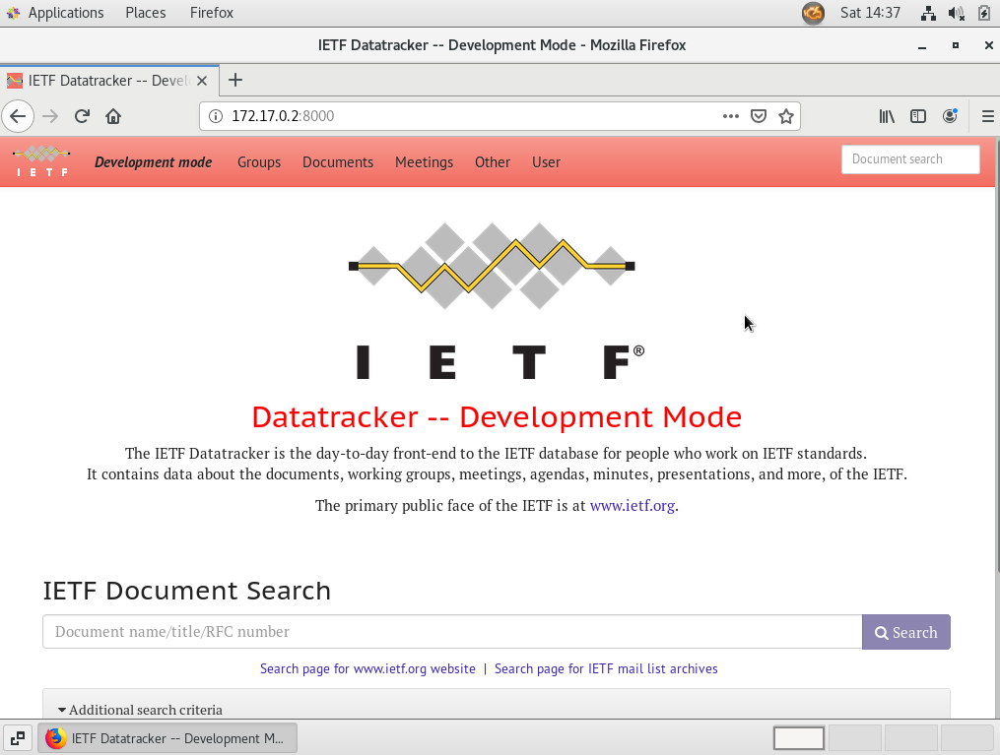

### Definition

#### Inversion of Control (IoC)

Central to the Spring Framework is its inversion of control (IoC) container, which provides a consistent means of configuring and managing Java objects using reflection. The container is responsible for managing object lifecycles of specific objects: creating these objects, calling their initialization methods, and configuring these objects by wiring them together.

{}
A process in which an object defines its dependencies without creating them.
{}

The Spring IoC Container is the leading dependency injection framework. 

This chapter covers the Spring Framework implementation of the Inversion of Control (IoC) [1] principle. IoC is also known as dependency injection (DI). It is a process whereby objects define their dependencies, that is, the other objects they work with, only through constructor arguments, arguments to a factory method, or properties that are set on the object instance after it is constructed or returned from a factory method. The container then injects those dependencies when it creates the bean. This process is fundamentally the inverse, hence the name Inversion of Control (IoC), of the bean itself controlling the instantiation or location of its dependencies by using direct construction of classes, or a mechanism such as the Service Locator pattern.
https://docs.spring.io/spring/docs/4.2.x/spring-framework-reference/html/beans.html#beans-definition

#### Dependency Injection (DI)

Objects can be obtained by means of either dependency lookup or dependency injection. Dependency lookup is a pattern where a caller asks the container object for an object with a specific name or of a specific type. Dependency injection is a pattern where the container passes objects by name to other objects, via either constructors, properties, or factory methods.

IOC basically facilitates having different components designed and coded separately and later used together by defining their relation with DI.

But in Spring, since it is a framework or Container who does that job of injecting dependancies (DI) and not us, The flow of control is reversed, (Framework to Application) it is DI with IOC.

Objects can be obtained by means of either dependency lookup or dependency injection. Dependency lookup is a pattern where a caller asks the container object for an object with a specific name or of a specific type. Dependency injection is a pattern where the container passes objects by name to other objects, via either constructors, properties, or factory methods.

使用Bean类

public class UserBeanTest {
    public static void main(String[] args){
        //实例化
        UserBean userBean = new UserBean();
        userBean.setPlay("I want to play");
        userBean.setUser(true);

        //如果是用户，就打印语句
        if(userBean.isUser()){
            System.out.println(userBean.getPlay());
        }
    }
}

作者：胖若俩人
链接：https://juejin.im/post/6844903618567471112
来源：掘金
著作权归作者所有。商业转载请联系作者获得授权，非商业转载请注明出处。

### Step 2: Install GUI on the VM

Ssh to the VM,  

    vagrant ssh

then use the below commands to intall GUI on the VM.

    sudo yum -y groupinstall "GNOME Desktop"
    echo "exec gnome-session" >> ~/.xinitrc
    systemctl set-default graphical.target

Use command

    startx

in VirtualBox console to start the GUI.

### Step 3: Install Docker on the VM

Install docker and start the service.

    sudo yum -y install docker
    sudo systemctl status docker
    sudo systemctl start docker
    sudo systemctl enable docker

Create user group 'docker' and add you into the group.

    sudo groupadd docker
    sudo usermod -aG docker $(whoami)
    sudo usermod -aG docker vagrant

Reevaluate the group and restart the docker service.

    logout
    sudo systemctl restart docker

Check if you can run docker commands without sudo.

    docker info

### Step 4: Install SVN

Add the repository and install SVN.

    sudo vim /etc/yum.repos.d/wandisco-svn.repo

>[WandiscoSVN]
>name=Wandisco SVN Repo
>baseurl=http://opensource.wandisco.com/centos/$releasever/svn-1.8/RPMS/$basearch/
>enabled=1
>gpgcheck=0

    sudo yum remove subversion*
    sudo yum clean all
    sudo yum install subversion

    svn --version

### Step 5: Check out the branch

UTF-8 settings:

    export LC_ALL=C
    sudo vi .bashrc

Add below to the file \~/.bashrc

>LANG=en_US.UTF-8
>export LANG

Change SELinux settings, so that docker image can access your home directory.

    chcon -Rt svirt_sandbox_file_t /home/vagrant/

Checkout the branch

    mkdir -p ietf
    cd ietf
    svn co https://svn.tools.ietf.org/svn/tools/ietfdb/personal/flycoolman/7.10.1.dev0

### Step 6: Set up database

    cd 7.10.1.dev0/
    ./docker/setupdb

### Step 7: Set up virtual environment

    ./docker/run

{}
rsyslog error can be ignored!  
[FAIL] rsyslogd is not running ... failed!
{}

**In virtual environment of the container**

    pip install --upgrade -r requirements.txt

    ./ietf/manage.py migrate

{}
The below operation might be needed if the migration fails.  

    sudo cp docker/settings_local.py ietf/  

Then run the migrate command again.
{}

### Step 8: Run the tests
In the virtual environment to run the tests:

./ietf/manage.py test --settings=settings_sqlitetest

{}
Make sure that one of the following commands runs to completion without errors.
{}

### Step 9: Start the Development Server

    ./ietf/manage.py runserver 0.0.0.0:8000 &

Test the access to datatracker.

### Step 10: Mailserver and Rsync Data

Go to [the original page](https://trac.tools.ietf.org/tools/ietfdb/wiki/SprintCoderSetup) for details about:  
- [(Optional) Run the mailserver](https://trac.tools.ietf.org/tools/ietfdb/wiki/SprintCoderSetup)  
- [Manually Edit or rsync Datatracker Data Directories](https://trac.tools.ietf.org/tools/ietfdb/wiki/SprintCoderSetup)

### Setup Complete

For other workflow things, please refer to [the original setup guide.](https://trac.tools.ietf.org/tools/ietfdb/wiki/SprintCoderSetup)

### Links
[JavaBeans on Wikipedia](https://en.wikipedia.org/wiki/JavaBeans)
[Oracle's JavaBeans tutorials](http://download.oracle.com/javase/tutorial/javabeans/)
[JavaBeans specification](http://www.oracle.com/technetwork/java/javase/documentation/spec-136004.html)
[初识Spring —— Bean的装配（一）](https://juejin.im/post/6844903618567471112)  
[Inversion of Control Containers and the Dependency Injection pattern](https://martinfowler.com/articles/injection.html)  
[What in the world are Spring beans?](https://stackoverflow.com/questions/17193365/what-in-the-world-are-spring-beans)  
[Spring Framework](https://en.wikipedia.org/wiki/Spring_Framework#Inversion_of_control_container_.28dependency_injection.29)  
[What is Dependency Injection and Inversion of Control in Spring Framework?](https://stackoverflow.com/questions/9403155/what-is-dependency-injection-and-inversion-of-control-in-spring-framework)  
[Spring – Inversion of Control vs Dependency Injection](https://howtodoinjava.com/spring-core/spring-ioc-vs-di/)  

 

#### Did you find this page helpful? Consider sharing it 🙌
