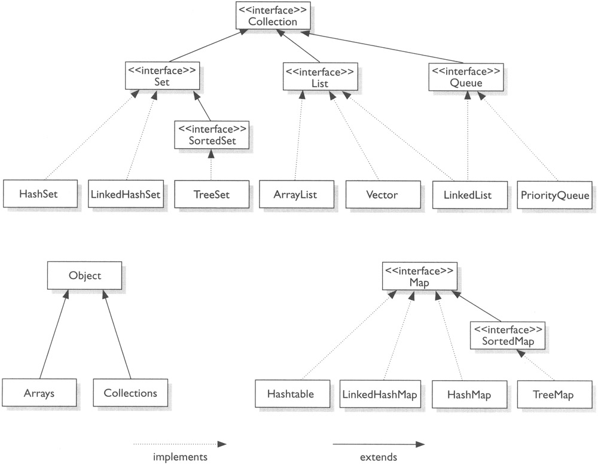
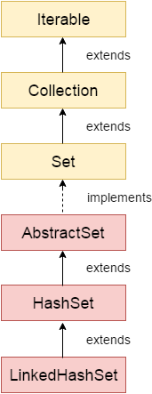
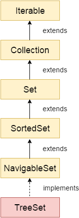

# Java Collection

- Any group of individual objects which are represented as a single unit is known as the collection of the objects.  
- The **Collection** in Java is a framework that provides an architecture to store and manipulate the group of objects.  
- The **Collection** interface (**java.util.Collection**) and Map interface (**java.util.Map**) are the two main “root” interfaces of Java collection classes.  
- Java Collections can achieve all the operations that you perform on a data such as **searching**, **sorting**, **insertion**, **manipulation**, and **deletion**.

## Java Collection Hierarchy

  
  
 

The utility package, (**java.util**) contains all the classes and interfaces that are required by the collection framework. The collection framework contains an interface named as an iterable interface which provides the iterator to iterate through all the collections. This interface is extended by the main collection interface which acts as a root for the collection framework. All the collections extend this collection interface thereby extending the properties of the iterator and the methods of this interface.  

### Iterable Interface

This is the root interface for the entire collection framework. The collection interface extends the iterable interface. Therefore, inherently, all the interfaces and classes implement this interface. The main functionality of this interface is to provide an iterator for the collections. Therefore, this interface contains only one abstract method which is the iterator. It returns the

    Iterator iterator();

### List Interface

- This interface is dedicated to the data of the list type in which we can store all the ordered collection of the objects.  
- This also allows duplicate data to be present in it.  
- It is implemented by various classes like **ArrayList**, **Vector**, **Stack**, etc.  

#### ArrayList

- ArrayList provides us with **dynamic arrays** in Java. Though, it may be slower than standard arrays but can be helpful in programs where lots of manipulation in the array is needed. The size of an ArrayList is increased automatically if the collection grows or shrinks if the objects are removed from the collection.  
- It is like an array, but there is no size limit.  
- Java ArrayList allows us to randomly access the list. ArrayList can not be used for primitive types, like int, char, etc. We will need a wrapper class for such cases.  
- The ArrayList class maintains the insertion order and is non-synchronized.  
- The elements stored in the ArrayList class can be randomly accessed.  

#### LinkedList

- LinkedList is a linear data structure where the elements are not stored in contiguous locations and every element is a separate object with a data part and address part.  
- The elements are linked using pointers and addresses. Each element is known as a node.
- It uses a doubly linked list internally to store the elements.  
- It can store the duplicate elements.  
- It maintains the insertion order and is not synchronized.  
- In LinkedList, the manipulation is fast because no shifting is required.  
- It can be used as a list, stack or queue.  

#### Vector

- Vector uses a dynamic array to store the data elements.  
- It may be slower than standard arrays but can be helpful in programs where lots of manipulation in the array is needed. 
- The primary difference between a vector and an ArrayList is that a Vector is synchronized and an ArrayList is non-synchronized.  
- It is synchronized and contains many methods that are not the part of Collection framework.  

#### Stack

- It implements the last-in-first-out data structure. 
- The stack is the subclass of Vector. The stack contains all of the methods of Vector class and also provides its methods like boolean push(), boolean peek(), boolean push(object o), which defines its properties.  

{}
Stack is a subclass of Vector and a legacy class. It is thread safe which might be an overhead in an environment where thread safety is not needed.  
An alternate to Stack is to use ArrayDequeue which is not thread safe and faster array implementation.
{}

### Queue Interface

A queue interface maintains the FIFO(First In First Out) order similar to a real-world queue line. This interface is dedicated to storing all the elements where the order of the elements matter. There are various classes like **PriorityQueue**, **Deque**, **ArrayDeque**, etc.  

#### Priority Queue

- A PriorityQueue is used when the objects are supposed to be processed based on the priority.  
- It is known that a queue follows the First-In-First-Out algorithm, but sometimes the elements of the queue are needed to be processed according to the priority and this class is used in these cases.  
- The PriorityQueue is based on the priority heap.  
- The elements of the priority queue are ordered according to the natural ordering, or by a Comparator provided at queue construction time, depending on which constructor is used.
- PriorityQueue doesn't allow null values to be stored in the queue.  
- The elements in PriorityQueue must be of Comparable type. String and Wrapper classes are Comparable by default.  
- To add user-defined objects in PriorityQueue, you need to implement Comparable interface.  

### Deque Interface

Deque, also known as a double-ended queue, is a data structure where we can add and remove the elements from both the ends of the queue.  
- This interface extends the queue interface.  
- The class which implements this interface is **ArrayDeque**.  

#### ArrayDeque

- The ArrayDeque class provides the facility of using deque and resizable-array. This is a special kind of array that grows and allows users to add or remove an element from both sides of the queue.  
- Array deques have no capacity restrictions and they grow as necessary to support usage.  
- ArrayDeque is faster than ArrayList and Stack.   
- Unlike Queue, we can add or remove elements from both sides.  
- Null elements are not allowed in the ArrayDeque.  
- ArrayDeque is not thread safe, in the absence of external synchronization.  

### Set Interface

- A set is an unordered collection of objects in which duplicate values cannot be stored.  
- This collection is used when we wish to avoid the duplication of the objects and wish to store only the unique objects.  
- This set interface is implemented by various classes like **HashSet**, **TreeSet**, **LinkedHashSet**, etc.  

#### HashSet

- The HashSet class is an inherent implementation of the hash table data structure.  
- HashSet stores the elements by using a mechanism called hashing.  
- HashSet contains unique elements only.  
- HashSet allows null value. 
- HashSet class is non synchronized.   
- HashSet doesn't maintain the insertion order. Here, elements are inserted on the basis of their hashcode.  
- HashSet is the best approach for search operations.  
- The initial default capacity of HashSet is 16, and the load factor is 0.75.  

  

#### LinkedHashSet

- LinkedHashSet uses a doubly linked list to store the data and retains the ordering of the elements.  
- Like HashSet, It also contains unique elements only.  
- It maintains the insertion order. 
- It permits null elements.  
- LinkedHashSet class is non synchronized.  

  

### SortedSet Interface

- This interface is very similar to the set interface. The only difference is that this interface has extra methods that maintain the ordering of the elements.  
- The sorted set interface extends the set interface and is used to handle the data which needs to be sorted.  
- The class which implements this interface is **TreeSet**.  

#### TreeSet

- TreeSet class contains unique elements only like HashSet.  
- TreeSet class **doesn't** allow null element.  
- The TreeSet class uses a Tree for storage.  
- The ordering of the elements is maintained by a set using their natural ordering whether or not an explicit comparator is provided.  
- It can also be ordered by a Comparator provided at set creation time, depending on which constructor is used.  
- the access and retrieval time of TreeSet is quite fast.  
- The elements in TreeSet stored in ascending order.  
- TreeSet class is non synchronized.  

  

### Map Interface

A map is a data structure which supports the key-value pair mapping for the data. This interface doesn’t support duplicate keys because the same key cannot have multiple mappings. A map is useful if there is a data and we wish to perform operations on the basis of the key. This map interface is implemented by various classes like **HashMap**, **TreeMap**, etc.  
There are two interfaces for implementing Map in java: **Map** and **SortedMap**, and three classes: **HashMap**, **LinkedHashMap**, and **TreeMap**. The hierarchy of Java Map is given below:

  

#### HashMap

HashMap provides the basic implementation of the Map interface of Java. It stores the data in (Key, Value) pairs. To access a value in a HashMap, we must know its key. HashMap uses a technique called Hashing. Hashing is a technique of converting a large String to small String that represents the same String so that the indexing and search operations are faster. HashSet also uses HashMap internally.  

- Java HashMap contains values based on the key.  
- Java HashMap contains only unique keys.  
- Java HashMap may have one null key and multiple null values.  
- Java HashMap is non synchronized.  
- Java HashMap maintains no order.  
- The initial default capacity of Java HashMap class is 16 with a load factor of 0.75.  

**HashMap implementation**  
[Working of HashMap in Java](https://www.javatpoint.com/working-of-hashmap-in-java)  
- It stores the data in the pair of Key and Value.  
- HashMap contains an array of the nodes, and the node is represented as a class.  
- It uses an array and LinkedList data structure internally for storing Key and Value.  

#### LinkedHashMap

- LinkedHashMap contains values based on the key.  
- LinkedHashMap contains unique elements.  
- LinkedHashMap may have one null key and multiple null values.  
- LinkedHashMap is non synchronized.  
- LinkedHashMap maintains insertion order.  
- The initial default capacity of Java HashMap class is 16 with a load factor of 0.75.  

#### TreeMap

Java TreeMap class is a **red-black tree** based implementation. It provides an efficient means of storing key-value pairs in sorted order.

- TreeMap contains values based on the key.  
- It implements the NavigableMap interface and extends AbstractMap class.
- TreeMap contains only unique elements.
- TreeMap cannot have a null key but can have multiple null values.
- TreeMap is non synchronized.
- TreeMap maintains ascending order.

### HashTable

Java Hashtable class inherits Dictionary class and implements the Map interface.

- A Hashtable is an array of a list. Each list is known as a bucket. The position of the bucket is identified by calling the hashcode() method. A Hashtable contains values based on the key.  
- Hashtable class contains unique elements.  
- Hashtable class doesn't allow null key or value.  
- Hashtable class is synchronized.  
- The initial default capacity of Hashtable class is 11 whereas loadFactor is 0.75.  

### EnumSet

EnumSet class is the specialized Set implementation for use with enum types. It inherits AbstractSet class and implements the Set interface.  

### EnumMap

EnumMap class is the specialized Map implementation for enum keys. It inherits Enum and AbstractMap classes.  

### Collections class
This class consists exclusively of static methods that operate on or return collections. It contains polymorphic algorithms that operate on collections, "wrappers", which return a new collection backed by a specified collection, and a few other odds and ends.  
The methods of this class all throw a NullPointerException if the collections or class objects provided to them are null.  

#### Sorting in collection

1. String objects
  Collections.sort()  
2. Wrapper class objects
  Collections.sort()  
3. User-defined class objects  
  Collections.sort() with user-defined class implements comparable interface (compareTo() method)  

### Comaprable

- Java **Comparable interface** is used to order the objects of the user-defined class.  
- This interface is found in **java.lang** package and contains only one method named compareTo(Object).  
- It provides a single sorting sequence only, i.e., you can sort the elements on the basis of single data member only. For example, it may be rollno, name, age or anything else.  

#### compareTo(Object obj) method

public int compareTo(Object obj): It is used to compare the current object with the specified object. It returns  

- positive integer, if the current object is greater than the specified object.  
- negative integer, if the current object is less than the specified object.  
- zero, if the current object is equal to the specified object.  

### Comparator

- Java Comparator interface is used to order the objects of a user-defined class.  
- This interface is found in **java.util** package and contains 2 methods **compare(Object obj1,Object obj2)** and **equals(Object element)**.  
- It provides multiple sorting sequences, i.e., you can sort the elements on the basis of any data member, for example, rollno, name, age or anything else.  

#### Comparator Implementation

- Non-generic Old Style  
- Generic style  

#### Java 8 Comparator Interface

Java 8 has more comparator methods  

### Properties class

- The properties object contains key and value pair both as a string.  
- The java.util.Properties class is the subclass of Hashtable.  
- It can be used to get property value based on the property key. The Properties class provides methods to get data from the properties file and store data into the properties file. Moreover, it can be used to get the properties of a system.  
- Recompilation is not required if the information is changed from a properties file: If any information is changed from the properties file, you don't need to recompile the java class. It is used to store information which is to be changed frequently.  

### A Little Deep In Queues

#### The queue (a FIFO list)  
Implementation of a queue
- A queue (of bounded size) can be efficiently implemented in an array.  
- A queue can be efficiently implemented using any linked list that supports deletion in the front and insertion at the end in constant time. The first (last) element of the queue is at the front (end) of the linked list.  

#### The stack (a LIFO list)

Implementation of a stack
- A stack (of bounded size) can be efficiently implemented using an array b and an int variable n: The n elements of the stack are in b[0..n-1], with b[0] being the bottom element and b[n-1] being the top element.  
- A stack can be efficiently implemented using a linked list. The first element is the top of the stack and the last element is the bottom. It’s easy to push (prepend) an element and pop (remove) the first element in constant time.  

#### The deque

The word deque, usually pronounced deck, is short for double-ended queue. A deque is a list that supports insertion and removal at both ends. Thus, a deque can be used as a queue or as a stack.  

#### Stacks, queues, and deques in the Java Collection framework

- Java has interface Deque<E>. It is implemented by classes ArrayDeque<E> (which implements a list in an expandable array) and LinkedList<E>, so these two classes can be used for a queue and for a stack.  
- Both ArrayDeque and LinkedList also implement interface Queue<E>, so you can use this interface to restrict operations to queue operations. For example, create a LinkedList and assign it to a Queue variable.  

        Queue<E> q= new LinkedList<>();  

Thereafter, use only q for the LinkedList and operations are restricted to queue operations.
- Java also has a class Stack<E>, which implements a stack in an expandable array. However, the Java API would rather you use an ArrayDeque. The problem is that there is no suitable way to restrict the operations of an Array-Deque to stack operations, so we prefer to use class Stack<E>.

### Some Implementations

- **LinkedList:** Although mainly known to be a List implementation, this class also implements the Queue interface. This implementation works by linking its elements together and going through that chain when iterating or searching for elements.  
- **ArrayDeque:** An implementation of both Queue and Deque. It's backed up by an array, which can be increased when the number of elements increase over its current capacity.  
- **DelayQueue:** Can only contain elements which implement the Delayed interface - elements that become active after a certain time. The DelayQueue will only deliver elements whose delays have expired.  
- **PriorityQueue:** Orders its elements according to their natural order or a Comparator (if provided). This means it doesn't work using the FIFO principle, but rather returns the element with the highest priority (defined by how they compare to each other).

### Non-generic vs Generic

- Java collection framework was non-generic before JDK 1.5. Since 1.5, it is generic.
- Java new generic collection allows you to have only one type of object in a collection. Now it is type safe so typecasting is not required at runtime.
- In a generic collection, the type is specified in angular braces.  
- If trying to add another type of object into generic collection, it gives compile time error.  

        ArrayList list=new ArrayList();//creating old non-generic arraylist  
        ArrayList<String> list=new ArrayList<String>();//creating new generic arraylist  

### Ways to iterate the elements of the collection in Java

- By Iterator interface.
- By for-each loop.
- By ListIterator interface.
- By for loop.
- By forEach() method.
- By forEachRemaining() method.

### Comparison

#### Array vs ArrayList

| Basis | Array | ArrayList |
|-------|-------|-----------|
| **Definition** | An array is a dynamically-created object. It serves as a container that holds the constant number of values of the same type. It has a contiguous memory location. | The ArrayList is a class of Java Collections framework. It contains popular classes like Vector, HashTable, and HashMap. |
| **Size** | Array is static in size. | ArrayList is dynamic in size. |
| **Resizable** | An array is a fixed-length data structure. | ArrayList is a variable-length data structure. It can be resized itself when needed. |
| **Initialization** | It is mandatory to provide the size of an array while initializing it directly or indirectly. | We can create an instance of ArrayList without specifying its size. Java creates ArrayList of default size. |
| **Performance** | It performs fast in comparison to ArrayList because of fixed size. | ArrayList is internally backed by the array in Java. The resize operation in ArrayList slows down the performance. |
| **Primitive/ Generic type** | An array can store both objects and primitives type. | We cannot store primitive type in ArrayList. It automatically converts primitive type to object. |
| **Iterating Values** | We use for loop or for each loop to iterate over an array. | We use an iterator to iterate over ArrayList. |
| **Type-Safety** | We cannot use generics along with array because it is not a convertible type of array. | ArrayList allows us to store only generic/ type, that's why it is type-safe. |
| **Length** | Array provides a length variable which denotes the length of an array. | ArrayList provides the size() method to determine the size of ArrayList. |
| **Adding Elements** | We can add elements in an array by using the assignment operator. | Java provides the add() method to add elements in the ArrayList. |
| **Single/ Multi-Dimensional** | Array can be multi-dimensional. | ArrayList is always single-dimensional. |
|||

#### ArrayList vs LinkedList

| ArrayList                                                       | LinkedList                                                                        |
| ----------------------------------------------------------------| --------------------------------------------------------------------------------- |
| ArrayList internally uses a dynamic array to store the elements. | LinkedList internally uses a doubly linked list to store the elements.            |
| Manipulation with ArrayList is slow because it internally uses an array. If any element is removed from the array, all the bits are shifted in memory.   | Manipulation with LinkedList is faster than ArrayList because it uses a doubly linked list, so no bit shifting is required in memory.   |
|An ArrayList class can act as a list only because it implements List only.  | LinkedList class can act as a list and queue both because it implements List and Deque interfaces. |
|ArrayList is better for storing and accessing data.     |   LinkedList is better for manipulating data.   |

#### ArrayList vs Vector

| ArrayList      | Vector      |
|----------------|-------------|
| ArrayList is not synchronized. | Vector is synchronized.|
| ArrayList increments 50% of current array size if the number of elements exceeds from its capacity. | Vector increments 100% means doubles the array size if the total number of elements exceeds than its capacity. |
| ArrayList is not a legacy class. It is introduced in JDK 1.2. | Vector is a legacy class. |
| ArrayList is fast because it is non-synchronized. | Vector is slow because it is synchronized, i.e., in a multithreading environment, it holds the other threads in runnable or non-runnable state until current thread releases the lock of the object. |
| ArrayList uses the Iterator interface to traverse the elements. | A Vector can use the Iterator interface or Enumeration interface to traverse the elements. |

#### List vs Set

A list can contain duplicate elements whereas Set contains unique elements only.

#### HashMap vs LinkedHashMap vs TreeMap

- A Map doesn't allow duplicate keys, but you can have duplicate values.  
- HashMap and LinkedHashMap allow null keys and values, but TreeMap doesn't allow any null key or value.  
- A Map can't be traversed, so you need to convert it into Set using keySet() or entrySet() method. 

| Class          | Description |
|----------------|-------------|
| HashMap        | HashMap is the implementation of Map, but it doesn't maintain any order. |
| LinkedHashMap  | LinkedHashMap is the implementation of Map. It inherits HashMap class. It maintains insertion order. |
| TreeMap        | TreeMap is the implementation of Map and SortedMap. It maintains ascending order. |

| HashMap        |  TreeMap  |
|----------------|-------------|
| HashMap can contain one null key.   | TreeMap cannot contain any null key. |
| HashMap maintains no order.         | TreeMap maintains ascending order.   |

#### HashMap vs Hashtable

| HashMap | Hashtable |
|---------|-----------|
| HashMap and Hashtable both are used to store data in key and value form. Both are using hashing technique to store unique keys. |
| 1) HashMap is non synchronized. It is not-thread safe and can't be shared between many threads without proper synchronization code. | Hashtable is synchronized. It is thread-safe and can be shared with many threads. |
| 2) HashMap allows one null key and multiple null values. | Hashtable doesn't allow any null key or value. |
| 3) HashMap is fast. | Hashtable is slow. |
| 4) We can make the HashMap as synchronized by calling this code    Map m = Collections.synchronizedMap(hashMap); | Hashtable is internally synchronized and can't be unsynchronized. |
| 5) HashMap is traversed by Iterator.  | Hashtable is traversed by Enumerator and Iterator. |
| 6) Iterator in HashMap is fail-fast.  | Enumerator in Hashtable is not fail-fast. |
| 7) HashMap inherits AbstractMap class. | Hashtable inherits Dictionary class. |

#### Collections Class vs Collection Framework

| Collection | Collections |
|------------|-------------|
| The Collection is an interface | whereas Collections is a utility class. |
| The Collection interface provides the standard functionality of data structure to List, Set, and Queue. | However, Collections class contains only static methods like sort(), min(), max(), fill(), copy(), reverse() etc. |
| The Collection interface provides the methods that can be used for data structure | whereas Collections class provides the static methods which can be used for various operation on a collection. |

#### Comparable vs Comparator

| key     | Comparable | Comparator  |
|---------|------------|-------------|
| Package | Comparable interface belongs to java.lang package. | Comparator interface belongs to java.util package. |
| Method  | The comparable interface has a method compareTo(Object a ) | The comparator has a method compare(Object o1, Object O2) |
| Sorting uses | Comparable provides single sorting sequence. In other words, we can sort the collection on the basis of single element such as id or title or rating etc. | Collection.sort(List, Comparator) method can be used to sort the collection of Comparator type objects. |
| Sorting sequence | Comparable provides single sorting sequence. | Comparator provides multiple sorting sequence. In other words, we can sort the collection on the basis of multiple elements such as id, title and rating etc. |
| Original class | Comparable affects the original class, i.e., the actual class is modified. | Comparator provides compare() method to sort elements. |

 

## Links

[Collections in Java](https://www.geeksforgeeks.org/collections-in-java-2/)  
[Java Collections: Queue and Deque Interfaces](https://stackabuse.com/java-collections-queue-and-deque-interfaces/)  
[Java ArrayList](https://www.javatpoint.com/java-arraylist)  

 

