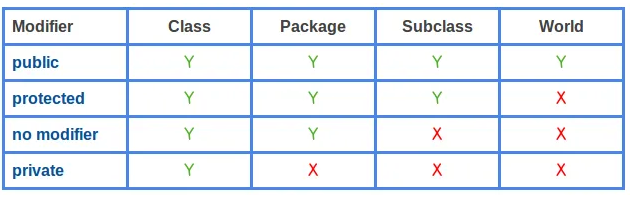
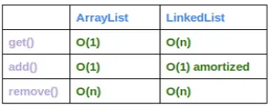
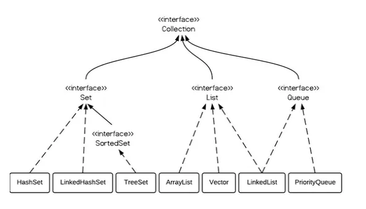

## Java Notes
A free style notes of Java.

### Top 10 Mistakes Java Developers Make

[Top 10 Mistakes Java Developers Make](https://www.programcreek.com/2014/05/top-10-mistakes-java-developers-make/)  

### Differentiate JVM JRE JDK JIT

- Java Virtual Machine (JVM) is an abstract computing machine.
- Java Runtime Environment (JRE) is an implementation of the JVM.
- Java Development Kit (JDK) contains JRE along with various development tools like Java libraries, Java source compilers, Java debuggers, bundling and deployment tools.
- Just In Time compiler (JIT) is runs after the program has started executing, on the fly. It has access to runtime information and makes optimizations of the code for better performance.

[Differentiate JVM JRE JDK JIT](https://javapapers.com/core-java/differentiate-jvm-jre-jdk-jit/)  

### Pass By Value and Pass By Reference and Pass Reference by Value

{}
Java uses pass by value. There is no pass by reference in Java.
{}

Pass By Value and Pass By Reference and Pass Reference by Value
[Java Pass By Value and Pass By Reference](https://javapapers.com/core-java/java-pass-by-value-and-pass-by-reference/)  

- Java always passes parameter variables by value.
- Object variables in Java always point to the real object in the memory heap.
- A mutable object’s value can be changed when it is passed to a method.
- An immutable object’s value cannot be changed, even if it is passed a new value.
- “Passing by value” refers to passing a copy of the value.
- “Passing by reference” refers to passing the real reference of the variable in memory.

[Does Java pass by reference or pass by value?](https://www.infoworld.com/article/3512039/does-java-pass-by-reference-or-pass-by-value.html#:~:text=Java%20always%20passes%20parameter%20variables,is%20passed%20to%20a%20method.)  

### Java (JVM) Memory Types

**Shared/Common Area** 
1. Heap Memory  
Class instances and arrays are stored in heap memory. Heap memory is also called as shared memory. As this is the place where multiple threads will share the same data.  
Heap data area is created at VM startup. Claiming the memory back is done automatically by the garbage collector (GC).

2. Non-heap Memory  
    * Method area 
    Method area is created at JVM startup and shared among all the threads. 
        1. per-class structures (runtime constants and static fields)  
        2. code for methods  
        3. constructors
        4. **Run-time Constant Pool**  

**Per-Thread Area**
1. Program Counter (PC) Register
PC keeps a pointer to the current statement that is being executed in its thread. If the current executing method is ‘native’, then the value of program counter register will be undefined.
2. JVM Stacks or Frames
Java JVM frames are created when a method is invoked, it performs the dynamic linking. JVM stacks are created and managed for each thread.
3. Native Method Stacks
It is used for native methods, and created per thread. 

**Memory Generations**
HotSpot VM’s garbage collector uses generational garbage collection. It separates the JVM’s memory into and they are called young generation and old generation.
1. Young Generation
- Eden space
- Survivor space
2. Old Generation
- Tenured Generation
GC moves live objects from survivor space to tenured generation. 
- PermGen (Permanent Generation)
The permanent generation contains meta data of the virtual machine, class and method objects.  

(Java JVM Run-time Data Areas)[https://javapapers.com/core-java/java-jvm-run-time-data-areas/#Java_Virtual_Machine_Stacks]  
(Java (JVM) Memory Types)[https://javapapers.com/core-java/java-jvm-memory-types/]  

**Key Takeaways**  
- Local Variables are stored in Frames during runtime.
- Static Variables are stored in Method Area.
- Arrays are stored in heap memory.

### Java Static

#### Java Static Variables
- Java instance variables are given separate memory for storage. If there is a need for a variable to be common to all the objects of a single java class, then the static modifier should be used in the variable declaration.
- Any java object that belongs to that class can modify its static variables.
- Also, an instance is not a must to modify the static variable and it can be accessed using the java class directly.
- Static variables can be accessed by java instance methods also.
- When the value of a constant is known at compile time it is declared ‘final’ using the ‘static’ keyword.

#### Java Static Methods
- Similar to static variables, java static methods are also common to classes and not tied to a java instance.
- Good practice in java is that, static methods should be invoked with using the class name though it can be invoked using an object. ClassName.methodName(arguments) or objectName.methodName(arguments)
- General use for java static methods is to access static fields.
- Static methods can be accessed by java instance methods.
- Java static methods cannot access instance variables or instance methods directly.
- Java static methods cannot use the ‘this’ keyword.  

#### Java Static Classes
- For java classes, only an inner class can be declared using the static modifier.  
- For java a static inner class it does not mean that, all their members are static. These are called nested static classes in java.  

[Java Static](https://javapapers.com/core-java/explain-the-java-static-modifier/)  

### Static Block

It's a static initializer. It's executed when the class is loaded (or initialized, to be precise, but you usually don't notice the difference).  
It can be thought of as a "class constructor".  
Note that there are also instance initializers, which look the same, except that they don't have the static keyword. Those are run in addition to the code in the constructor when a new instance of the object is created.  
A static block in Java is a block of code that is executed at the time of loading a class for use in a Java application. It starts with a 'static {' and it is used for initializing static Class members in general — and is also known as a 'Static Initializer'. The most powerful use of a static block can be realized while performing operations that are required to be executed only once for a Class in an application lifecycle.  

[Static Block in Java](https://stackoverflow.com/questions/2943556/static-block-in-java)  
[The Hidden Synchronized Keyword With a Static Block](https://dzone.com/articles/the-hidden-synchronized-keyword-with-a-static-bloc)  

### Builder Patter

**Builder** is a creational design pattern that lets you construct complex objects step by step. The pattern allows you to produce different types and representations of an object using the same construction code.  

Builder pattern builds a complex object using simple objects and using a step by step approach. This type of design pattern comes under creational pattern as this pattern provides one of the best ways to create an object.  

A Builder class builds the final object step by step. This builder is independent of other objects.

#### Pros and Cons

**Pros**  
 - You can construct objects step-by-step, defer construction steps or run steps recursively.
 - You can reuse the same construction code when building various representations of products.
 - Single Responsibility Principle. You can isolate complex construction code from the business logic of the product.

**Cons**  
- The overall complexity of the code increases since the pattern requires creating multiple new classes.

#### Relations with Other Patterns

- Many designs start by using **Factory Method** (less complicated and more customizable via subclasses) and evolve toward **Abstract Factory**, **Prototype**, or **Builder** (more flexible, but more complicated).

- **Builder** focuses on constructing complex objects step by step. **Abstract Factory** specializes in creating families of related objects. Abstract Factory returns the product immediately, whereas Builder lets you run some additional construction steps before fetching the product.

- You can use **Builder** when creating complex **Composite** trees because you can program its construction steps to work recursively.

- You can combine **Builder** with **Bridge**: the director class plays the role of the abstraction, while different builders act as implementations.

- **Abstract Factories**, **Builders** and **Prototypes** can all be implemented as **Singletons**.

[Builder pattern](https://en.wikipedia.org/wiki/Builder_pattern)  
[Builder](https://refactoring.guru/design-patterns/builder)  
[Design Patterns - Builder Pattern](https://www.tutorialspoint.com/design_pattern/builder_pattern.htm)  

### transient keyword in Java
The transient keyword in Java is used to indicate that a field should not be part of the serialization (which means saved, like to a file) process.

[Why does Java have transient fields?](https://stackoverflow.com/questions/910374/why-does-java-have-transient-fields)  

### Array vs. ArrayList

- **Array** is a fixed length data structure whereas **ArrayList** is a variable length Collection class.  
- We cannot change length of array once created in Java but ArrayList can be changed.  
- We cannot store primitives in ArrayList, it can only store objects. But array can contain both primitives and objects in Java.

[Array vs ArrayList in Java](https://www.javatpoint.com/array-vs-arraylist-in-java#:~:text=Array%20is%20a%20fixed%20length,primitives%20and%20objects%20in%20Java.)  
[Array vs ArrayList in Java](https://www.geeksforgeeks.org/array-vs-arraylist-in-java/)  

### Arrays.asList() vs new ArrayList()

When you call Arrays.asList it does not return a java.util.ArrayList. It returns a java.util.Arrays$ArrayList which is a fixed size list backed by the original source array. In other words, it is a view for the array exposed with Java's collection-based APIs.

[Difference between Arrays.asList(array) and new ArrayList<Integer>(Arrays.asList(array))](https://stackoverflow.com/questions/16748030/difference-between-arrays-aslistarray-and-new-arraylistintegerarrays-aslist/16748184#:~:text=asList(ia)%20returns%20a%20List,from%20new%20ArrayList%20.)  
[Why does Arrays.asList() return its own ArrayList implementation](https://stackoverflow.com/questions/4658867/why-does-arrays-aslist-return-its-own-arraylist-implementation)  

### Access Level
  

[Java Access Level for Members: public, protected, private](https://www.programcreek.com/2011/11/java-access-level-public-protected-private/)  

### Set vs. Set<?>

- an unbounded wildcard Set<?> can hold elements of any type, and a raw type Set can also hold elements of any type.
- wildcard type is safe and the raw type is not. We can not put any element into a Set<?>
- When you want to use a generic type, but you don't know or care what the actual type the parameter is, you can use <?>[1]. It can only be used as parameters for a method.

[Raw type vs. Unbounded wildcard](https://www.programcreek.com/2013/12/raw-type-set-vs-unbounded-wildcard-set/)  

### ArrayList vs. LinkedList vs. Vector

#### Implementation
- **ArrayList** is implemented as a resizable array. As more elements are added to ArrayList, its size is increased dynamically. It's elements can be accessed directly by using the get and set methods, since ArrayList is essentially an array.
- **LinkedList** is implemented as a double linked list. Its performance on add and remove is better than Arraylist, but worse on get and set methods.
- **Vector** is similar with ArrayList, but it is synchronized.

#### Some details
- ArrayList is a better choice if your program is thread-safe. 
- Vector and ArrayList require more space as more elements are added. 
- Vector each time doubles its array size, while ArrayList grow 50% of its size each time. 
- LinkedList, however, also implements Queue interface which adds more methods than ArrayList and Vector, such as offer(), peek(), poll(), etc.

{}
The default initial capacity of an ArrayList is pretty small. It is a good habit to construct the ArrayList with a higher initial capacity. This can avoid the resizing cost.
{}

#### How to use
- LinkedList should be preferred if there are a large number of add/remove operations  
- LinkedList should be preferred if there are not a lot of random access operations. 
- Vector is almost identical to ArrayList, and the difference is that Vector is synchronized. Because of this, it has an overhead than ArrayList. Normally, most Java programmers use ArrayList instead of Vector because they can synchronize explicitly by themselves.

  
add() in the table refers to add(E e), and remove() refers to remove(int index)
- ArrayList has O(n) time complexity for arbitrary indices of add/remove, but O(1) for the operation at the end of the list.
- LinkedList has O(n) time complexity for arbitrary indices of add/remove, but O(1) for operations at end/beginning of the List.

### Java Collection Hierarchy

  
  

### Mutable vs. Immutable

### Java Generics

[Java Generics Tutorial](http://tutorials.jenkov.com/java-generics/index.html)  

 

#### Did you find this page helpful? Consider sharing it 🙌
