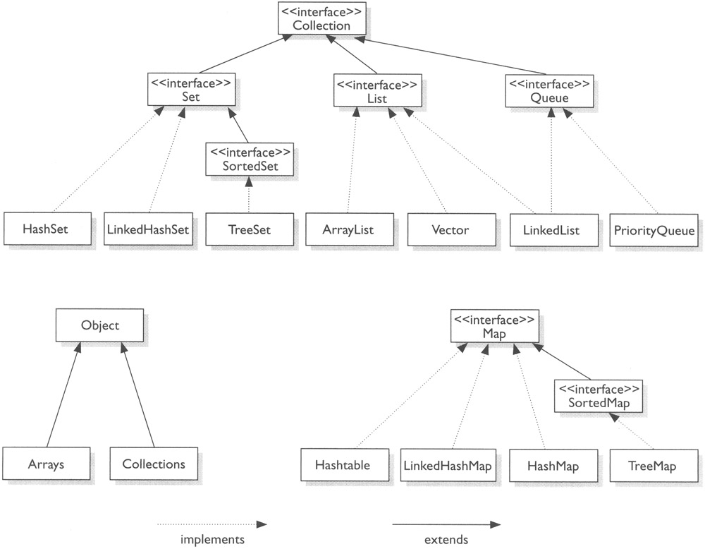

## Java Notes
A free style notes of Java.

### Basic knowledge

- Static blocks  
- Non static blocks  
- Static methods  
- Non-Static methods  
- Static blank final variables
- Non-Static blank final variables
- Static classes  
- Non-Static inner classes  
- Static and dynamic polymorphism
- Static binding/Early binding
- Dynamic binding/Late binding

### Top 10 Mistakes Java Developers Make

[Top 10 Mistakes Java Developers Make](https://www.programcreek.com/2014/05/top-10-mistakes-java-developers-make/)  

### Differentiate JVM JRE JDK JIT

- Java Virtual Machine (JVM) is an abstract computing machine.
- Java Runtime Environment (JRE) is an implementation of the JVM.
- Java Development Kit (JDK) contains JRE along with various development tools like Java libraries, Java source compilers, Java debuggers, bundling and deployment tools.
- Just In Time compiler (JIT) is runs after the program has started executing, on the fly. It has access to runtime information and makes optimizations of the code for better performance.

[Differentiate JVM JRE JDK JIT](https://javapapers.com/core-java/differentiate-jvm-jre-jdk-jit/)  

### Class vs Interface
- **Class:** A class is a user-defined blueprint or prototype from which objects are created. It represents the set of properties or methods that are common to all objects of one type.  
- **Interface:** Like a class, an interface can have methods and variables, but the methods declared in an interface are by default abstract (only method signature, no body). Interfaces specify what a class must do and not how. It is the blueprint of the class.  

An interface defines a protocol of behavior and not how we should be implemented. A class that implements an interface adheres to the protocol defined by that interface.

- Interface variables are static because java interfaces cannot be instantiated on their own. The value of the variable must be assigned in a static context in which no instance exists.  
- The final modifier ensures the value assigned to the interface variable is a true constant that cannot be re-assigned. In other words, interfaces can declare only constants, not instance variables.  

### Pass By Value and Pass By Reference and Pass Reference by Value

{}
Java uses pass by value. There is no pass by reference in Java.
{}

Pass By Value and Pass By Reference and Pass Reference by Value
[Java Pass By Value and Pass By Reference](https://javapapers.com/core-java/java-pass-by-value-and-pass-by-reference/)  

- Java always passes parameter variables by value.
- Object variables in Java always point to the real object in the memory heap.
- A mutable object’s value can be changed when it is passed to a method.
- An immutable object’s value cannot be changed, even if it is passed a new value.
- “Passing by value” refers to passing a copy of the value.
- “Passing by reference” refers to passing the real reference of the variable in memory.

[Does Java pass by reference or pass by value?](https://www.infoworld.com/article/3512039/does-java-pass-by-reference-or-pass-by-value.html#:~:text=Java%20always%20passes%20parameter%20variables,is%20passed%20to%20a%20method.)  

### Java (JVM) Memory Types

**Shared/Common Area** 
1. Heap Memory  
Class instances and arrays are stored in heap memory. Heap memory is also called as shared memory. As this is the place where multiple threads will share the same data.  
Heap data area is created at VM startup. Claiming the memory back is done automatically by the garbage collector (GC).

2. Non-heap Memory  
    * Method area 
    Method area is created at JVM startup and shared among all the threads. 
        1. per-class structures (runtime constants and static fields)  
        2. code for methods  
        3. constructors
        4. **Run-time Constant Pool**  

**Per-Thread Area**
1. Program Counter (PC) Register
PC keeps a pointer to the current statement that is being executed in its thread. If the current executing method is ‘native’, then the value of program counter register will be undefined.
2. JVM Stacks or Frames
Java JVM frames are created when a method is invoked, it performs the dynamic linking. JVM stacks are created and managed for each thread.
3. Native Method Stacks
It is used for native methods, and created per thread. 

**Memory Generations**
HotSpot VM’s garbage collector uses generational garbage collection. It separates the JVM’s memory into and they are called young generation and old generation.
1. Young Generation
- Eden space
- Survivor space
2. Old Generation
- Tenured Generation
GC moves live objects from survivor space to tenured generation. 
- PermGen (Permanent Generation)
The permanent generation contains meta data of the virtual machine, class and method objects.  

(Java JVM Run-time Data Areas)[https://javapapers.com/core-java/java-jvm-run-time-data-areas/#Java_Virtual_Machine_Stacks]  
(Java (JVM) Memory Types)[https://javapapers.com/core-java/java-jvm-memory-types/]  

**Key Takeaways**  
- Local Variables are stored in Frames during runtime.
- Static Variables are stored in Method Area.
- Arrays are stored in heap memory.

### Java Static

#### Java Static Variables
- Java instance variables are given separate memory for storage. If there is a need for a variable to be common to all the objects of a single java class, then the static modifier should be used in the variable declaration.
- Any java object that belongs to that class can modify its static variables.
- Also, an instance is not a must to modify the static variable and it can be accessed using the java class directly.
- Static variables can be accessed by java instance methods also.
- When the value of a constant is known at compile time it is declared ‘final’ using the ‘static’ keyword.

#### Java Static Methods
- Similar to static variables, java static methods are also common to classes and not tied to a java instance.
- Good practice in java is that, static methods should be invoked with using the class name though it can be invoked using an object. ClassName.methodName(arguments) or objectName.methodName(arguments)
- General use for java static methods is to access static fields.
- Static methods can be accessed by java instance methods.
- Java static methods cannot access instance variables or instance methods directly.
- Java static methods cannot use the ‘this’ keyword.  

#### Java Static Classes
- For java classes, only an inner class can be declared using the static modifier.  
- For java a static inner class it does not mean that, all their members are static. These are called nested static classes in java.  

[Java Static](https://javapapers.com/core-java/explain-the-java-static-modifier/)  

### Static Block

It's a static initializer. It's executed when the class is loaded (or initialized, to be precise, but you usually don't notice the difference).  
It can be thought of as a "class constructor".  
Note that there are also instance initializers, which look the same, except that they don't have the static keyword. Those are run in addition to the code in the constructor when a new instance of the object is created.  
A static block in Java is a block of code that is executed at the time of loading a class for use in a Java application. It starts with a 'static {' and it is used for initializing static Class members in general — and is also known as a 'Static Initializer'. The most powerful use of a static block can be realized while performing operations that are required to be executed only once for a Class in an application lifecycle.  

[Static Block in Java](https://stackoverflow.com/questions/2943556/static-block-in-java)  
[The Hidden Synchronized Keyword With a Static Block](https://dzone.com/articles/the-hidden-synchronized-keyword-with-a-static-bloc)  

### Builder Patter

**Builder** is a creational design pattern that lets you construct complex objects step by step. The pattern allows you to produce different types and representations of an object using the same construction code.  

Builder pattern builds a complex object using simple objects and using a step by step approach. This type of design pattern comes under creational pattern as this pattern provides one of the best ways to create an object.  

A Builder class builds the final object step by step. This builder is independent of other objects.

#### Pros and Cons

**Pros**  
 - You can construct objects step-by-step, defer construction steps or run steps recursively.
 - You can reuse the same construction code when building various representations of products.
 - Single Responsibility Principle. You can isolate complex construction code from the business logic of the product.

**Cons**  
- The overall complexity of the code increases since the pattern requires creating multiple new classes.

#### Relations with Other Patterns

- Many designs start by using **Factory Method** (less complicated and more customizable via subclasses) and evolve toward **Abstract Factory**, **Prototype**, or **Builder** (more flexible, but more complicated).

- **Builder** focuses on constructing complex objects step by step. **Abstract Factory** specializes in creating families of related objects. Abstract Factory returns the product immediately, whereas Builder lets you run some additional construction steps before fetching the product.

- You can use **Builder** when creating complex **Composite** trees because you can program its construction steps to work recursively.

- You can combine **Builder** with **Bridge**: the director class plays the role of the abstraction, while different builders act as implementations.

- **Abstract Factories**, **Builders** and **Prototypes** can all be implemented as **Singletons**.

[Builder pattern](https://en.wikipedia.org/wiki/Builder_pattern)  
[Builder](https://refactoring.guru/design-patterns/builder)  
[Design Patterns - Builder Pattern](https://www.tutorialspoint.com/design_pattern/builder_pattern.htm)  

### transient keyword in Java
The transient keyword in Java is used to indicate that a field should not be part of the serialization (which means saved, like to a file) process.

[Why does Java have transient fields?](https://stackoverflow.com/questions/910374/why-does-java-have-transient-fields)  

### Array vs. ArrayList

- **Array** is a fixed length data structure whereas **ArrayList** is a variable length Collection class.  
- We cannot change length of array once created in Java but ArrayList can be changed.  
- We cannot store primitives in ArrayList, it can only store objects. But array can contain both primitives and objects in Java.

[Array vs ArrayList in Java](https://www.javatpoint.com/array-vs-arraylist-in-java#:~:text=Array%20is%20a%20fixed%20length,primitives%20and%20objects%20in%20Java.)  
[Array vs ArrayList in Java](https://www.geeksforgeeks.org/array-vs-arraylist-in-java/)  

### Arrays.asList() vs new ArrayList()

When you call Arrays.asList it does not return a java.util.ArrayList. It returns a java.util.Arrays$ArrayList which is a fixed size list backed by the original source array. In other words, it is a view for the array exposed with Java's collection-based APIs.

[Difference between Arrays.asList(array) and new ArrayList<Integer>(Arrays.asList(array))](https://stackoverflow.com/questions/16748030/difference-between-arrays-aslistarray-and-new-arraylistintegerarrays-aslist/16748184#:~:text=asList(ia)%20returns%20a%20List,from%20new%20ArrayList%20.)  
[Why does Arrays.asList() return its own ArrayList implementation](https://stackoverflow.com/questions/4658867/why-does-arrays-aslist-return-its-own-arraylist-implementation)  

### Access Level
  

[Java Access Level for Members: public, protected, private](https://www.programcreek.com/2011/11/java-access-level-public-protected-private/)  

### Set vs. Set<?>

- an unbounded wildcard Set<?> can hold elements of any type, and a raw type Set can also hold elements of any type.
- wildcard type is safe and the raw type is not. We can not put any element into a Set<?>
- When you want to use a generic type, but you don't know or care what the actual type the parameter is, you can use <?>[1]. It can only be used as parameters for a method.

[Raw type vs. Unbounded wildcard](https://www.programcreek.com/2013/12/raw-type-set-vs-unbounded-wildcard-set/)  

### ArrayList vs. LinkedList vs. Vector

#### Implementation
- **ArrayList** is implemented as a resizable array. As more elements are added to ArrayList, its size is increased dynamically. It's elements can be accessed directly by using the get and set methods, since ArrayList is essentially an array.
- **LinkedList** is implemented as a double linked list. Its performance on add and remove is better than Arraylist, but worse on get and set methods.
- **Vector** is similar with ArrayList, but it is synchronized.

#### Some details
- ArrayList is a better choice if your program is thread-safe. 
- Vector and ArrayList require more space as more elements are added. 
- Vector each time doubles its array size, while ArrayList grow 50% of its size each time. 
- LinkedList, however, also implements Queue interface which adds more methods than ArrayList and Vector, such as offer(), peek(), poll(), etc.

{}
The default initial capacity of an ArrayList is pretty small. It is a good habit to construct the ArrayList with a higher initial capacity. This can avoid the resizing cost.
{}

#### How to use
- LinkedList should be preferred if there are a large number of add/remove operations  
- LinkedList should be preferred if there are not a lot of random access operations. 
- Vector is almost identical to ArrayList, and the difference is that Vector is synchronized. Because of this, it has an overhead than ArrayList. Normally, most Java programmers use ArrayList instead of Vector because they can synchronize explicitly by themselves.

  
add() in the table refers to add(E e), and remove() refers to remove(int index)
- ArrayList has O(n) time complexity for arbitrary indices of add/remove, but O(1) for the operation at the end of the list.
- LinkedList has O(n) time complexity for arbitrary indices of add/remove, but O(1) for operations at end/beginning of the List.

### Java Collection Hierarchy

  
  
 

#### The queue (a FIFO list)  
Implementation of a queue
- A queue (of bounded size) can be efficiently implemented in an array. Look at JavaHypertext entry “queue”.  
- A queue can be efficiently implemented using any linked list that supports deletion in the front and insertion at the end in constant time. The first (last) element of the queue is at the front (end) of the linked list.  

#### The stack (a LIFO list)

Implementation of a stack
- A stack (of bounded size) can be efficiently implemented using an array b and an int variable n: The n elements of the stack are in b[0..n-1], with b[0] being the bottom element and b[n-1] being the top element.  
- A stack can be efficiently implemented using a linked list. The first element is the top of the stack and the last element is the bottom. It’s easy to push (prepend) an element and pop (remove) the first element in constant time.  

#### The deque
The word deque, usually pronounced deck, is short for double-ended queue. A deque is a list that supports insertion and removal at both ends. Thus, a deque can be used as a queue or as a stack.  

#### Stacks, queues, and deques in the Java Collection framework
- Java has interface Deque<E>. It is implemented by classes ArrayDeque<E> (which implements a list in an expandable array) and LinkedList<E>, so these two classes can be used for a queue and for a stack.  
- Both ArrayDeque and LinkedList also implement interface Queue<E>, so you can use this interface to restrict operations to queue operations. For example, create a LinkedList and assign it to a Queue variable.  

        Queue<E> q= new LinkedList<>();  

Thereafter, use only q for the LinkedList and operations are restricted to queue operations.
- Java also has a class Stack<E>, which implements a stack in an expandable array. However, the Java API would rather you use an ArrayDeque. The problem is that there is no suitable way to restrict the operations of an Array-Deque to stack operations, so we prefer to use class Stack<E>.

### Arrays.asList() Variable Arguments

Since the asList method in Arrays uses variable arguments, and **variable arguments expressions are mapped to arrays**, you could either pass an inline array as in:  

    List<String> list = Arrays.asList(new String[]{"a", "b", "c"});  

Or simply pass the variable arguments that will be automatically mapped to an array:  

    List<String> list = Arrays.asList("a","b","c");  

### Varargs (Variable-length Arguments)

A method that takes a variable number of arguments is a varargs method.  

A variable-length argument is specified by three periods(…). For Example,

   public static void varargFunction(dataType ... dataVar) 
   {
      // method body
   } 

The ... syntax tells the Java compiler that the method can be called with zero or more arguments. As a result, **dataVar** variable is implicitly declared as an array of type dataType[ ]. Thus, inside the method, **dataVar** variable is accessed using the array syntax.  
In case of no arguments, the length of nums is 0.  

- Vararg Methods can also be overloaded but overloading may lead to ambiguity.
- Prior to JDK 5, variable length arguments could be handled into two ways : One was using overloading, other was using array argument.
- There can be only one variable argument in a method.
- Variable argument (varargs) must be the last argument.

### Patterns by type

- Creational
Creational patterns are ones that create objects, rather than having to instantiate objects directly. This gives the program more flexibility in deciding which objects need to be created for a given case.
    * Abstract factory
    groups object factories that have a common theme.
    * Builder
    constructs complex objects by separating construction and representation.
    * Factory method
    creates objects without specifying the exact class to create.
    * Prototype
    creates objects by cloning an existing object.
    * Singleton
    restricts object creation for a class to only one instance.

- Structural
These concern class and object composition. They use inheritance to compose interfaces and define ways to compose objects to obtain new functionality.

    * Adapter
    allows classes with incompatible interfaces to work together by wrapping its own interface around that of an already existing class.
    * Bridge
    decouples an abstraction from its implementation so that the two can vary independently.
    * Composite
    composes zero-or-more similar objects so that they can be manipulated as one object.
    * Decorator
    dynamically adds/overrides behaviour in an existing method of an object.
    * Facade
    provides a simplified interface to a large body of code.
    * Flyweight
    reduces the cost of creating and manipulating a large number of similar objects.
    * Proxy
    provides a placeholder for another object to control access, reduce cost, and reduce complexity.

- Behavioral
Most of these design patterns are specifically concerned with communication between objects.

    * Chain of responsibility
    delegates commands to a chain of processing objects.
    * Command
    creates objects which encapsulate actions and parameters.
    * Interpreter
    implements a specialized language.
    * Iterator
    accesses the elements of an object sequentially without exposing its underlying representation.
    * Mediator
    allows loose coupling between classes by being the only class that has detailed knowledge of their methods.
    * Memento
    provides the ability to restore an object to its previous state (undo).
    * Observer
    is a publish/subscribe pattern which allows a number of observer objects to see an event.
    * State
    allows an object to alter its behavior when its internal state changes.
    * Strategy
    allows one of a family of algorithms to be selected on-the-fly at runtime.
    * Template method
    defines the skeleton of an algorithm as an abstract class, allowing its subclasses to provide concrete behavior.
    * Visitor
    separates an algorithm from an object structure by moving the hierarchy of methods into one object.

[Design Patterns](https://en.wikipedia.org/wiki/Design_Patterns)  

### Factory Pattern

### Java Best Practice

#### Return a List, not a LinkedList
#### Return a List, not an ArrayList

Your Java code will be more flexible when you learn to return more-general object references. In most cases other developers only need to see your interface, not your implementation. Put another way, does it matter to anyone else if you used a LinkedList or an ArrayList? If it doesn't matter, then return a List, or perhaps even a Collection.  
It's best to return the most generic type that's appropriate for your interface.  
If there's some reason why ArrayList is inherently appropriate for the data you're returning then you should use that. Typically List is fine but you might also consider using Collection if the returned values are inherently unordered.

[Should i return List or ArrayList](https://stackoverflow.com/questions/10328658/should-i-return-list-or-arraylist#:~:text=The%20only%20reason%20to%20return,properly%20serialize%20generic%20list%20interface.)  
[Java Best Practice  - return a List, not a LinkedList](https://alvinalexander.com/blog/post/java/java-return-collection-list-not-linkedlist/)  

### Mutable vs. Immutable

#### String vs StringBuilder vs StringBuffer

[String vs StringBuilder vs StringBuffer in Java](https://www.geeksforgeeks.org/string-vs-stringbuilder-vs-stringbuffer-in-java/)  

- String is immutable  
- StringBuilder is mutable  
- StringBuffer is similar to StringBuilder except one difference that StringBuffer is thread safe, i.e., multiple threads can use it without any issue. The thread safety brings a penalty of performance  
- When to use  
    * If a string is going to remain constant throughout the program, then use String class object because a String object is immutable.  
    * If a string can change (example: lots of logic and operations in the construction of the string) and will only be accessed from a single thread, using a StringBuilder is good enough.  
    * If a string can change, and will be accessed from multiple threads, use a StringBuffer because StringBuffer is synchronous so you have thread-safety.  

[Java Generics](https://www.ntu.edu.sg/home/ehchua/programming/java/JavaGeneric.html)  
[Generic Lists](https://www.cs.wcupa.edu/rkline/cs3/generic-lists.html)  

[Java Generics Tutorial](http://tutorials.jenkov.com/java-generics/index.html)  

### Java X-ables

Mutable vs. Immutable
Closable
Serialable
Comparable

### Java toString() works differently between Array and ArrayList

[Why toString() method works differently between Array and ArrayList object in Java](https://stackoverflow.com/questions/13780374/why-tostring-method-works-differently-between-array-and-arraylist-object-in-ja)  

The main difference between an array and an arraylist is that an arraylist is a class that is written in Java and has its own implementation (including the decision to override toString) whereas arrays are part of the language specification itself.  
In other words the language specification prevents the toString method of an array to be overriden and it therefore uses the default implementation defined in Object which prints the class name and hashcode.  

- An array, i.e. int[], String[], does not have toString(), but use the default implementation defined in Object
- Arrays class has its own toString() implementation, i.e. Arrays.toString(arr)  

#### Comparable vs Comparator in Java

[Comparable vs Comparator in Java](https://www.geeksforgeeks.org/comparable-vs-comparator-in-java/)  
[Comparator Interface in Java with Examples](https://www.geeksforgeeks.org/comparator-interface-java/)  

A comparable object is capable of comparing itself with another object. The class itself must implements the java.lang.Comparable interface (override compareTo() method) to compare its instances.  

Unlike Comparable, **Comparator** is external to the element type we are comparing. It’s a separate class. We create multiple separate classes (that implement Comparator) to compare by different members.  

Collections class has a second sort() method and it takes Comparator. The **sort()** method invokes the **compare()** to sort objects.  
##### How does Collections.Sort() work?   
Internally the Sort method does call Compare method of the classes it is sorting. To compare two elements, it asks “Which is greater?” Compare method returns -1, 0 or 1 to say if it is less than, equal, or greater to the other. It uses this result to then determine if they should be swapped for its sort.  

- Comparable is meant for objects with natural ordering which means the object itself must know how it is to be ordered. Whereas, Comparator interface sorting is done through a separate class.  
- Logically, Comparable interface compares “this” reference with the object specified and Comparator in Java compares two different class objects provided.  
If any class implements Comparable interface in Java then collection of that object either List or Array can be sorted automatically by using Collections.sort() or Arrays.sort() method and objects will be sorted based on there natural order defined by CompareTo method.  
- To summarize, if sorting of objects needs to be based on natural order then use Comparable whereas if you sorting needs to be done on attributes of different objects, then use Comparator in Java.

### Java.util.Properties

The java.util.Properties class is a class which represents a persistent set of properties.The Properties can be saved to a stream or loaded from a stream.Following are the important points about Properties

- Each key and its corresponding value in the property list is a string.  
- A property list can contain another property list as its 'defaults', this second property list is searched if the property key is not found in the original property list.  
- This class is thread-safe; multiple threads can share a single Properties object without the need for external synchronization.  
- Properties is a subclass of Hashtable.

[Java.util.Properties Class](https://www.tutorialspoint.com/java/util/java_util_properties.htm)  
[Java.util.Properties class in Java](https://www.geeksforgeeks.org/java-util-properties-class-java/)  

### Java 8

#### Stream

#### forEach

#### Optional

 

#### Did you find this page helpful? Consider sharing it 🙌
