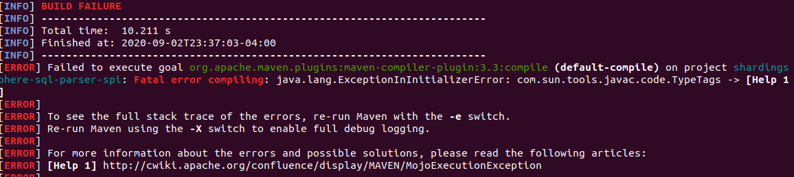
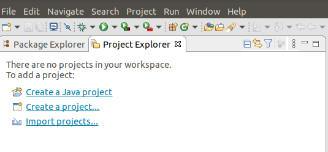
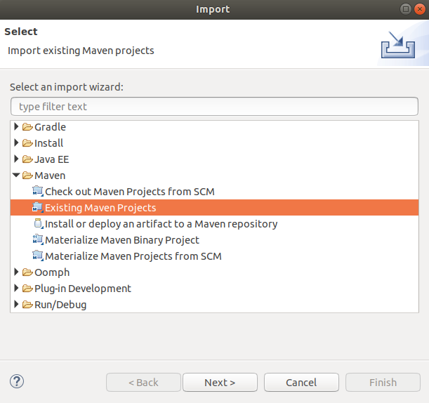
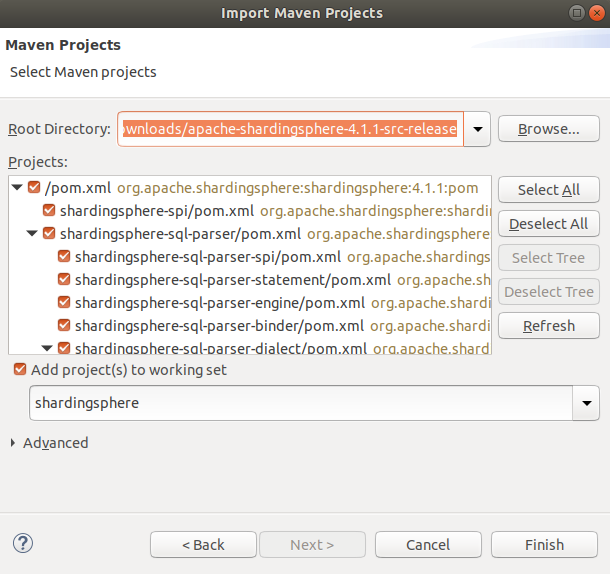
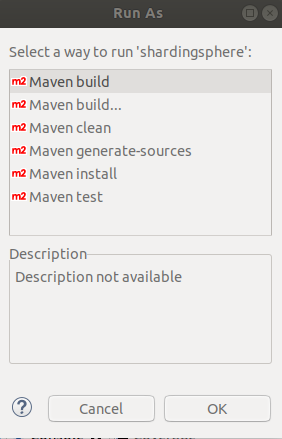
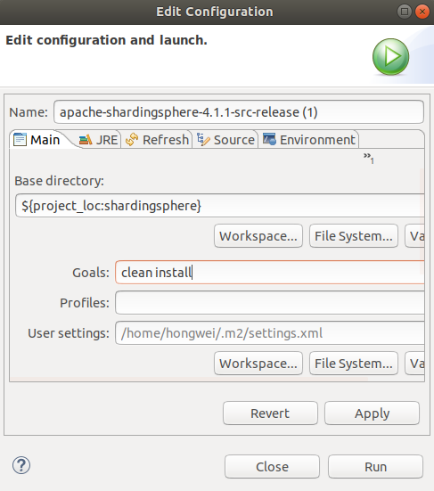
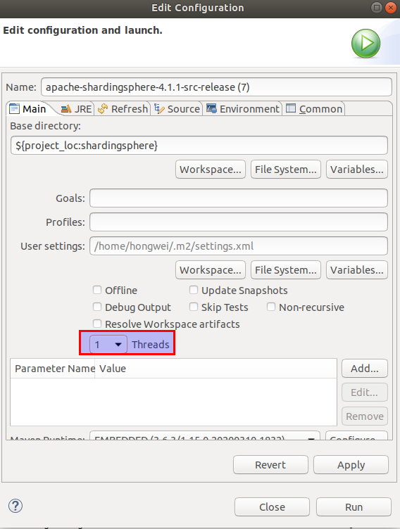
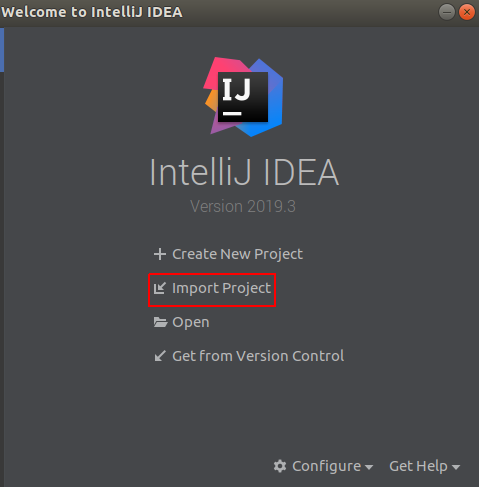
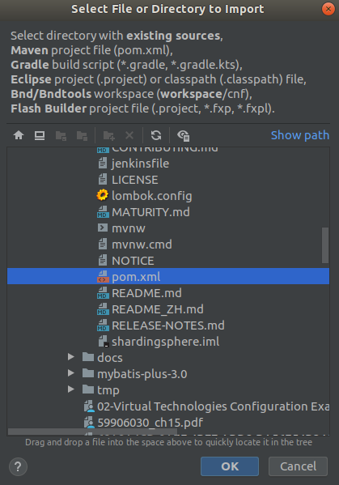
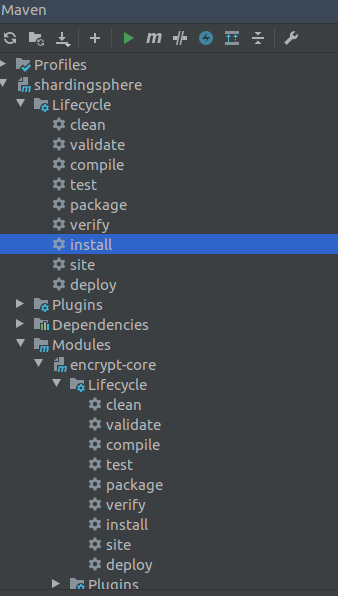

## Set Up Shardingsphere Development Environment

This document used the official release version to set up and verify development environment. 
This way could help to rule out any unstable issues of source code and to focus the issues on environment.

## Prerequisites

- Linux (Ubuntu 18.04)
- Source code [4.1.1](https://www.apache.org/dyn/closer.cgi/shardingsphere/4.1.1/apache-shardingsphere-4.1.1-src.zip) 
- Eclipse
- IntelliJ IDEA 

{}
Choose the proper IDE (Eclipse or IntelliJ IDEA), even No IDE 
{}

### Java Development Environment (No IDE)

#### Install JDK 8

    sudo apt install openjdk-8-jdk

    $ java -version
    openjdk version "1.8.0_252"
    OpenJDK Runtime Environment (build 1.8.0_252-8u252-b09-1~18.04-b09)
    OpenJDK 64-Bit Server VM (build 25.252-b09, mixed mode)

#### Install Maven (Optional)

    sudo apt install maven

    $ mvn -version
    Apache Maven 3.6.0
    Maven home: /usr/share/maven
    Java version: 1.8.0_252, vendor: Private Build, runtime: /usr/lib/jvm/java-8-openjdk-amd64/jre
    Default locale: en_US, platform encoding: UTF-8
    OS name: "linux", version: "5.4.0-42-generic", arch: "amd64", family: "unix"

#### Unzip Source Code

- Download [Source Code](https://www.apache.org/dyn/closer.cgi/shardingsphere/4.1.1/apache-shardingsphere-4.1.1-src.zip)

- Unzip the source code

        unzip apache-shardingsphere-4.1.1-src.zip

- Change file permissions 

        chmod -R 755 apache-shardingsphere-4.1.1-src-release/

#### Build and Test

Based the Github page [Build Apache ShardingSphere](https://github.com/apache/shardingsphere), there is a script to do the build  

    ./mvnw clean install -Prelease

{}
Make sure all the tests pass 
{}

#### Issues and Tricks

- Lombok in the project not support Java 11  
If Java 11 is set as default, this may cause the error below for Lombok does not support Java 11.
  

**Solution**  
Use Java 8.

- Multiple Java version installed  
If multiple versions of Java are installed on the system, such as Java 11 and Java 8, in the mean time, Java 11 is set as default, the above error will cause the build failure.
Even the default JDK is changed to Java 8 by **update-alternatives --config java**, the above issue may still be there.  

**Solution**  
Uninstall all the JDKs by the command  

    sudo apt-get remove openjdk* 

and reinstall JDK 8.

 

### Eclipse

#### Import the Project
Follow the steps below to import the project.  

Import projects... or File ---> Import...
  
  
  

{}
The import is done by m2e plugin.  
The **warning** shown below can be ignored.  
maven-remote-resources-plugin (goal "process") is ignored by m2e.
{}

#### Build and Test

Build and test as separate steps, i.e.

- Run As ---> Maven clean
- Run As ---> Maven build
- Run As ---> Maven test
- Run As ---> Maven install

  

Or define the goals at one time, i.e.
Run As ---> Maven build...  ---> Goals: (clean install)
  

{}
Specific module can be chosen and do the same build.  
Maven will build the dependencies automatically.
{}

#### Issues and Tricks

- Too many files with unapproved license  
When doing 'install', the below error occurs. No issue with 'build' and 'test', but with 'install'

>[INFO] BUILD FAILURE
> Too many files with unapproved license

**Solution**  
Use or check out clean source code, then do 'install'.

- Build failed with 8 threads  
When setting 8 threads for build, the build failed.

**Solution**  
Set build threads as 1.

 

### IntelliJ IDEA

#### Import the Project
Follow the steps below to import the project.  

On the Welcome window, select **Import Project**, then select the project POM file in the next window.
  
  

{}
The **errors** and **warnings** of the POM file analysis can be ignored.
{}

#### Build and Test

As there are errors in the POM file, the tool window of Maven lifecyle may not show up automatically.  
To add Maven support, right click on the project name in the project view, then select **Add Framework Support...**.  

In the **Maven** window, different phase of lifecyle of project or module can be chosen to build.  

  

{}
Specific module can be chosen and do the build.  
Maven will build the dependencies automatically.
{}

 

### Links
[Maven - Build Life Cycle](https://www.tutorialspoint.com/maven/maven_build_life_cycle.htm#:~:text=When%20Maven%20starts%20building%20a,are%20registered%20with%20each%20phase.&text=A%20goal%20represents%20a%20specific,and%20managing%20of%20a%20project.)  
[Introduction to the Build Lifecycle](https://maven.apache.org/guides/introduction/introduction-to-the-lifecycle.html)  

 

#### Did you find this page helpful? Consider sharing it 🙌
