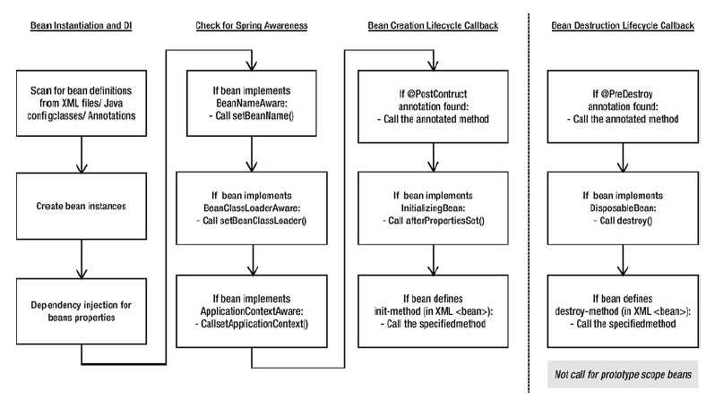

### Spring Beans

 

{}
**The objects that are managed by Spring IoC container**
{}

 

The objects that form the backbone of your application and that are managed by the **Spring IoC container** are called beans. A bean is an object that is instantiated, assembled, and otherwise managed by a Spring IoC container. These beans are created with the **configuration metadata** that you supply to the container, for example, in the form of XML <bean/> definitions.

In Spring, the objects that form the backbone of your application and that are managed by the Spring IoC container are called beans. A bean is an object that is instantiated, assembled, and otherwise managed by a Spring IoC container. Otherwise, a bean is simply one of many objects in your application. Beans, and the dependencies among them, are reflected in the configuration metadata used by a container.

Spring Bean is nothing special, any object in the Spring framework that we initialize through Spring container is called Spring Bean. Any normal Java POJO class can be a Spring Bean if it’s configured to be initialized via container by providing configuration metadata information.

### Spring IoC Container

 

{}
- Representation - org.springframework.context.ApplicationContext
- Responsibilities - instantiating, configuring, and assembling Beans
- Tool: configuration metadata

{}

 

The interface org.springframework.context.ApplicationContext represents the Spring IoC container and is responsible for instantiating, configuring, and assembling the aforementioned beans. The container gets its instructions on what objects to instantiate, configure, and assemble by reading configuration metadata. 

### Configuration Metadata

- This configuration metadata represents how you as an application developer tell the Spring container to instantiate, configure, and assemble the objects in your application.
- The configuration metadata is represented in **XML**, **Java annotations**, or **Java code**. 
- It allows you to express the objects that compose your application and the rich interdependencies between such objects.
- Spring configuration consists of at least one and typically more than one bean definition that the container must manage. 
- Consumed by Spring IoC container

### Spring Bean Scopes

**7 scopes (Spring 4.2.x) are supported out of the box. You can also create a custom scope.**  
1. **Singleton** – Only one instance of the bean will be created for each container. This is the default scope for the spring beans. While using this scope, make sure bean doesn’t have shared instance variables otherwise it might lead to data inconsistency issues.
2. **Prototype** – A new instance will be created every time the bean is requested.
3. **Request** – This is same as prototype scope, however it’s meant to be used for web applications. A new instance of the bean will be created for each HTTP request.
4. **Session** – A new bean will be created for each HTTP session by the container.
5. **Global-session** – This is used to create global session beans for Portlet applications.
6. **Application** - Scopes a single bean definition to the lifecycle of a ServletContext. Only valid in the context of a web-aware Spring ApplicationContext.
7. **Websocket** - Scopes a single bean definition to the lifecycle of a WebSocket. Only valid in the context of a web-aware Spring ApplicationContext.

{}
As of Spring 3.0, a thread scope is available, but is not registered by default.
{}

{}
- As a rule, use the prototype scope for all stateful beans and the singleton scope for stateless beans.
- The client code must clean up prototype-scoped objects and release expensive resources that the prototype bean(s) are holding. 
{}

5 of the above are available only if you use a **web-aware ApplicationContext**
- request
- session
- globalSession
- application
- websocket

#### Spring Singleton vs Singleton Pattern

Spring’s concept of a singleton bean differs from the **Singleton pattern** as defined in the Gang of Four (GoF) patterns book. The GoF Singleton hard-codes the scope of an object such that one and only one instance of a particular class is created per ClassLoader.  

The scope of the **Spring singleton** is best described as per container and per bean. This means that if you define one bean for a particular class in a single Spring container, then the Spring container creates one and only one instance of the class defined by that bean definition. 

### Spring Bean Lifecycle

#### Lifecycle Overview

The lifecycle of any object means when & how it is born, how it behaves throughout its life, and when & how it dies.
The lifecycle of Spring Beans is not different from normal beans or objects. The below picture shows the overview of the lifecycle of objects, or Spring Beans.  

As the Spring Beans are managed by Spring IoC containers. This makes the application developers not able to control the full lifecycle of Spring Beans. But Spring provides ways to add customizations into the lifecycle of Spring Beans, such as aware interfaces and callback methods, which are added in the below picture to show the lifecycle.

#### Aware Interfaces

- BeanNameAware  
The BeanNameAware interface is implemented by beans that need access to its name defined in the Spring container.  

        import org.springframework.beans.factory.BeanNameAware;

        public class BeanNameAwareImpl implements BeanNameAware {
            @Override
            public void setBeanName(String s) {
                System.out.println("Bean Name: " + s);
            }
        }

- BeanFactoryAware  
Beans might need access to the bean factory that created it, say to call any service from the bean factory.  

        import org.springframework.beans.BeansException;
        import org.springframework.beans.factory.BeanFactory;
        import org.springframework.beans.factory.BeanFactoryAware;

        public class BeanFactoryAwareImpl implements BeanFactoryAware {

            @Override
            public void setBeanFactory(BeanFactory beanFactory) throws BeansException {
                System.out.println(beanFactory.getBean("fooBean"));
            }
        }

- ApplicationContextAware  
In Spring beans, you might require access to the ApplicationContext. For example, if your bean needs to look up some other beans. Similarly, if your bean needs access to some application file resource in your bean or even publish some application events, you need access to the ApplicationContext.

        import org.springframework.beans.BeansException;
        import org.springframework.context.ApplicationContext;
        import org.springframework.context.ApplicationContextAware;

        public class ApplicationContextAwareImpl implements ApplicationContextAware {

            @Override
            public void setApplicationContext(ApplicationContext applicationContext) throws BeansException {
                FooBean userBean = (FooBean) applicationContext.getBean("fooBean");
                System.out.println("User Id: " + fooBean.getFooBeanId() + "  Bean Name :" + fooBean.getName());
            }
        }

For more aware interfaces and details, go to the link  [Interface Aware](https://docs.spring.io/spring-framework/docs/current/javadoc-api/org/springframework/beans/factory/Aware.html).

#### Lifecycle Callbacks

##### Callback Methods

{}
**InitializingBean** and **DisposableBean** callback interfaces are not recommended. 
{}

- **Initialization callbacks**  
3 options:
    * Annotation-based  
      **@PostConstruct** annotation or specify a POJO initialization method
    * XML-based  
      **init-method** attribute to specify the name of the method that has a void no-argument signature
    * Java Config  
      initMethod attribute of **@Bean**

 

- **Destruction callbacks**  
3 options:
    * Annotation-based  
      **@PreDestroy** annotation or specify a generic method that is supported by bean definitions
    * XML-Based  
      **destroy-method** attribute on the **&lt;bean/&gt;**
    * Java Config  
      **destroyMethod** attribute of **@Bean**

 

- **Startup and shutdown callbacks**  
The Lifecycle interface defines the essential methods for any object that has its own lifecycle requirements (e.g. starts and stops some background process)

##### Callback Examples

- XML-based: Custom init() and destroy() methods  
The default init and destroy methods in bean configuration file can be defined in two ways:

    * **Bean local definition** applicable to a single bean
    * **Global definition** applicable to all beans defined in beans context

    **beans.xml**  
    
    **Local definition**  
    
        <beans>
         
            <bean id="demoBean" class="com.flycoolman.callbackdemo.DemoBean"
                            init-method="customInit"
                            destroy-method="customDestroy"></bean>
         
        </beans>
    
    **Global definition**  
    
        <beans default-init-method="customInit" default-destroy-method="customDestroy">   
         
                <bean id="demoBean" class="com.flycoolman.callbackdemo.DemoBean"></bean>
         
        </beans>
    
    **DemoBean.java**  
    
        package com.flycoolman.callbackdemo;
         
        public class DemoBean 
        {
            public void customInit() 
            {
                System.out.println("Method customInit() invoked...");
            }
         
            public void customDestroy() 
            {
                System.out.println("Method customDestroy() invoked...");
            }
        }

- Annotation-based: @PostConstruct and @PreDestroy

    * @PostConstruct annotated method will be invoked after the bean has been constructed using default constructor and just before it’s instance is returned to requesting object.
    * @PreDestroy annotated method is called just before the bean is about be destroyed inside bean container.  

            package com.flycoolman.callbackdemo;  
             
            import javax.annotation.PostConstruct;  
            import javax.annotation.PreDestroy;  
             
            public class DemoBean  
            {
                @PostConstruct
                public void customInit() 
                {
                    System.out.println("Method customInit() invoked...");
                }
                 
                @PreDestroy
                public void customDestroy() 
                {
                    System.out.println("Method customDestroy() invoked...");
                }
            }

- Java Config

        public class Foo {
            public void init() {
                // initialization logic
            }
            public void cleanup() {
                    // destruction logic
                }
        }

        @Configuration
        public class AppConfig {
            @Bean(initMethod = "init", destroyMethod = "cleanup")
            public Foo foo() {
                return new Foo();
            }

#### Multiple Lifecycle Mechanisms/Execution Orders

Multiple lifecycle mechanisms configured for the same bean, with different initialization methods, are called as follows:

- Methods annotated with @PostConstruct
- afterPropertiesSet() as defined by the InitializingBean callback interface
- A custom configured init() method

 

Destroy methods are called in the same order:

- Methods annotated with **@PreDestroy**
- **destroy()** as defined by the DisposableBean callback interface
- A custom configured **destroy()** method

##### What is Callback

**From Wikipedia**  
In computer programming, a **callback**, also known as a "**call-after**" function, is **any executable code that is passed as an argument to other code**; that other code is expected to call back (execute) the argument at a given time. This execution may be immediate as in a **synchronous callback**, or it might happen at a later time as in an **asynchronous callback**. Programming languages support callbacks in different ways, often implementing them with
- subroutines,
- lambda expressions,
- blocks, 
- or function pointers.

**For Java**  
In object-oriented programming languages without function-valued arguments, such as in Java before its 1.7 version, callbacks can be simulated by passing an instance of an abstract class or interface, of which the receiver will call one or more methods, while the calling end provides a concrete implementation. Something like below (from Stackoverflow)

    public class Test {
        public static void main(String[] args) throws  Exception {
            new Test().doWork(new Callback() { // implementing class            
                @Override
                public void call() {
                    System.out.println("callback called");
                }
            });
        }

        public void doWork(Callback callback) {
            System.out.println("doing work");
            callback.call();
        }

        public interface Callback {
            void call();
        }
    }

### Spring Bean Instantiation

- Instantiation with a constructor
- Instantiation with a static factory method
- Instantiation using an instance factory method

See [Instantiating beans](https://docs.spring.io/spring/docs/4.2.x/spring-framework-reference/html/beans.html#beans-factory-class)  

### Spring Bean Configuration/Container Configuration

#### XML-based

XML-based configuration metadata shows these beans configured as <bean/> elements inside a top-level <beans/> element.

- Bean Configuration with Property  

        <?xml version="1.0" encoding="UTF-8"?>
        <beans xmlns="http://www.springframework.org/schema/beans"
            xmlns:xsi="http://www.w3.org/2001/XMLSchema-instance"
            xsi:schemaLocation="http://www.springframework.org/schema/beans
                http://www.springframework.org/schema/beans/spring-beans.xsd">

            <!-- services -->

            <bean id="petStore" class="org.springframework.samples.jpetstore.services.PetStoreServiceImpl">
                <property name="accountDao" ref="accountDao"/>
                <property name="itemDao" ref="itemDao"/>
                <!-- additional collaborators and configuration for this bean go here -->
            </bean>

            <!-- more bean definitions for services go here -->

        </beans>

- Multiple Bean Configuration

        <?xml version="1.0" encoding="UTF-8"?>
        <beans xmlns="http://www.springframework.org/schema/beans"
            xmlns:xsi="http://www.w3.org/2001/XMLSchema-instance"
            xsi:schemaLocation="http://www.springframework.org/schema/beans
                http://www.springframework.org/schema/beans/spring-beans.xsd">

            <bean id="accountDao"
                class="org.springframework.samples.jpetstore.dao.jpa.JpaAccountDao">
                <!-- additional collaborators and configuration for this bean go here -->
            </bean>

            <bean id="itemDao" class="org.springframework.samples.jpetstore.dao.jpa.JpaItemDao">
                <!-- additional collaborators and configuration for this bean go here -->
            </bean>

            <!-- more bean definitions for data access objects go here -->

        </beans>

- Multiple XML Files

        <beans>
            <import resource="services.xml"/>
            <import resource="resources/messageSource.xml"/>
            <import resource="/resources/themeSource.xml"/>

            <bean id="bean1" class="..."/>
            <bean id="bean2" class="..."/>
        </beans>

#### Annotation-based

Spring 2.5 introduced support for annotation-based configuration metadata.

{}
Annotation injection is performed before XML injection, thus the latter configuration will override the former for properties wired through both approaches.
{}

- Implicit Registeration  

        <?xml version="1.0" encoding="UTF-8"?>
        <beans xmlns="http://www.springframework.org/schema/beans"
            xmlns:xsi="http://www.w3.org/2001/XMLSchema-instance"
            xmlns:context="http://www.springframework.org/schema/context"
            xsi:schemaLocation="http://www.springframework.org/schema/beans
                http://www.springframework.org/schema/beans/spring-beans.xsd
                http://www.springframework.org/schema/context
                http://www.springframework.org/schema/context/spring-context.xsd">

            <context:annotation-config/>

        </beans>

{}
<context:annotation-config/> only looks for annotations on beans in the same application context in which it is defined.  
This means that, if you put <context:annotation-config/> in a WebApplicationContext for a DispatcherServlet, it only checks for @Autowired beans in your controllers, and not your services.
{}

- Annotate the Method  

        public class SimpleMovieLister {

            private MovieFinder movieFinder;

            @Autowired
            public void setMovieFinder(MovieFinder movieFinder) {
                this.movieFinder = movieFinder;
            }

            // ...

        }

{}
@Autowired annotation can be applied to setter methods, constructors, methods with arbitrary names and/or multiple arguments, fields, etc.
{}

For more details, go to the link 
[Annotation-based container configuration](https://docs.spring.io/spring/docs/4.2.x/spring-framework-reference/html/beans.html#beans-annotation-config)  

#### Java-based (JavaConfig)

- JavaConfig Overview

    Starting with Spring 3.0, many features provided by the Spring JavaConfig project became part of the core Spring Framework. Thus you can define beans external to your application  classes by using Java rather than XML files. To use these new features, see the @Configuration, @Bean, @Import and @DependsOn annotations.  
    
    Java configuration typically uses @Bean annotated methods within a @Configuration class.  
    
    Spring JavaConfig is a product of the Spring community that provides a pure-Java approach to configuring the Spring IoC Container. While JavaConfig aims to be a feature-complete     option for configuration, it can be (and often is) used in conjunction with the more well-known XML-based configuration approach.
    
- @Bean Annotation

    The @Bean annotation is used to indicate that a method instantiates, configures and initializes a new object to be managed by the Spring IoC container. For those familiar with Spring’s <beans/> XML configuration the @Bean annotation plays the same role as the <bean/> element. You can use @Bean annotated methods with any Spring @Component, however, they are most often used with @Configuration beans.

- @Configuration Annotation

    Annotating a class with @Configuration indicates that its primary purpose is as a source of bean definitions. Furthermore, @Configuration classes allow inter-bean dependencies to be defined by simply calling other @Bean methods in the same class. The simplest possible @Configuration class would read as follows:

        @Configuration
        public class AppConfig {

            @Bean
            public MyService myService() {
                return new MyServiceImpl();
            }

        }

For more details, go to the link 
[Java-based container configuration](https://docs.spring.io/spring/docs/4.2.x/spring-framework-reference/html/beans.html#beans-java)  

### Links
[Spring Core Technologies - beans definition](https://docs.spring.io/spring/docs/4.2.x/spring-framework-reference/html/beans.html#beans-definition)  
[初识Spring —— Bean的装配（一）](https://juejin.im/post/6844903618567471112)  
[初识Spring —— Bean的装配（二）](https://juejin.im/post/6844903619834150919)  
[What in the world are Spring beans?](https://stackoverflow.com/questions/17193365/what-in-the-world-are-spring-beans)  
[Spring注入Bean的几种方式](https://juejin.im/post/6844903813753602056)  
[Beans, BeanFactory和ApplicationContext](https://docs.huihoo.com/spring/zh-cn/beans.html)  
[Spring IoC and Bean](https://www.journaldev.com/2461/spring-ioc-bean-example-tutorial)  
[Spring Context and Bean Lifecycle callbacks: practical examples of usage](https://stackoverflow.com/questions/21163355/spring-context-and-bean-lifecycle-callbacks-practical-examples-of-usage)  
[what do you mean by callbacks?](https://stackoverflow.com/questions/25469369/what-do-you-mean-by-callbacks)  
[Spring Bean Lifecycle: Using Spring Aware Interfaces](https://dzone.com/articles/spring-bean-lifecycle-using-spring-aware-interface)  
[Bean life cycle in Java Spring](https://www.geeksforgeeks.org/bean-life-cycle-in-java-spring/)  
[Callback (computer programming)](https://en.wikipedia.org/wiki/Callback_(computer_programming))  
[Spring – Bean Life Cycle](https://howtodoinjava.com/spring-core/spring-bean-life-cycle/)  
[Spring Bean Lifecycle](https://dzone.com/articles/spring-bean-lifecycle)  

 

#### Did you find this page helpful? Consider sharing it 🙌
