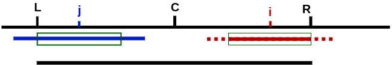
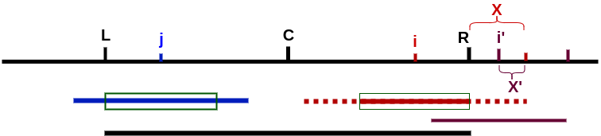

## Algorithm Description
To find a longest palindrome in a string in linear time, an algorithm may take advantage of the following characteristics or observations about a palindrome and a sub-palindrome:

1. The left side of a palindrome is a mirror image of its right side.
2. (Case 1) A third palindrome whose center is within the right side of a first palindrome will have exactly the same length as a second palindrome anchored at the mirror center on the left side, if the second palindrome is within the bounds of the first palindrome by at least one character (not meeting the left bound of the first palindrome). Such as "dacabacad", the whole string is the first palindrome, "aca" in the left side as second palindrome, "aca" in the right side as third palindrome. In this case, the second and third palindrome have exactly the same length.
3. (Case 2) If the second palindrome meets or extends beyond the left bound of the first palindrome, then the distance from the center of the second palindrome to the left bound of the first palindrome is exactly equal to the distance from the center of the third palindrome to the right bound of the first palindrome.
4. To find the length of the third palindrome under Case 2, the next character after the right outermost character of the first palindrome would then be compared with its mirror character about the center of the third palindrome, until there is no match or no more characters to compare.
5. (Case 3) Neither the first nor second palindrome provides information to help determine the palindromic length of a fourth palindrome whose center is outside the right side of the first palindrome.
6. It is therefore desirable to have a palindrome as a reference (i.e., the role of the first palindrome) that possesses characters farthest to the right in a string when determining from left to right the palindromic length of a substring in the string (and consequently, the third palindrome in Case 2 and the fourth palindrome in Case 3 could replace the first palindrome to become the new reference).
7. Regarding the time complexity of palindromic length determination for each character in a string: there is no character comparison for Case 1, while for Cases 2 and 3 only the characters in the string beyond the right outermost character of the reference palindrome are candidates for comparison (and consequently Case 3 always results in a new reference palindrome while Case 2 does so only if the third palindrome is actually longer than its guaranteed minimum length).
8. For even-length palindromes, the center is at the boundary of the two characters in the middle.

## TL;DR

Manacher's algorithm fills in a table P[i] which contains how far the palindrome centered at i extends. If P[5]=3, then three characters on either side of position five are part of the palindrome. The algorithm takes advantage of the fact that if you've found a long palindrome, you can fill in values of P on the right side of the palindrome quickly by looking at the values of P on the left side, since they should mostly be the same. 

Simply put:  
- makes either odd length or even lenght as odd length only by adding a special character, which is not in the original string, to the both sides of each character in original string.
- utilize the mirroring charateristic of a palindrome and a sub-palindrome to fill the table p[i].

---
**NOTE**

To simplify the desciption, define:
- String **S** is the original string with inserted special characters.  
- **C** is the center position of panlindrome **sub(C)** of string S.  
- **L** is the leftmost position of sub(C).  
- **R** is the rightmost position of sub(C).  
- **P[i]** is the array to store the length of panlindrome, which has center position x.  
- **i** is the position that needs to calculate the length of panlindrom, that is to calculate **P[i]** of **sub(i)**.  
- **j** is the mirroring position of i about center position C.  
- **P[j]** is the calculated/known lenght of panlindrome **sub(j)**.  

---

### Odd + Even ---> Odd only

    aba   --->  #a#b#a#
    abba  --->  #a#b#b#a#

### Mirroring

- i and j are mirroring about C  
- sub(i) and sub(j) are mirroring about C

        C - j = i - C  ---> j = 2 * C - i

  

### 3 Cases

#### Case 1: i < R and j-P[j] > L

i < R and j-P[j] > L  means  whole sub(j) within left side of sub(C)  
  

    j - P[j] > L   --->   R - i > P[j]

Based on mirroring:  

    P[i] = P[j] 

#### Case 2: i < R and j-P[j] <= L

leftmost side of sub(j) is at or outside of leftmost of sub(C)
  

    j - P[j] <= L   --->   R - i <= P[j]

From the picture, we can see P[i] is at least R - i

    P[i] >= R - i   --->   P[i] = R - i as initial value of P[i] and do calculation for the part outside R and update P[i] 

**Code for case 1 and case 2:**  

From programming convenience perspective, here make case 1 and case 2 in 1 situation i < R.  
length is the intermidiate variable of P[i].  

    if i < R:
        j = 2 * C - i
        length = min(P[j], R - i)
    while i + length < len(s) and i - length >= 0:
        if s[i + length] != s[i - length]:
            break
        length += 1    

#### Case 3: i >= R

  

No shortcuts for this situation other than brute force.  
Calculate from length of 1 at the position i as the center.  
length is the intermidiate variable of P[i].  

**Code for case 3:**  

    length = 1
    while i + length < len(s) and i - length >= 0:
        if s[i + length] != s[i - length]:
            break
        length += 1

## Full Implementation

    def longestPalindrome(self, s: str) -> str:
        if not s:
            return
        
        # Using manacher's algorithm
        # abba => #a#b#b#a#
        # s: original string
        # t: transformed string
        t = []
        for c in s:
            t.append('#')
            t.append(c)
        t.append('#')
        
        n = len(t)
        # p: P[i] table
        p = [0] * n
        p[0] = 1
        
        mid, longest = 0, 1
        for i in range(1, n):
            length = 1
            if mid + longest > i:
                mirror = mid - (i - mid)
                length = min(p[mirror], mid + longest - i)
        
            while i + length < len(t) and i - length >= 0:
                if t[i + length] != t[i - length]:
                    break;
                length += 1
            
            if length > longest:
                longest = length
                mid = i
            
            p[i] = length
        
        # remove the extra #
        longest = longest - 1
        start = (mid - 1) // 2 - (longest - 1) // 2
        return s[start:start + longest]

## Time Complexition

O(N)  
- For case 1: no comparison  
- For case 2: take the example in below picture, i' is the following position of i.  
              Even there is comparison for range X, but for the following any i', no comparison again for range X'. So ther is no repeated comparison for the whole process.   
    
- For case 3: similar to case 2.

So the time complexity is O(N).  

## Space Complexition

O(N)  
Array P to store the lengths of sub-panlindrome strings.  

## Links

[Manacher's algorithm](https://en.wikipedia.org/wiki/Longest_palindromic_substring#Manacher's_algorithm)  
[Manacher's ALGORITHM](https://www.felix021.com/blog/read.php?2040)  
[Longest Palindromic Substring](https://www.jiuzhang.com/solution/longest-palindromic-substring/#tag-lang-python)  
[Manacher's Algorithm - Finding all sub-palindromes in O(N)](https://cp-algorithms.com/string/manacher.html)   

 

