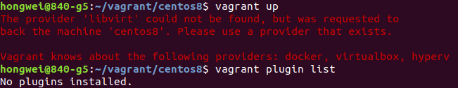
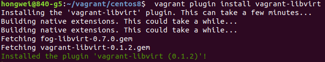
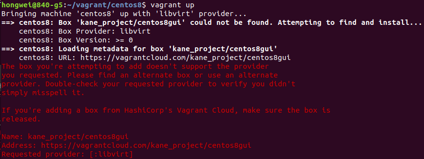
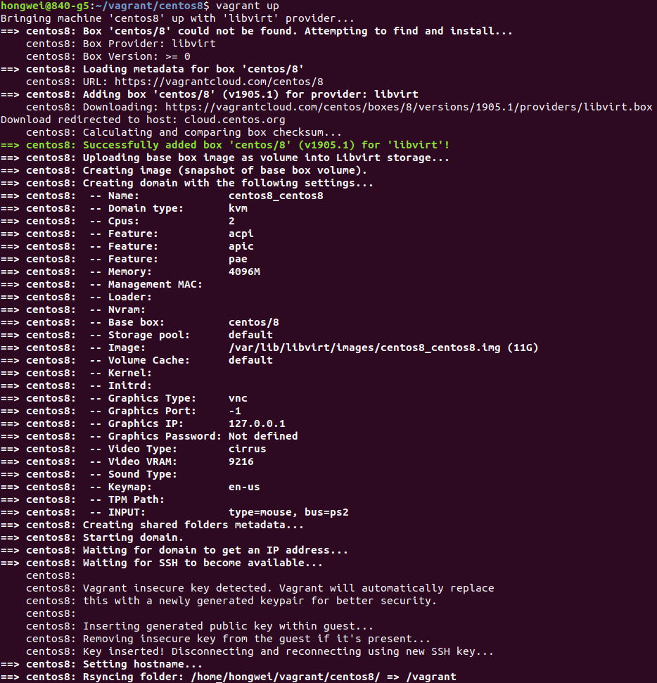
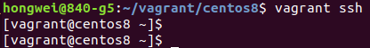
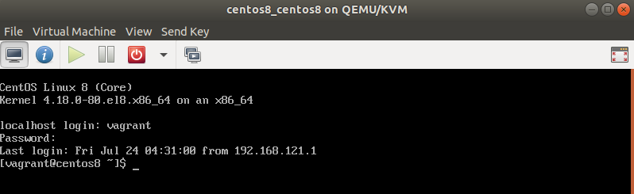

I needed to set up a development environment for this week's IETF code sprint. As this was a very short term project, I would like to
set up the environment in a VM. Instead of downloading Linux image, install it on VirtualBox or KVM, Vagrant is handy to use, particularly
for development environment. I was thinking to get some new exeperience. Then CentOS 8 came up, as I have been using CentOS 7, but no
CentOS 8 experience. And also I wanted the environment with GUI, so that I dould test my code on the VM directly.  

### Why to upgrade VirtualBox and Vagrant

I had VirtualBox and Vagrant on my machine(Ubuntu 18.04). So it was straight forward to boot up CentOS 8 by changing the Vagrant file.

>\# -\*- mode: ruby -\*-  
>\# vi: set ft=ruby :  
>  
>Vagrant.configure("2") do |config|  
>  &nbsp;&nbsp;&nbsp;&nbsp;&nbsp;config.vm.box = "centos/8"  
>  &nbsp;&nbsp;&nbsp;&nbsp;&nbsp;config.vm.box_check_update = false  
>  &nbsp;&nbsp;&nbsp;&nbsp;&nbsp;config.vm.hostname = "centos8"  
>  &nbsp;&nbsp;&nbsp;&nbsp;&nbsp;config.vm.provider "virtualbox" do |vb|  
>  &nbsp;&nbsp;&nbsp;&nbsp;&nbsp;\# Display the VirtualBox GUI when booting the machine  
>  &nbsp;&nbsp;&nbsp;&nbsp;&nbsp;&nbsp;&nbsp;&nbsp;&nbsp;&nbsp;&nbsp;vb.gui = true  
>  &nbsp;&nbsp;&nbsp;&nbsp;&nbsp;&nbsp;&nbsp;&nbsp;&nbsp;&nbsp;&nbsp;vb.memory = "4096"  
>  &nbsp;&nbsp;&nbsp;&nbsp;&nbsp;&nbsp;&nbsp;&nbsp;&nbsp;&nbsp;&nbsp;vb.cpus = 4  
>  &nbsp;&nbsp;&nbsp;&nbsp;&nbsp;end  
>end  

After  
>Vagrant up
  
I could **vagrant ssh** to the VM and there was terminal on VirtualBox console. Everything worked well until the GUI was installed and started.
I **could not** get into the GUI of CentOS.  
I guessed to upgrade the VirtualBox might resolve the issue, because I had VirtualBox 5.2. The latest version of VirtualBox is 6.1. So I started upgrading VirutalBox.  

### Upgrade VirtualBox 6.1

To install the latest version of VirtualBox, the usual way is to download the .DEB binary package simply from 
[VirtualBox downloads page](https://www.virtualbox.org/wiki/Linux_Downloads)  

    wget https://download.virtualbox.org/virtualbox/6.1.12/virtualbox-6.1_6.1.12-139181~Ubuntu~bionic_amd64.deb
  
Install the package by dpkg 

    dpkg -i virtualbox-6.1_6.1.12-139181~Ubuntu~bionic_amd64.deb
    sudo apt install -f
or apt

    sudo apt install ./virtualbox-6.1_6.1.12-139181~Ubuntu~bionic_amd64.deb

### Upgrade Vagrant 2.9.9

To support VirtualBox 6.1, I also have to upgrade Vagrant to 2.9.9. Again download the DEB package from  Vagrant release website and install with dpkg or apt.  

    curl -O https://releases.hashicorp.com/vagrant/2.2.9/vagrant_2.2.9_x86_64.deb
    sudo apt install ./vagrant_2.2.9_x86_64.deb

To verify that the installation was successful, run the following command which prints the Vagrant version: 

    vagrant --version 

### Install Virtualbox-dkms

When VirtualBox is upgraded, the old virtual machines might fail to open. Some error information like below:  

>Failed to open a session for the virtual machine xxxxxxx.  
>
>The VM session was closed before any attempt to power it on.
>
>Result Code: NS_ERROR_FAILURE (0x80004005)  
>Component: SessionMachine  
>Interface: ISession {7844aa05-b02e-4cdd-a04f-ade4a762e6b7}

Even running the command 'sudo /sbin/vboxconfig' can't resolve the issue. the dkms package needs to be reinstalled.

    dpkg -l | grep virtualbox-dkms
    sudo apt-get purge virtualbox-dkms && sudo apt-get install dkms
    sudo /sbin/vboxconfig

### Install VirtualBox Extension Pack

After the Vagrant and VirtualBox had been upgraded, unfortunately I still couldn't make the CentOS 8 GUI working, even though
I tried all the options of 'Graphics Controller'. When I tried to connect the VM by RDP, I got an error message of no 
VirtualBox Extension Pack. Here is the step to install the VirtualBox Extension Pack.  

#### Step 1

Go to the [virtualbox official website](https://www.virtualbox.org/wiki/Downloads) and download the package.  

#### Step 2

Double click the file, such as  
>Oracle_VM_VirtualBox_Extension_Pack-6.1.12  

then follow the wizard to install.

Unfortunately the RDP did not show me the desktop successfully either.

### Install Vagrant Plugin vagrant-libvirt

As I couldn't make the CentOS 8 GUI working on VirtualBox with Vagrant, then I moved to Libvirt with Vagrant.
But When I did 'vagrant up', got the below error.

It seemed that the libvirt plugin was not installed, because I installed Vagrant by DEB package, not apt.
To install Vagrant Plugin vagrant-libvert, please follow the 
[Vagrant Libvirt Provider](https://github.com/vagrant-libvirt/vagrant-libvirt#installation) 
on GitHub.

#### Step 1

The packages for building needs to be installed.
 
    apt-get build-dep vagrant ruby-libvirt  
    apt-get install qemu libvirt-bin ebtables dnsmasq-base  
    apt-get install libxslt-dev libxml2-dev libvirt-dev zlib1g-dev ruby-dev  

#### Step 2

Install the plugin.
    vagrant plugin install vagrant-libvirt

### Non-exist Box Error

I even tried some pre-built box with GUI, but the box was gone when I used the new version Vagrant.

### Terminal Mode

{}
Bad news - I have not made the CentOS 8 GUI working on VM through Vagrant with either VirtualBox or Libvirt.
{}

The pictures below show the successful terminal.

{}
The username and password for console are vagrant and vagrant.
{}

### Links

[How to Install Vagrant on Ubuntu 18.04](https://linuxize.com/post/how-to-install-vagrant-on-ubuntu-18-04/)  
[Install GNOME | How to enable GUI mode | RHEL CentOS 8](https://www.golinuxcloud.com/install-gnome-enable-gui-mode-rhel-centos-8/)  
[How to install a GUI on top of CentOS 7](https://www.techrepublic.com/article/how-to-install-a-gui-on-top-of-centos-7/)  
[Run CentOS 8 VM using Vagrant on KVM / VirtualBox / VMWare / Parallels](https://computingforgeeks.com/run-centos-8-vm-using-vagrant-on-kvm-virtualbox-vmware-parallels/)  
 

#### Did you find this page helpful? Consider sharing it 🙌
