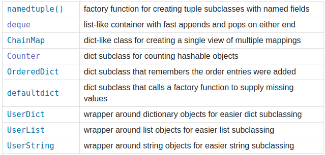

## Python Notes
A free style notes of Python.

### Class or Static Variables in Python

In C++ and Java, we can use static keyword to make a variable as class variable. The variables which don’t have preceding static keyword are instance variables.  

The Python approach is simple, it **doesn’t** require a static keyword. All variables which are assigned a value in class declaration are class variables. And variables which are assigned values inside methods are instance variables.  

### True or False

**Most Values are True:** 
- Almost any value is evaluated to True if it has some sort of content.  
- Any string is True, except empty strings.  
- Any number is True, except 0.  
- Any list, tuple, set, and dictionary are True, except empty ones.  

**Some Values are False:**  
In fact, there are not many values that evaluates to False,  
- except empty values, such as (), [], {}, "",  
- the number 0, and the value None.  
- And of course the value False evaluates to False.  

### Casting

- **int()** - constructs an integer number from an integer literal, a float literal (by rounding down to the previous whole number), or a string literal (providing the string represents a whole number)  
- **float()** - constructs a float number from an integer literal, a float literal or a string literal (providing the string represents a float or an integer)  
- **tr()** - constructs a string from a wide variety of data types, including strings, integer literals and float literals  

### Dictionary: [] vs. update
[How can I add new keys to a dictionary?](https://stackoverflow.com/questions/1024847/how-can-i-add-new-keys-to-a-dictionary)  
- **[]**  
you create a new key\value pair on a dictionary by assigning a value to that key. If the key doesn't exist, it's added and points to that value. If it exists, the current value it points to is overwritten.  
the d[key]=val syntax as it is shorter and can handle any object as key (as long it is hashable), and only sets one value

- **update**  
Whereas the .update(key1=val1, key2=val2) is nicer if you want to set multiple values at the same time, as long as the keys are strings (since kwargs are converted to strings).  
{}
dict.update can also take another dictionary, but I personally prefer not to explicitly create a new dictionary in order to update another one. 
{}

### collections
[collections — Container datatypes](https://docs.python.org/3/library/collections.html)  
This module implements specialized container datatypes providing alternatives to Python’s general purpose built-in containers, dict, list, set, and tuple.  

{}
Deprecated since version 3.3, will be removed in version 3.10: Moved Collections Abstract Base Classes to the collections.abc module. For backwards compatibility, they continue to be visible in this module through Python 3.9.
{}

### collections.abc
collections.abc — Abstract Base Classes for Containers  

### for/while else
[Why does python use 'else' after for and while loops?](https://stackoverflow.com/questions/9979970/why-does-python-use-else-after-for-and-while-loops)  
A common construct is to run a loop until something is found and then to break out of the loop. The problem is that if I break out of the loop or the loop ends I need to determine which case happened. One method is to create a flag or store variable that will let me do a second test to see how the loop was exited.

For example assume that I need to search through a list and process each item until a flag item is found and then stop processing. If the flag item is missing then an exception needs to be raised.

Using the Python for...else construct you have

    for i in mylist:
        if i == theflag:
            break
        process(i)
    else:
        raise ValueError("List argument missing terminal flag.")
Compare this to a method that does not use this syntactic sugar:

    flagfound = False
    for i in mylist:
        if i == theflag:
            flagfound = True
            break
        process(i)
    if not flagfound:
        raise ValueError("List argument missing terminal flag.")
In the first case the raise is bound tightly to the for loop it works with. In the second the binding is not as strong and errors may be introduced during maintenance.

### str.split()

Return a list of the words in the string, using sep as the delimiter string.  
for example, '1<>2<>3'.split('<>') returns ['1', '2', '3']  

- The separator can be string, not only single character  
- The return value of split  
  * if not found, the return value is the original full string, like '1<>2<>3'.split('not') returns ['1<>2<>3']  
  * if found, the strings are separated by the separator, like '1<>2<>3'.split('<>', 1) returns ['1', '2<>3']
  * ''.split('<>') returns ['']
  * ''.split('') raises exception  
  * '  1  2   3  '.split() returns ['1', '2', '3'],  
    '  1  2   3  '.split(None, 1) returns ['1', '2   3  '],  
    '  1  2   3  '.split(None) returns ['1', '2', '3']  

{}
TBD
{}

[Just a Placeholder](https://flycoolman.com)  

 

#### Did you find this page helpful? Consider sharing it 🙌
