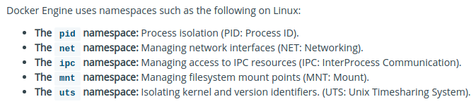
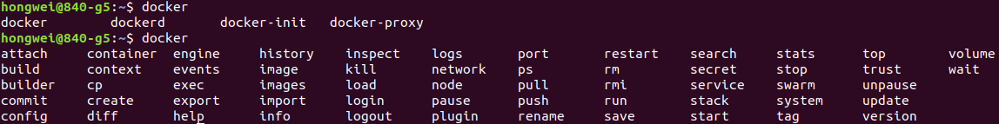

## Docker

### What is Docker?

**Docker** is basically a container engine which uses the Linux Kernel features like **namespaces** and **control groups** to create containers on top of an operating system and automates application deployment on the container. Docker uses **Copy-on-write union file system** for its **backend storage**.

### What is the difference between a docker container and a docker image?

**Docker Image** is a set of files which has no state, whereas **Docker Container** is the instantiation of Docker Image. In other words, Docker Container is the **run time instance** of images.

### What is a container?

In 4 bullet points:  
- Containers share the host kernel  
- Containers use the kernel ability to group processes for resource control  
- Containers ensure isolation through namespaces  
- Containers feel like lightweight VMs (lower footprint, faster), but are not Virtual Machines!  

### Namespaces and Cgroups  - - - - - - >  Docker

Docker makes use of kernel **namespaces** to provide the **isolated workspace** called the container.   
Docker also makes use of kernel **control groups** for resource allocation and isolation.  

### Container Format

Docker Engine combines the **namespaces**, **control groups** and **UnionFS** into a wrapper called a container format. The default container format is **libcontainer**.  

### Types of Containers

Given the above constructs, containers may be divided into 3 types as follows:  
- **System Containers** share rootfs, PID, network, IPC and UTS with host system but live inside a cgroup.  
- **Application Containers** live inside a cgroup and use namespaces (PID, network, IPC, chroot) for isolation from host system  
- **Pods** use namespaces for isolation from host system but create sub groups which share PID, network, IPC and UTS except the rootfs.  

### Images & Layers

Each Docker image references a list of **read-only layers** that represent filesystem differences. Layers are stacked on top of each other to form a base for a container’s rootfs.  
One big innovation of the Docker engine was the concept of leveraging Copy-On-Write file systems to significantly speed up the preparation of the rootfs.

### Copy-On-Write

When **Docker** creates a container, it **adds a new, thin, writable layer** on top of the underlying stack of image layers. This layer is often called the “container layer”.  
All changes made to the running container - such as writing new files, modifying existing files, and deleting files - are written to this thin writable container layer.

### Union File Systems

Union File Systems provide the following features for storage:  
- Layering
- Copy-On-Write
- Caching
- Diffing

### Dangling images

Docker images consist of multiple layers.  
- **Dangling images** are layers that have no relationship to any tagged images.  
- They no longer serve a purpose and consume disk space.  
- They can be located by adding the filter flag, **-f** with a value of **dangling=true** to the docker images command.  

**Another description:**  
- An unused image means that it has not been assigned or used in a container. For example, when running docker ps -a - it will list all of your exited and currently running containers. Any images shown being used inside any of containers are a "used image".  
- On the other hand, a dangling image just means that you've created the new build of the image, but it wasn't given a new name. So the old images you have becomes the "dangling image". Those old images are the ones that are untagged and displays "<none>" on its name when you run docker images.  
- When running **docker system prune -a**, it will remove both unused and dangling images. Therefore any images being used in a container, whether they have been exited or currently running, will NOT be affected.  

### The Difference between COPY and ADD in a Dockerfile

Sometimes you see **COPY** or **ADD** being used in a Dockerfile, but 99% of the time you should be using **COPY**, here's why.  
- **COPY** and **ADD** are both Dockerfile instructions that serve similar purposes. They let you copy files from a specific location into a Docker image.  
- **COPY** takes in a **src** and **destination**. It **only** lets you copy in a local file or directory from your host (the machine building the Docker image) into the Docker image itself.  
- **ADD** lets you do that too, but it also supports **2 other sources**. 
    * First, you can use a **URL** instead of a local file / directory.  
    * Secondly, you can extract a tar file from the source directly into the destination.  

- In most cases if you’re using a URL, you’re downloading a zip file and are then using the RUN command to extract it. However, you might as well just use RUN with curl instead of ADD here so you chain everything into 1 RUN command to **make a smaller Docker image**.  
- A valid use case for **ADD** is when you want to extract a local tar file into a specific directory in your Docker image. This is exactly what the Alpine image does with ADD rootfs.tar.gz /.  
- If you’re copying in local files to your Docker image, always use COPY because it’s more explicit.

### CMD vs. ENTRYPOINT

- Run or execute something when docker starts  
- The main purpose of a CMD is to provide defaults for an executing container  
- An ENTRYPOINT helps you to configure a container that you can run as an executable  
- CMD can be overridden, The ENTRYPOINT instruction works very similarly to CMD in that it is used to specify the command executed when the container is started. However, where it differs is that ENTRYPOINT doesn’t allow you to override the command.  
- CMD will be overridden by the ‘docker run …….’ command line, ENTRYPOINT just gets the parameter from ‘docker run …….’ command line  
- One important thing to call out about the ENTRYPOINT instruction is that syntax is critical. Technically, ENTRYPOINT supports both the ENTRYPOINT ["command"] syntax and the ENTRYPOINT command syntax. However, while both of these are supported, they have two different meanings and change how ENTRYPOINT works.

### CMD and ENTRYPOINT syntax

Both CMD and ENTRYPOINT are straight forward but they have a hidden, err, "feature" that can cause issues if you are not aware. Two different syntaxes are supported for these instructions.  

CMD /bin/echo  
 or  
CMD ["/bin/echo"]  
This may not look like it would be an issues but the devil in the details will trip you up. If you use the second syntax where the CMD ( or ENTRYPOINT ) is an array, it acts exactly like you would expect. If you use the first syntax without the array, docker pre-pends /bin/sh -c to your command. This has always been in docker as far as I can remember.  

Pre-pending /bin/sh -c can cause some unexpected issues and functionality that is not easily understood if you did not know that docker modified your CMD. Therefore, you should always use the array syntax for both instructions because both will be executed exactly how you intended.  

{}
Always use the array syntax when using CMD and ENTRYPOINT.
{}

### Docker commands

- docker build  
- docker pull  
- docker push  
- docker images …  
- docker commit  
- docker exec -it  
- docker run -it  
- docker system  
    * df  
    * events  
    * info  
    * prune  
- docker ps  

  

### Docker instructions in dockerfile
- ENV  
- RUN  
- CMD  
- ENTRYPOINT  
- COPY  
- ADD  
- USER  
- WORKDIR  
- ARG  
- EXPOSE  

### Dockerfile Best Practices
[Best practices for writing Dockerfiles](https://docs.docker.com/develop/develop-images/dockerfile_best-practices/)  
[Intro Guide to Dockerfile Best Practices](https://www.docker.com/blog/intro-guide-to-dockerfile-best-practices/)  
[Docker development best practices](https://docs.docker.com/develop/dev-best-practices/)  
[Best practices writing a Dockerfile](https://engineering.bitnami.com/articles/best-practices-writing-a-dockerfile.html)  

## Links

[The Difference between COPY and ADD in a Dockerfile](https://nickjanetakis.com/blog/docker-tip-2-the-difference-between-copy-and-add-in-a-dockerile)  

 

#### Did you find this page helpful? Consider sharing it 🙌
