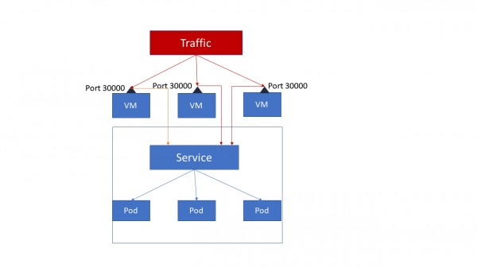

## K8S NOTES

### Kubernetes Components

- Cluster  
    * A cluster is a set of machines, called nodes, that run containerized applications managed by Kubernetes.  
    * A cluster has at least one worker node and at least one master node.  
- Node  
    * Master node(s)  
    The master node(s) manages the worker nodes and the pods in the cluster. Multiple master nodes are used to provide a cluster with failover and high availability.  
    * Worker node(s)  
    The worker node(s) host the pods that are the components of the application.  

#### Master Node Components
- kube-apiserver  
- etcd  
- kube-scheduler  
- kube-controller-manager  
    * Node Controller  
    * Replication Controller  
    * Endpoints Controller  
    * Service Account & Token Controllers  
- cloud-controller-manager  
The following controllers have cloud provider dependencies:  
    * Node Controller  
    * Route Controller  
    * Service Controller  
    * Volume Controller  

#### Worker Node Components
- Kubelet  
- kube-proxy  
- Container Runtime  

#### Addons
- DNS
- Web UI (Dashboard)
- Container Resource Monitoring
- Cluster-level Logging

### K8S Abbreviation

#### CNI

Kubernetes has adopted the Container Network Interface(CNI) specification for managing network resources on a cluster.  

#### CRI
Container Runtime Interface (CRI)  
Each container runtime has it own strengths, and many users have asked for Kubernetes to support more runtimes. CRI consists of a protocol buffers and gRPC API, and libraries, with additional specifications and tools under active development.  
Kubelet communicates with the container runtime (or a CRI shim for the runtime) over Unix sockets using the gRPC framework, where kubelet acts as a client and the CRI shim as the server.  

- Docker
- CRI-O
- Containerd
- Other CRI runtimes: frakti

#### CSI

The goal of CSI is to establish a standardized mechanism for Container Orchestration Systems (COs) to expose arbitrary storage systems to their containerized workloads. 
Assuming a CSI storage plugin is already deployed on a Kubernetes cluster, users can use CSI volumes through the familiar Kubernetes storage API objects:  
- PersistentVolumeClaims  
- PersistentVolumes  
- StorageClasses  

#### CRD

CustomResourceDefinition

### K8S Networking

#### POD Communication

- Inner POD  
Multi-containers in one POD  
Containers within a pod share an IP address and port space, and can find each other via localhost. They can also communicate with each other using standard inter-process communications.   
    * Shared volume  
    * IPC, i.e. queue  
    * Networking, localhost with different port  

- Inter PODs  

### Services

#### ClusterIP

ClusterIP accesses the services through proxy.  
ClusterIP can access services only inside the cluster.  
  

#### Nodeport

NodePort opens a specific port on each node of the cluster and traffic on that node is forwarded directly to the service.  
 

#### Loadbalancer

All the traffic on the port is forwarded to the service, there's no filtering, no routing.  
  

### Ingress Controller

Ingress Controller but there are third party solutions like **Traefik** and **Nginx** available. Ingress controller also provide L7 load balancing unlike cluster services.  

### Network policies

Isolation policies are configured on a per-namespace basis.  
[Kubernetes Networking](https://cloudnativelabs.github.io/post/2017-04-18-kubernetes-networking/)  

### K8S Objects
To find all the objects in some specific API version:  
- kubectl api-resources | cut -c92-  
- kubectl api-resources | cut -c92-150  
- kubectl api-resources | cut -c92-150 | wc -l  
- kubectl api-resources  

#### Pod

A thin wrapper around one or more containers  

#### DaemonSet

Implements a single instance of a pod on a worker node

#### Deployment

Details how to roll out (or roll back) across versions of your application

#### ReplicaSet

Ensures a defined number of pods are always running

#### Job

Ensures a pod properly runs to completion

#### Service

Maps a fixed IP address to a logical group of pods

#### Label

Key/Value pairs used for association and filtering  
Labels in Kubernetes are intended to be used to specify identifying attributes for objects. They are used by selector queries or with label selectors. Since they are used internally by Kubernetes, the structure of keys and values is constrained, to optimize queries.

#### Annotations
annotations are a way to attach non-identifying metadata to objects. This metadata is not used internally by Kubernetes, so they cannot be used to identify within k8s. Instead, they are used by external tools and libraries. Examples of annotations include build/release timestamps, client library information for debugging, or fields managed by a network policy like Calico in this case.  

#### Label vs. Annotation

You can use either labels or annotations to attach metadata to Kubernetes objects. Labels can be used to select objects and to find collections of objects that satisfy certain conditions. In contrast, annotations are not used to identify and select objects.  

#### Taints and Tolerations

Node affinity, described here, is a property of pods that attracts them to a set of nodes (either as a preference or a hard requirement). Taints are the opposite – they allow a node to repel a set of pods.

Taints and tolerations work together to ensure that pods are not scheduled onto inappropriate nodes. One or more taints are applied to a node; this marks that the node should not accept any pods that do not tolerate the taints. Tolerations are applied to pods, and allow (but do not require) the pods to schedule onto nodes with matching taints.

#### Node isolation/restriction

Adding labels to Node objects allows targeting pods to specific nodes or groups of nodes. This can be used to ensure specific pods only run on nodes with certain isolation, security, or regulatory properties.

#### NODESELECTOR
1. Attach a label to the node
2. Add a nodeSelector field to your pod configuration

#### Affinity and anti-affinity

    • Node affinity
    • Inter-pod affinity and anti-affinity
nodeSelector provides a very simple way to constrain pods to nodes with particular labels. The affinity/anti-affinity feature, currently in beta, greatly extends the types of constraints you can express. The key enhancements are:

    • The language is more expressive (not just “AND of exact match”)
    • You can indicate that the rule is “soft”/“preference” rather than a hard requirement, so if the scheduler can’t satisfy it, the pod will still be scheduled
    • You can constrain against labels on other pods running on the node (or other topological domain), rather than against labels on the node itself, which allows rules about which pods can and cannot be co-located

The affinity feature consists of two types of affinity, “node affinity” and “inter-pod affinity/anti-affinity”. Node affinity is like the existing nodeSelector (but with the first two benefits listed above), while inter-pod affinity/anti-affinity constrains against pod labels rather than node labels, as described in the third item listed above, in addition to having the first and second properties listed above.

Node affinity is conceptually similar to nodeSelector – it allows you to constrain which nodes your pod is eligible to be scheduled on, based on labels on the node.

### Deploy

When you wish to deploy an application in Kubernetes, you usually define three components:  
- a **Deployment** — which is a recipe for creating copies of your application called Pods  
- a **Service** — an internal load balancer that routes the traffic to Pods  
- an **Ingress** — a description of how the traffic should flow from outside the cluster to your Service  

### Ingress

#### What is an ingress?

In Kubernetes, an Ingress is an object that allows access to your Kubernetes services from outside the Kubernetes cluster. You configure access by creating a collection of rules that define which inbound connections reach which services.  
 
Ingress, added in Kubernetes v1.1, exposes HTTP and HTTPS routes from outside the cluster to services within the cluster. Traffic routing is controlled by rules defined on the Ingress resource.  
 
Internet---[ Ingress ]--|--|--[ Services ]
 

An Ingress can be configured to give services externally-reachable URLs, load balance traffic, terminate SSL, and offer name based virtual hosting. An Ingress controller is responsible for fulfilling the Ingress, usually with a loadbalancer, though it may also configure your edge router or additional frontends to help handle the traffic.  

An Ingress does not expose arbitrary ports or protocols. Exposing services other than HTTP and HTTPS to the internet typically uses a service of type NodePort or LoadBalancer.  
#### What is an ingress controller?

Kubernetes supports a high level abstraction called Ingress, which allows simple host or URL based HTTP routing. An ingress is a core concept (in beta) of Kubernetes, but is always implemented by a third party proxy. These implementations are known as ingress controllers.  
 
In order for the Ingress resource to work, the cluster must have an ingress controller running.  
Unlike other types of controllers which run as part of the kube-controller-manager binary, Ingress controllers are not started automatically with a cluster. Let’s see some options:  
- ALB Ingress Controller  

#### Ingress vs. Ingress controller

- Ingress should be the rules for the traffic, which indicate the destination of a request will go through in the cluster.  
- Ingress Controller is the implementation for the Ingress. GCE and Nginx are both supported by k8s. They will take care of L4 or L7 proxy.   
- Just like other objects in K8s, ingress is also a type of object, which is mainly referred as set of redirection rules.  
- Where as ingress controller is like other deployment objects(could be deamon set as well) which listen and configure those ingress rules.  
- If I talk in terms of Nginx, Ingress controller is Nginx software itself where as ingress(ingress rules) are nginx configurations.  

#### The Ingress Resource

A minimal ingress resource example:  
  

As with all other Kubernetes resources, an Ingress needs apiVersion, kind, and metadata fields. Ingress frequently uses annotations to configure some options depending on the Ingress controller, an example of which is the rewrite-target annotation. Different Ingress controller support different annotations. Review the documentation for your choice of Ingress controller to learn which annotations are supported.  
The Ingress spec has all the information needed to configure a loadbalancer or proxy server. Most importantly, it contains a list of rules matched against all incoming requests. Ingress resource only supports rules for directing HTTP traffic.  

#### Ingress Rules

Each http rule contains the following information:  
- An optional host. In this example, no host is specified, so the rule applies to all inbound HTTP traffic through the IP address specified. If a host is provided (for example, foo.bar.com), the rules apply to that host.  
- A list of paths (for example, /testpath), each of which has an associated backend defined with a serviceName and servicePort. Both the host and path must match the content of an incoming request before the loadbalancer will direct traffic to the referenced service. 
- A backend is a combination of service and port names as described in the services doc. HTTP (and HTTPS) requests to the Ingress matching the host and path of the rule will be sent to the listed backend.  
- A default backend is often configured in an Ingress controller that will service any requests that do not match a path in the spec.  

#### Default Backend

An Ingress with no rules sends all traffic to a single default backend. The default backend is typically a configuration option of the Ingress controller and is not specified in your Ingress resources.  

If none of the hosts or paths match the HTTP request in the Ingress objects, the traffic is routed to your default backend.

### ConfigMap

[Ultimate Guide to ConfigMaps in Kubernetes](https://matthewpalmer.net/kubernetes-app-developer/articles/ultimate-configmap-guide-kubernetes.html)  

### Secrets

Secret data should be stored and handled in a way that can be easily hidden and possibly encrypted at rest if the environment is configured as such. The Secret data is represented as base64-encoded information, and it is critical to understand that this is not encrypted. As soon as the secret is injected into the pod, the pod itself can see the secret data in plain text.  

Secret data is meant to be small amounts of data, limited by default in Kubernetes to 1 MB in size, for the base64-encoded data, so ensure that the actual data is approximately 750 KB because of the overhead of the encoding.

There are three types of secrets in Kubernetes:  
- generic  
regular key/value pairs that are created from a file, a directory, or from string literals using the --from-literal= parameter.  
- docker-registry  
This is used by the kubelet when passed in a pod template if there is an imagePullsecret to provide the credentials needed to authenticate to a private Docker registry:  
- tls  
This creates a Transport Layer Security (TLS) secret from a valid public/private key pair. As long as the cert is in a valid PEM format, the key pair will be encoded as a secret and can be passed to the pod to use for SSL/TLS needs.  

### ConfigMaps vs Secrets

- the ConfigMap API is meant more for string data that is not really sensitive data. If your application requires more sensitive data, the Secrets API is more appropriate.  
- ConfigMap data can be injected as either a volume mounted into the pod or as environment variables.  
- Secrets are also mounted into tmpfs only on the nodes that have a pod that requires the secret and are deleted when the pod that needs it is gone. This prevents any secrets from being left behind on the disk of the node.  

### Roles

Kubernetes has two types of roles, role and clusterRole, the difference being that role is specific to a namespace, and clusterRole is a cluster-wide role across all namespaces.

### RoleBindings

The RoleBinding allows a mapping of a subject like a user or group to a specific role. Bindings also have two modes: roleBinding, which is specific to a namespace, and clusterRoleBinding, which is across the entire cluster.  

### Storage

- PersistentVolume – the low level representation of a storage volume  
- Volume Driver – the code used to communicate with the backend storage provider  
- Pod – a running container that will consume a PersistentVolume  
- PersistentVolumeClaim – the binding between a Pod and PersistentVolume  
- StorageClass – allows for dynamic provisioning of PersistentVolumes  

#### Controllers and Kubelets
Kubernetes has a number of controllers that run on the masters, monitor the state of the cluster and initiate actions in response to events.  
It also runs a kubelet process on all of the worker nodes. The kubelet stays in constant contact with the controllers, submitting metrics about current running pods and listening for new instructions.  

##### Kubelet:
- Mount and format new PersistentVolumes that are scheduled to this host  
- Start containers with PersistentVolume hostpath mounted inside the container  
- Stop containers and unmount the associated PersistentVolume  
- Constantly send metrics to the controllers about container & PersistentVolume state  

##### Controller:
- to match a PersistentVolumeClaim to a PersistentVolume  
- to dynamically provision a new PersistentVolume if a claim cannot be met (if enabled)  
    * in the case of EBS this is done via the AWS api from the masters  
- to attach the backend storage to a specific node if needed  
    * in the case of EBS this is done via the AWS api from the masters  
- to instruct the kubelet for a node to mount (and potentially format) the volume  
    * this is done on the actual node  
- to instruct the kubelet to start a container that uses the volume  
The kubelet itself performs the low-level mount and mkfs commands when instructed by the controller.  

### Kubernetes Operator

An Operator is an application-specific controller that extends the Kubernetes API to create, configure, and manage instances of complex stateful applications on behalf of a Kubernetes user. It builds upon the basic Kubernetes resource and controller concepts but includes domain or application-specific knowledge to automate common tasks.  
Examples are:  
- elasticsearch-operator 
- prometheus-operator
- cassandra-operator
- Flux  The GitOps Kubernetes Operator

{}
TBD
{}

### Troubleshooting

[A visual guide on troubleshooting Kubernetes deployments](https://learnk8s.io/troubleshooting-deployments) | [PDF](./A-visual-guide-on-troubleshooting-Kubernetes.pdf) 

## Links

[Kubernetes Networking](https://cloudnativelabs.github.io/post/2017-04-18-kubernetes-networking/)  
[Ultimate Guide to ConfigMaps in Kubernetes](https://matthewpalmer.net/kubernetes-app-developer/articles/ultimate-configmap-guide-kubernetes.html)  
[A visual guide on troubleshooting Kubernetes deployments](https://learnk8s.io/troubleshooting-deployments)  
[A Basic Guide to Kubernetes Storage: PVS, PVCs, Statefulsets and More](https://portworx.com/basic-guide-kubernetes-storage/)  

 

#### Did you find this page helpful? Consider sharing it 🙌
