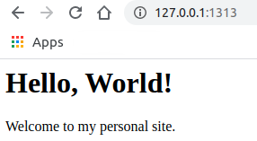

When I create this website, I find that there are no documents to walk me through each step from 'Hello World' to deployment till customization. This makes me have the idea to create one and help others to understand the whole process. In this tutorial, we will use the tools **GitHub Pages**, **Hugo** and **Academic**.  
This is the [Part-1](https://flycoolman.com/post/build-a-free-website-in-minutes-part-1/) of this series.

 

## Prerequisites

Before contiduing this tutorial, you should have the basic knowledge of the following items:  

- Git
- GitHub
- HTTP
- HTTPS
- DNS

{}
If you are familiar with these and just want to build your website quickly, you can jump to [Part-3](https://flycoolman.com/post/build-a-free-website-in-minutes-part-3/).
{}

 

## Tools

### GitHub Pages

[GitHub Pages](https://pages.github.com/) is a static site hosting service that takes HTML, CSS, and JavaScript files straight from a repository on GitHub, optionally runs the files through a build process, and publishes a website.

### Hugo

[Hugo](https://gohugo.io/) is a fast and modern static site generator written in Go.

### Academic

[Academic](https://themes.gohugo.io/academic/) is a website builder for Hugo. Build *anything* with widgets and personalize your site with themes, plugins, and language packs.

 

## How to Use the Tools

From the brief introduction above, you have known what the tools are. Basically we will use Hugo to generate the website, personalize it with Academic, and deploy it to GitHub Pages. Now let's put hands on it. We will start from 'Hello World'.

### Hello World of GitHub Pages

Please follow the [GitHub Pages Hello World Guide](https://pages.github.com/).

### Hello World of Hugo

Hugo official site has [a quick start on macOS](https://gohugo.io/getting-started/quick-start/). But it may not install the latest version of Hugo, like on Ubuntu 18.04, the Hugo version is quite old if installing by **apt**. I will introduce the steps on Ubuntu 18.04 here.

#### Step 1 - Install

    mkdir -p temp
    cd temp/
    wget https://github.com/gohugoio/hugo/releases/download/v0.73.0/hugo_0.73.0_Linux-64bit.deb
    sudo dpkg -i hugo_0.73.0_Linux-64bit.deb
    hugo version

The output like below
>Hugo Static Site Generator v0.73.0-428907CC linux/amd64 BuildDate: 2020-06-23T16:30:43Z

#### Step 2 - New Site

    sudo rm hugo_0.73.0_Linux-64bit.deb 
    mkdir hugo-sites
    cd hugo-sites/
    hugo new site hello-world

The output like below
>Congratulations! Your new Hugo site is created in /home/hongwei/temp/hugo-sites/hello-world.
>
>Just a few more steps and you're ready to go:
>
>1. Download a theme into the same-named folder.
>   Choose a theme from https&#58;//themes.gohugo.io/ or
>   create your own with the "hugo new theme <THEMENAME>" command.
>2. Perhaps you want to add some content. You can add single files
>   with "hugo new <SECTIONNAME>/<FILENAME>.<FORMAT>".
>3. Start the built-in live server via "hugo server".
>
>Visit https&#58;//gohugo.io/ for quickstart guide and full documentation.

Let's see the structure of the directory

    cd hello-world
    tree
The output like below  
  

Let's check the result

    hugo server

Now go to http://127.0.0.1:1313, you get a blank page.  

#### Step 3 - Hello World

To ask the website to say 'Hello World', we need to add content and template.  
Add a file named **_index.md** in the fold of **content**  

    cd content/
    vi _index.md

The file content

>\-\-\-  
>title: Hello, World!  
>description: |  
>&nbsp; &nbsp; My personal site.  
>\-\-\-
>
>Welcome to my personal site.

Add a html template file named **index.html** in the fold of **layouts**  

    cd ..
    cd layouts/
    vi index.html
    cd ..  

To check the result  

    hugo server

Now you get the 'Hello World' page.  
  

 

To customize the website, we will discuss Hugo theme and Academic in [Part-2](https://flycoolman.com/post/build-a-free-website-in-minutes-part-2/).  

 

#### Did you find this page helpful? Consider sharing it 🙌
