This document preassumes that you are familiar with VirtualBox, Vagrant on Linux.  

## Prerequisites
- VirtualBox
- Vagrant

## What to Build
- 3 Virtual Machines
- 3 MySQL instances running on the 3 VMs
- Employees Sample Database
- Data replication

## IP Settings
- Master  - 192.168.0.201
- Slave-1 - 192.168.0.202
- Slave-2 - 192.168.0.203

## Vagrantfiles
- [Vagrantfile-Master](./Vagrantfile-master)
- [Vagrantfile-Slave-1](./Vagrantfile-slave-1)
- [Vagrantfile-Slave-2](./Vagrantfile-slave-2)

## Steps

### Boot up Virtual Machines
- Use 'vagrant up' to boot up 3 virtual machines.
- Use 'vagrant halt' to power off the VMs
- Open VirtualBox GUI and change the MAC addresses of the 3 VMs  
Make sure the 3 VMs have different MAC addresses

### Install MySQL Server

Install MySQL server on the 3 VMs separately.  
The guide [How To Install MySQL on CentOS 8](https://www.digitalocean.com/community/tutorials/how-to-install-mysql-on-centos-8) can be referenced.

    sudo dnf install mysql-server
    sudo systemctl start mysqld.service
    sudo systemctl status mysqld
    sudo systemctl enable mysqld
    sudo mysql_secure_installation
    mysqladmin -u root -p version
    mysql -u root -p

### Configure MySQL Server on Master VM

- Edit MySQL configuration file '/etc/my.cnf'. Add the below configuration.  
>[mysqld]  
>log-bin=mysql-bin # Optinal  
>server-id=1　　　　# Must  
>  
>bind-address = 0.0.0.0 # Must

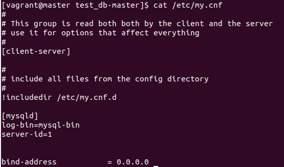

- Restart MySQL server service  

System command:

    sudo systemctl restart mysqld

- Create user for syncing data  

MySQL commands:  

    CREATE USER 'repl'@'192.168.0.%' IDENTIFIED BY '123456';  
    GRANT REPLICATION SLAVE ON *.* TO 'repl'@'192.168.0.%';  
    FLUSH PRIVILEGES;  

- Check master status

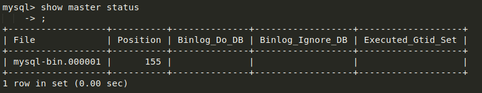

### Configure MySQL Server on Slave VM

- Edit MySQL configuration file '/etc/my.cnf'. Add the below configuration. 

>[mysqld]  
>server-id=2 

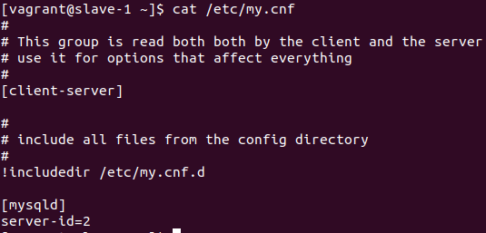

- Restart MySQL server service  

System command:

    sudo systemctl restart mysqld

- Configure syncronization  

MySQL command:  

    change master to master_host='192.168.0.201', master_user='repl', master_password='123456', master_log_file='mysql-bin.000001', master_log_pos=155;

    start slave;

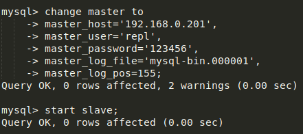

- Check slave status  

Both **Slave_IO_Running** and **Slave_SQL_Running** should be '**Yes**'.

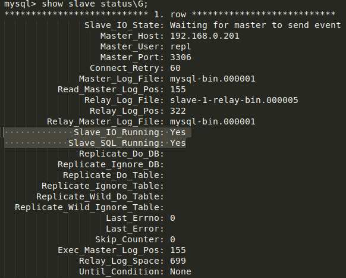

{}
Same configuration and steps on Slave-2 VM, except the **server-id=3**.
{}

### Import the 'Employees Sample Database'

- Sync folder
{}
Note that when you vagrant ssh into your machine, you're in /home/vagrant. /home/vagrant is a different directory from the synced /vagrant directory.
{}

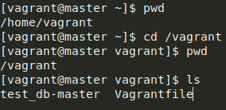

{}
By default, Vagrant only syncs the folders on **vagrant up** or **vagrant reload**.  
The tool **rsync** can be used for data syncronization.
{}

- Download the 'Employees Sample Database'

Download the zip file from [Employees DB on GitHub](https://github.com/datacharmer/test_db), unzip the file and put the unzipped folder into the master VM folder of the host machine.

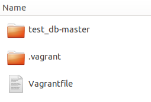

- Reload the master VM

Here we use the simple way, just reload the master VM.

- Import the database

On master VM:  

    cd test_db-master/
    mysql -u root -p -t < employees.sql

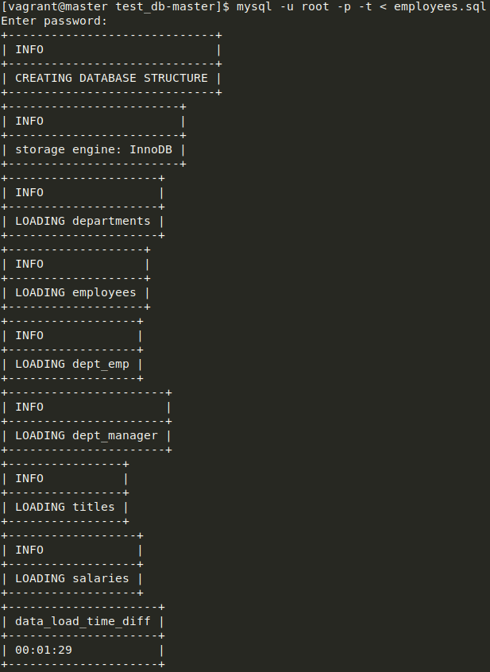

- Validating the Employee Data

time mysql -u root -p -t < test_employees_sha.sql

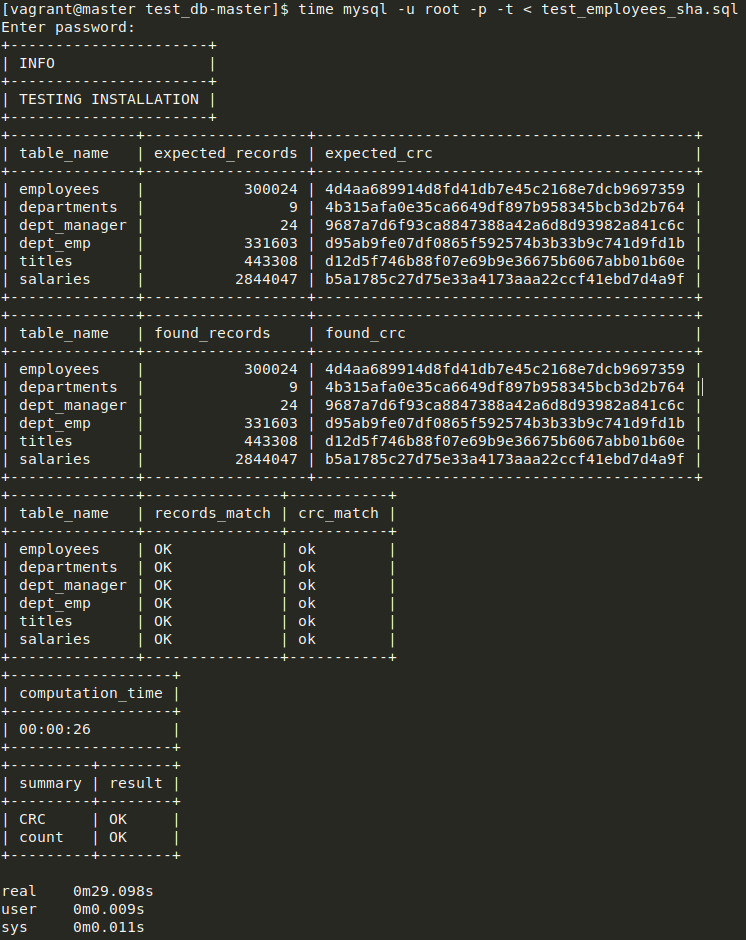

- Check data on slaves

Now you can see all the data has been replicated on the slave servers.

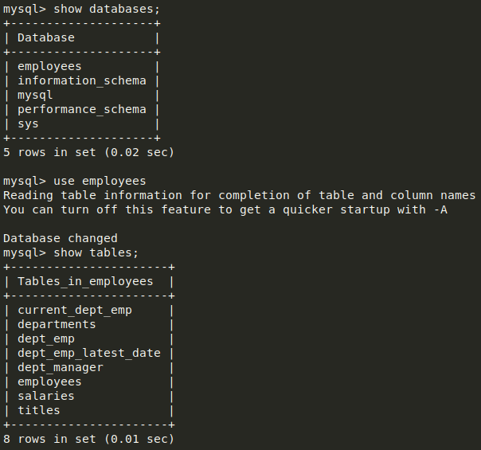
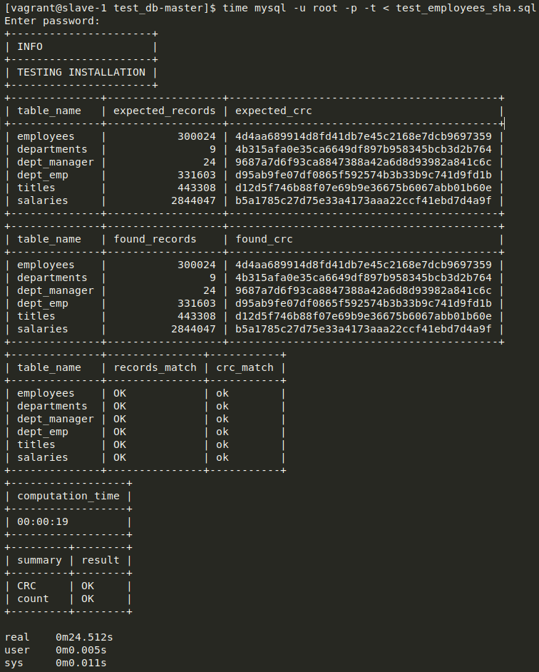

### Errors

#### Slave_IO_Running: No

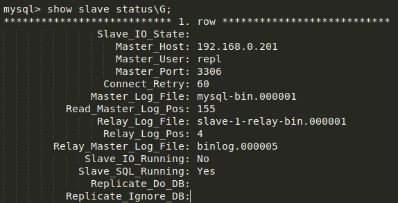

Possible reasons:  
- Forget to restart mysqld service  
- Forget to bind address.

Solution:
- Restart mysqld service
- Use netstat to check the status, i.e.

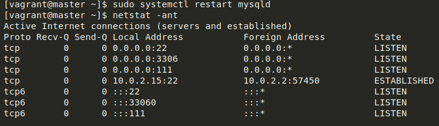

### Links

[Synced Folders](https://www.vagrantup.com/intro/getting-started/synced_folders)  
[How To Install MySQL on CentOS 8](https://www.digitalocean.com/community/tutorials/how-to-install-mysql-on-centos-8)  
[Employees Sample Database](https://dev.mysql.com/doc/employee/en/)  
[MySQL Cluster COnfiguration](https://www.cnblogs.com/cjsblog/p/9706370.html)  
[How To Import SQL File](https://stackoverflow.com/questions/17666249/how-do-i-import-an-sql-file-using-the-command-line-in-mysql)
 

#### Did you find this page helpful? Consider sharing it 🙌
