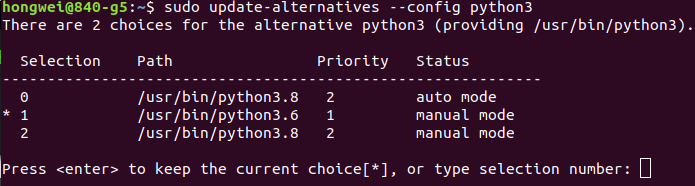

### Symptom

After the upgrade from Python 3.6 to Python 3.8:

- Ubuntu Software Center not working
- Can't start terminal by Ctl+Alt+t
- Can't start terminal or software
- Error Message - A problem occured when checking for the updates

### Root cause

After the Python 3 upgrade, I changed the Update-alternatives configuration. Fortunately I remembered it!

### Solution

Start terminal in right click menu and change back to the original configuration of update-alternatives, as below:

  

 

#### Did you find this page helpful? Consider sharing it 🙌
