---
[OSPF](#ospf)  
[ISIS](#isis)  
[BGP](#bgp)  
[VXLAN](#vxlan)  
[EVPN](#evpn)  
[SR](#sr)  
[SR-MPLS](#sr-mpls)  
[SRv6](#srv6)  

---
## OSPF

### Route types
- Intra-Area (O)
- Inter-Area (O IA)
- External Type 1 (E1)
- NSSA Type 1 (N1)
- External Type 2 (E2)
- NSSA Type 2 (N2)

A type 1 route has a metric that is the sum of the internal OSPF cost and the external redistributed cost. A type 2 route has a metric equal only to the redistributed cost.

### Packet
- IP, 89
- 5 Types
  * Hello
  * DD (Database Description)
  * LSR (Link State Request)
  * LSU (Link State Update)
  * LSAck (Link State Acknowledgement)

LSA (Link State Advertisement)
LSDB (Link State Database)

### LSA Types
- Router LSA (Type-1) By Router
- Network LSA（Type-2) by DR
- Network Summary LSA（Type-3） by ABR (Area Border Router)
- ASBR Summary LSA（Type-4) by ABR
- AS External LSA（Type-5） by ASBR
- NSSA External LSA（Type-7） by ASBR in NSSA (Not-so-stubby Area)
- Opaque LSA
  * Type 9 (Grace LSA), for GR (Grace Restart), link local
  * Type 10, flood in area
  * Type 11, flood in AS

### Area
- Backbone area
- Normal area
- Stub area
- Totally Stub area
- NSSA
- Totally NSSA

Virtual link, transit area

### Router Types
- Internal Router
- ABR
- Backbone Router
- ASBR

### Network Types
- Broadcast, 224.0.0.5 (224.0.0.6 for DR/BDR)
- NBMA, unicast
- P2MP, 224.0.0.5
- P2P, 224.0.0.5

### DR/BDR
- DR/BDR
- DR other

### DR/BDR Election
Priority + Router ID
1. Priority > 0
2. Priority higher
3. Router ID higher

### Neighbor States
[OSPF Neighbor States](https://www.cisco.com/c/en/us/support/docs/ip/open-shortest-path-first-ospf/13685-13.html)  
- Down
- Attempt (only in NBMA)
- Init
- 2-Way
- ExStart
- Exchange
- Loading
- Full

### Neighborship on Ethernet
[OSPF NEIGHBOR STATES – OSPF NEIGHBOR FORMING PROCESS](https://www.firewall.cx/networking-topics/routing/ospf-routing-protocol/1142-ospf-adjacency-neighbor-states-forming-process.html)  
Down--->Init--->2-Way---(DR Election)--->ExStart---(DD)--->Exchange(DD)--->Loading---(LSR,LSU,LSAck)--->Full

---

## IS-S
ISIS（Intermediate System-to-Intermediate System)  

- IS (Intermediate System)
- ES（End System）
- RD（Routing Domain）
- Area
- LSDB (Link State DataBase)
- LSPDU (Link State Protocol Data Unit)
- NPDU（Network Protocol Data Unit）
- DIS (Designated IS)
- NSAP（Network Service Access Point）

### ISIS Address (NSAP Address)
[NSAP Addresses](https://sites.google.com/site/amitsciscozone/is-is/nsap-addresses?authuser=0)  
#### IDP + DSP
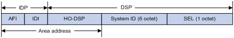  
ISIS Address = IDP + DSP = (AFI + IDI) + (HO-DSP + ID + SEL)  
**ISIS Address = Area address + System ID + SEL**
Area Address = AFI + IDI + HO-DSP
IDP = AFI + IDI  
DSP = HO-DSP + ID + SEL  

- IDP（Initial Domain Part）
- DSP（Domain Specific Part）
- AFI（Authority and Format Identifier)
- IDI（Initial Domain Identifier）
- HO-DSP（High Order Part of DSP

- SEL, a.k.a. N-SEL（NSAP Selector）
- ID, a.k.a. System ID

### Router Types
- Level-1 Router
- Level-2 Router
- Level-1-2 Router, has two LSDB

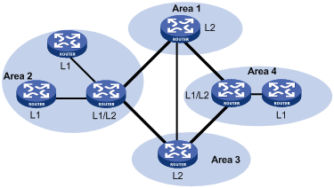  

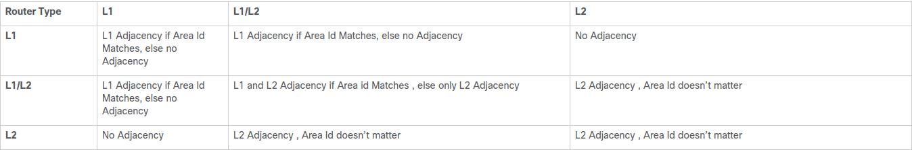  
[ISIS Adjacency and Area Types](https://www.cisco.com/c/en/us/support/docs/ip/integrated-intermediate-system-to-intermediate-system-is-is/200293-IS-IS-Adjacency-and-Area-Types.html) 

### Network Types
- Broadcast
- P2P

### DIS
- Level-1 and Level-2 have their own DIS
- Priority >= 0, not > 0
- Priority > SNPA address
- Highest Priority ---> Largest SNPA(MAC)

SNPA is MAC in Broadcast network

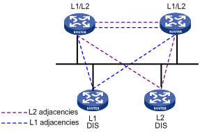  
[Designated IS](https://sites.google.com/site/amitsciscozone/is-is/designated-is?authuser=0)  
- All routers have adjency with other routers in the same level, **NOT** only with DIS.  
- DIS to sync up LSDB.  
- DIS to create and update Pseudonode.
- All routers on the broadcast network, including the DIS, form adjacencies with the Pseudonode. 
- The DIS assigns the LAN ID (similar to System ID) to the broadcast network. The LAN ID is created by concatenating the System ID of the DIS with its Circuit ID (Pseudonode ID, in this case) for the attached network. All routers on the network will use the LAN ID assigned by the DIS.

### ISIS Packet

| Type |                     PDU                  |   Abbr.      |
|------|------------------------------------------|--------------|
|  15  |  Level-1 LAN ISIS Hello PDU             | L1 LAN IIH   |
|  16  |  Level-2 LAN ISIS Hello PDU             | L2 LAN IIH   |
|  17  |  Point-to-Point ISIS Hello PDU          | P2P IIH      |
|  18  |  Level-1 Link State PDU                  | L1 LSP       |
|  20  |  Level-2 Link State PDU                  | L2 LSP       |
|  24  |  Level-1 Complete Sequence Numbers PDU   | L1 CSNP      |
|  25  |  Level-2 Complete Sequence Numbers PDU   | L2 CSNP      |
|  26  |  Level-1 Partial Sequence Numbers PDU    | L1 PSNP      |
|  27  |  Level-2 Partial Sequence Numbers PDU    | L2 PSNP      |

- Hello (IS-to-IS Hello PDUs), Level-1 LAN IIH, Level-2 LAN IIH, P2P IIH
- LSP Link state packet (LSP)
- SNP (Sequence Number Packet)
  * PSNP  
  PSNP only lists one or more last received LSP sequence numbers, and confirms multiple LSPs. When detecting asynchronous LSDBs, the system asks neighbors to send new LSPs by PSNPs.
  * CSNP  
  CSNP contains all LSP digest information in an LSDB, synchronizing LSDBs for neighbor routers.

### ISIS Adjacency States
There are only three adjacency states in ISIS.  
Down----->Initializing------>Up  
- Down  
This is the initial state. Its means that no hellos have been received from the neighbor.

- Initializing  
This state means that the local router has successfully received hellos from the neighboring router, however it’s not sure that the neighboring router has also successfully received local router’s hellos.

- Up  
Now it’s confirmed that neighboring router is receiving local router’s hellos. 

### ISIS MAC ADDRESS
- 0180.c200.0014 --- All L1 IS devices
- 0180.c200.0015 --- All L2 IS devices
- 0900.2b00.0005 --- All IS devices

---

## BGP

### Message Types
- Open  
- Update  
- Keepalive  
- Route-refresh  
- Notification  

TCP 179

### BGP Attributes
[BGP path attributes](https://techhub.hpe.com/eginfolib/networking/docs/switches/K-KA-KB/15-18/5998-8164_mrg/content/ch15s07.html)  
1. Origin (IGP, EGP, Incomplete)
2. AS_PATH (Avoid loop, Route selection, Route filtering)
    - AS_SEQUENCE  
    - AS_SET  
3. NEXT_HOP
4. MED（Multi-Exit Discriminator)
5. LOCAL_PREF (IBGP only, the higher, the better)
6. COMMUNITY (4 bytes)
    - INTERNET      ---        to all BGP neighbors
    - NO_EXPORT     ---        NOT beyond local AS or confederation (OK to sub-as)
    - NO_ADVERTISE  ---        NOT to any BGP neighbors
    - NO_EXPORT_SUBCONFED  --- NOT beyond local AS or confederation (NOT to sub-as)
7. EXTENDED COMMUNITY (8 bytes)
    - VPN target
    - SoO (Site of Origin), avoid loop
      * an 16 bits autonomous system number and an arbitrary number, i.e. 101:3
      * an IP address and an arbitrary number, i.e. 192.168.122.15:1
      * an 32 bits autonomous system number and an arbitrary number, i.e. 65536:1

|Name                     |     Category                 |
|-------------------------|------------------------------|
|ORIGIN                   |  Well-known mandatory        |
|AS_PATH                  |  Well-known mandatory        |
|NEXT_HOP                 |  Well-known mandatory        |
|LOCAL_PREF               |  Well-known discretionary    |
|ATOMIC_AGGREGATE         |  Well-known discretionary    |
|COMMUNITY Optional       |  transitive                  |
|MULTI_EXIT_DISC (MED)    |  Optional non-transitive     |
|ORIGINATOR_ID            |  Optional non-transitive     |
|CLUSTER_LIST             |  Optional non-transitive     |

### Path Selection
[BGP Best Path Selection Algorithm](https://www.cisco.com/c/en/us/support/docs/ip/border-gateway-protocol-bgp/13753-25.html)  
1. Prefer the path with the highest WEIGHT.  
2. Prefer the path with the highest LOCAL_PREF.  
3. Prefer the path that was locally originated via a network or aggregate BGP subcommand or through redistribution from an IGP.  
Local paths that are sourced by the network or redistribute commands are preferred over local aggregates that are sourced by the aggregate-address command.  
4. Prefer the path with the shortest AS_PATH.  
5. Prefer the path with the lowest origin type.  
6. Prefer the path with the lowest multi-exit discriminator (MED).  
7. Prefer eBGP over iBGP paths.  
If bestpath is selected, go to Step 9 (multipath).
8. Prefer the path with the lowest IGP metric to the BGP next hop.  
Continue, even if bestpath is already selected.
9. Determine if multiple paths require installation in the routing table for BGP Multipath.  
Continue, if bestpath is not yet selected.
10. When both paths are external, prefer the path that was received first (the oldest one).  
11. Prefer the route that comes from the BGP router with the lowest router ID.  
12. If the originator or router ID is the same for multiple paths, prefer the path with the minimum cluster list length.  
13. Prefer the path that comes from the lowest neighbor address.  

### BGP Neighbor States
- Idle
- Connect
- Active
- OpenSent
- OpenConfirm
- Established 
  

### BGP Route Advertisement Rules
[BGP route advertisement rules](https://techhub.hpe.com/eginfolib/networking/docs/switches/5930/5200-4579_l3-ip-rtng_cg/content/491335171.htm)  
- When multiple feasible routes to a destination exist, BGP advertises only the optimal route to its peers. If the advertise-rib-active command is configured, BGP advertises the optimal route in the IP routing table. If not, BGP advertises the optimal route in the BGP routing table.
- BGP advertises only routes that it uses.
- BGP advertises routes learned from an EBGP peer to all BGP peers, including both EBGP and IBGP peers.
- BGP advertises routes learned from an IBGP peer to EBGP peers, rather than other IBGP peers.
- After establishing a session with a new BGP peer, BGP advertises all the routes matching the above rules to the peer. After that, BGP advertises only incremental updates to the peer.

---

## VXLAN
### VXLAN Terms
- VXLAN（Virtual eXtensible LAN)  
- MAC in UDP  
- 2^24(16777216) VXLAN  
- Underlay vs Overlay  
- VXLAN ID, a.k.a. VNI (VXLAN Network Identifier)  
- VTEP (VXLAN Tunnel End Point)  
- VXLAN Tunnel  
- VSI (Virtual Switch Instance), 1:1 mapping to VXLAN
- AC（Attachment Circuit)

### VXLAN Packet Format
- 8-byte VXLAN header—VXLAN information for the frame.
  * Flags—If the I bit is 1, the VXLAN ID is valid. If the I bit is 0, the VXLAN ID is invalid. All other bits are reserved and set to 0.
  * 24-bit VXLAN ID—Identifies the VXLAN of the frame. It is also called the virtual network identifier (VNI).
- 8-byte outer UDP header for VXLAN—The default VXLAN destination UDP port number is 4789.
- 20-byte outer IP header—Valid addresses of VTEPs or VXLAN multicast groups on the transport network. Devices in the transport network forward VXLAN packets based on the outer IP header.
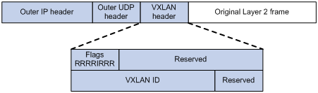  

### BUM Traffic
BUM - Broadcast, Uknown unicast and Multicast  
[Configuring EVPN VXLAN Layer 2 Overlay Network](https://www.cisco.com/c/en/us/td/docs/switches/lan/catalyst9600/software/release/17-3/configuration_guide/vxlan/b_173_bgp_evpn_vxlan_9600_cg/configuring_evpn_vxlan_layer_2_overlay_network.html)  
- HER (Headend Replication, Ingress Replication)  
  * Ingress replication, or headend replication, is a unicast approach to handle multidestination Layer 2 overlay BUM traffic.  
  * Ingress replication involves an ingress device replicating every incoming BUM packet and sending them as a separate unicast to the remote egress devices.  
  * Ingress replication happens through EVPN route type 3, also called as inclusive multicast ethernet tag (IMET) route. BGP EVPN ingress replication uses IMET route for auto-discovery of remote peers in order to set up the BUM tunnels over VXLAN.  
  * Using ingress replication to handle BUM traffic can result in scaling issues as an ingress device needs to replicate the BUM traffic as many times as there are VTEPs associated with the Layer 2 VNI.

- Underlay Multicast  
BUM traffic forwarding through underlay multicast is achieved by mapping a Layer 2 VNI to the multicast group.  

### Flooding Suppression
- ARP Flooding Suppression  
- IPv6 Neighbor Discovery Flooding Suppression  

---

## EVPN  
Ethernet Virtual Private Network (EVPN)  
- Control Plane --- MP-BGP  
- Data Plane --- VXLAN  
- IRB (Integrated routing and bridging)  
MP-BGP advertises both Layer 2 and Layer 3 host reachability information to provide optimal forwarding paths and minimize flooding.  

### BGP EVPN Routes     

| Type  |         Name                               |   Abbr.        |
|-------|--------------------------------------------|----------------|
| 1     | Ethernet autodiscovery route               |                |
|**2**  | **MAC/IP advertisement route**             | **MAC/IP**     |
|**3**  | **Inclusive Multicast Ethernet Tag route** | **IMET**       |
| 4     | Ethernet Segment Route                     |                |
|**5**  | **IP Prefix Route**                        | **IP Prefix**  |
| 6     | Selective Multicast Ethernet Tag routes    |                |
| 7     | NLRI to sync IGMP joins                    |                |
| 8     | NLRI to sync IGMP leaves                   |                |

- **Type 1 route, Ethernet autodiscovery route**  
**Advertises ES information in multihomed sites**  
  * Type 1 routes are for networkwide messages. Ethernet autodiscovery routes are advertised on a per end virtual identifier (EVI) and per Ethernet segment identifier (ESI) basis. The Ethernet autodiscovery routes are required when a customer edge (CE) device is multihomed. When a CE device is single-homed, the ESI is zero. This route type is supported by all EVPN switches and routers.

  * An ESI can participate in more than one broadcast domain; for example, when a port is trunked. An ingress provider edge (PE) device that reaches the MAC on that ESI must have Type 1 routes to perform split horizon and fast withdraw. Therefore, a Type 1 route for an ESI must reach all ingress PE devices importing a virtual network identifier (VNI) or tag (broadcast domains) in which that ESI is a member.  

- **Type 2 route, MAC with IP advertisement route**  
**Advertises MAC reachability information and host route information (host ARP information)**  
  * Type 2 routes are per-VLAN routes, so only PEs that are part of a VNI need these routes. EVPN allows an end host’s IP and MAC addresses to be advertised within the EVPN Network Layer Reachability Information (NLRI). This allows for control plane learning of ESI MAC addresses. Because there are many Type 2 routes, a separate route-target auto-derived per VNI helps to confine their propagation. This route type is supported by all EVPN switches and routers.  

- **Type 3 route, Inclusive Multicast Ethernet Tag route**  
**Advertises VTEP and VXLAN mappings for automating VTEP discovery, VXLAN tunnel establishment, and VXLAN tunnel assignment**  
  * Type 3 routes are per-VLAN routes; therefore, only PE devices that are part of a VNI need these routes. An inclusive multicast Ethernet tag route sets up a path for broadcast, unknown unicast, and multicast (BUM) traffic from a PE device to the remote PE device on a per-VLAN, per-EVI basis. Because there are many Type 3 routes, a separate route-target auto-derived per VNI helps in confining their propagation. This route type is supported by all EVPN switches and routers.  

- **Type 4 route, Ethernet Segment Route**  
**Advertises ES and VTEP mappings**  
  * An Ethernet segment identifier (ESI) allows a CE device to be multihomed to two or more PE devices—in single/active or active/active mode. PE devices that are connected to the same Ethernet segment discover each other through the ESI. This route type is supported by all EVPN switches and routers.  

- **Type 5 route, IP prefix Route**  
**Advertises BGP IPv4 unicast routes as IP prefixes**  
  * An IP prefix route provides encoding for inter-subnet forwarding. In the control plane, EVPN Type 5 routes are used to advertise IP prefixes for inter-subnet connectivity across data centers. To reach a tenant using connectivity provided by the EVPN Type 5 IP prefix route, data packets are sent as Layer 2 Ethernet frames encapsulated in the VXLAN header over the IP network across the data centers.  

- **Type 6 route, Selective Multicast Ethernet Tag routes**

- **Type 7 route, Network Layer Reachability Information (NLRI) to sync IGMP joins.**

- **Type 8 route, NLRI to sync IGMP leaves.**

### BGP EVPN Route, VXLAN and Tenant
MP-BGP uses the route distinguisher (**RD**) field to differentiate BGP EVPN routes of different VXLANs and uses route targets to control the advertisement and acceptance of BGP EVPN routes. MP-BGP supports the following types of route targets:
- **Export target**  
A VTEP sets the export targets for BGP EVPN routes learned from the local site before advertising them to remote VTEPs.
- **Import target**  
A VTEP checks the export targets of BGP EVPN routes received from remote VTEPs. The VTEP imports the BGP EVPN routes only when their export targets match the local import targets.

### Configuration Automation
VTEPs use BGP EVPN routes to discover VTEP neighbors, establish VXLAN tunnels, and assign the tunnels to VXLANs.

- **IMET** route  
VTEPs advertise the VXLAN IDs they have through IMET routes. If two VTEPs have the same VXLAN ID, they automatically establish a VXLAN tunnel and assign the tunnel to the VXLAN.

- **MAC/IP** advertisement route and **IP prefix** advertisement route  
In the EVPN gateway deployment, VTEPs advertise MAC/IP advertisement routes or IP prefix advertisement routes with the export targets. When a VTEP receives a route, it compares the export targets of the route with the local import targets. If the route targets match, the VTEP establishes a VXLAN tunnel with the remote VTEP and associates the tunnel with the L3 VXLAN ID of the corresponding VPN instance.

### MAC Learning
- Local MAC Learning
- Remote MAC Learning

### Layer 2 Forwarding
- Unicast traffic
- Flood (BUM Traffic)

### Layer 3 Forwarding
- Centralized EVPN Gateway deployment
- Distributed EVPN Gateway deployment  
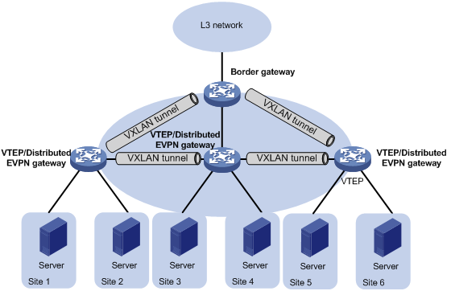  

### Symmetric IRB
Symmetric IRB uses the same Layer-3 VNI for bi-directional traffic between two hosts on different VLANs/VNIs.  
- Distributed EVPN gateway  
A distributed EVPN gateway uses symmetric IRB for Layer 3 forwarding, which means both the ingress and egress gateways perform Layer 2 and Layer 3 lookups.

- L3 VXLAN ID --- Also called L3 VNI  
An L3 VXLAN ID identifies the traffic of a routing domain where devices have Layer 3 reachability. An L3 VXLAN ID is associated with one VPN instance. Distributed EVPN gateways use VPN instances to isolate traffic of different services on VXLAN tunnel interfaces.

- Router MAC address  
Each distributed EVPN gateway has a unique router MAC address used for inter-gateway forwarding. The MAC addresses in the inner Ethernet header of VXLAN packets are router MAC addresses of distributed EVPN gateways.

### Symmetric IRB Forwarding Process
[Symmetric IRB](https://www.arubanetworks.com/techdocs/AOS-CX/10.09/HTML/vxlan/Content/Chp_EVPN/sym-irb-ove-fl-gl-ll-xl-10.htm)  

#### Distributed EVPN Gateway Traffic Forwarding
[Traffic forwarding](http://www.h3c.com/en/Support/Resource_Center/Technical_Documents/Routers/Catalog/MSR5600/MSR5600/Configure/Configuration_Guides/H3C_MSR_5600_CG(V7)-R0707-6W301/22/201904/1174909_294551_0.htm#_Toc3538740)  

A distributed EVPN gateway can work in one of the following mode:

- **Switching and routing mode**  
Forwards Layer 2 traffic based on the MAC address table and forwards Layer 3 traffic based on the FIB table. In this mode, you need to enable ARP flood suppression on the distributed EVPN gateway to reduce flooding.

- **Routing mode**  
Forwards both Layer 2 and Layer 3 traffic based on the FIB table. In this mode, you need to enable local proxy ARP on the distributed EVPN gateway.

##### Intra-site Layer 3 Forwarding
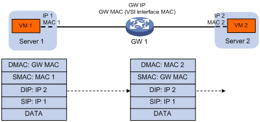  

##### Inter-site Layer 3 Forwarding
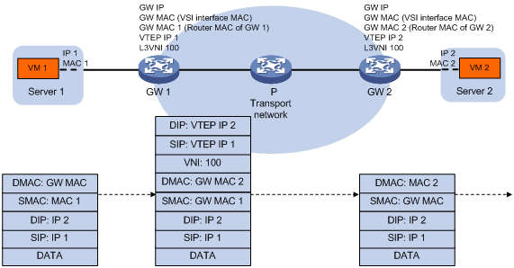  

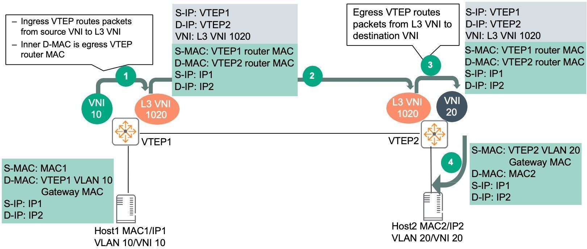  
1. Host1 in VLAN 10/VNI 10 connected to VTEP1 sends traffic to Host2 in VLAN 20/VNI 20 connected to VTEP2.  
  **a.** Traffic from Host1 is sent to VTEP1 VLAN 10/ VNI 10 gateway MAC.

2. VTEP1 routes traffic in the VRF (mapping to L3-VNI 1020), encapsulates traffic with VXLAN, adds outer Source/Destination IP, VNI info and sends traffic to VTEP2.  
  **a.** VTEP1 does not need to have a MAC/ARP entry for Host2.  
  **b.** VTEP1 learns the prefix route and/or host route corresponding to Host2 via EVPN Route type 5 or 2 respectively thus facilitating routing to the destination.  
  **c.** The inner Source MAC is changed to VTEP1 router MAC and inner Destination MAC is changed to VTEP2 router MAC.  
3. VTEP2 decapsulates outer VXLAN, routes and sends the traffic to Host2 on VLAN 20/VNI 20.  
  **a.** Host2 will see source MAC as VTEP2 gateway MAC.  

Return traffic from Host2 to Host1 is similar, traffic from Host2 is sent to VTEP2 VLAN20/VNI 20 gateway MAC. VTEP2 routes traffic to L3 VNI 1020, encapsulates and sends the traffic to VTEP1. VTEP1 decapsulates, route and send the traffic to Host1 on VLAN 10/VNI 10.

As seen from the traffic flow:

- Routing is used on both ingress and egress VTEPs.
- Bi-directional traffic uses symmetric path; same L3 VNI in both directions.
- VTEPs do not need to hold unnecessary ARP/MAC resources.
- Destination VLAN/VNI does not have to be configured on source VTEP.

#### Asymmetric IRB Forwarding Process
[Asymmetric IRB](https://www.arubanetworks.com/techdocs/AOS-CX/10.09/HTML/vxlan/Content/Chp_EVPN/asy-irb-fl-gl-ll-xl-10.htm)  
Asymmetric IRB uses different VNIs for bi-directional traffic between 2 hosts on different Layer-2 VNIs.  
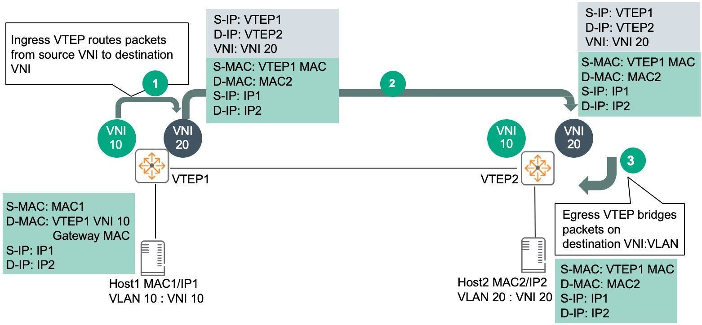  

1. Host1 in VLAN 10/VNI 10 connected to VTEP1 sends traffic to Host2 in VLAN 20/VNI 20 connected to VTEP2.  
  **a.** Traffic from Host1 is sent to VTEP1 VLAN 10/ VNI 10 gateway MAC.  

2. VTEP1 routes traffic to VNI 20, encapsulates frame with VXLAN, adds outer Source/Destination IP, VNI info and sends traffic to VTEP2.  
  **a.** VTEP1 should already have a MAC/ARP entry for Host2.  
  **b.** The inner Source MAC is changed to VTEP1 VLAN 20 gateway MAC and inner Destination MAC is changed to MAC2 which belongs to Host2.  

3. VTEP2 decapsulates outer VXLAN, bridges and sends the traffic to Host2 on VLAN 20/VNI 20.  
  **a.** Host2 will see source MAC as VTEP1.  

Return traffic from Host2 to Host1 is similar. Traffic from Host2 is sent to VTEP2 VLAN20/VNI 20 gateway MAC. VTEP2 routes traffic to VNI 10, encapsulates and sends the traffic to VTEP1. VTEP1 will decapsulate, bridge and send the traffic to Host1 on VLAN 10/VNI 10.  

As seen from the traffic flow:  

- Asymmetric IRB needs both source and destination Layer-2 VNIs to be configured on the ingress VTEP.
- Routing and bridging is used on the ingress VTEP.
- Bridging is used on the egress VTEP.
- Bi-directional traffic uses asymmetric paths:
  * Host1 to Host2 uses VNI 10 -> VNI 20.
  * Host2 to Host1 uses VNI 20 -> VNI 10.
- Asymmetric IRB will lead to increased ARP/MAC scale on VTEPs as they need to contain MAC/ARP of both source/destination hosts.
- If Asymmetric IRB is used, all subnets/VNIs have to be configured on all VTEPs. As previously shown, it is not mandatory for a subnet to span across all VTEPs in both Data Center and Campus networks, e.g. 10.10.220.0/24 only exists on Leaf1A/1B, Leaf2A/2B in Figure 2, 10.10.220.0/24 only exists in Building#1.

### ARP flood suppression
ARP flood suppression reduces ARP request broadcasts by enabling the VTEP to reply to ARP requests on behalf of VMs.
#### Basic of ARP flood suppression  
This feature snoops ARP requests, ARP responses, and BGP EVPN routes to populate the ARP flood suppression table with local and remote MAC addresses. If an ARP request has a matching entry, the VTEP replies to the request on behalf of the VM. If no match is found, the VTEP floods the request to both local and remote sites.  
 
#### Detailed process of ARP flood suppression
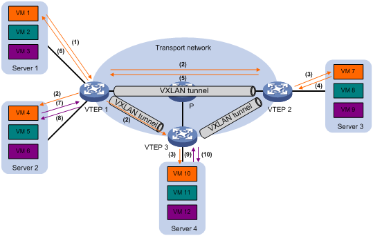 
1. VM 1 sends an ARP request to obtain the MAC address of VM 7.
2. VTEP 1 creates a suppression entry for VM 1, floods the ARP request in the VXLAN, and sends the suppression entry to VTEP 2 and VTEP 3 through BGP EVPN.
3. VTEP 2 and VTEP 3 de-encapsulate the ARP request and broadcast the request in the local site.
4. VM 7 sends an ARP reply.
5. VTEP 2 creates a suppression entry for VM 7, forwards the ARP reply to VTEP 1, and sends the suppression entry to VTEP 1 and VTEP 3 through BGP EVPN.
6. VTEP 1 de-encapsulates the ARP reply and forwards the ARP reply to VM 1.
7. VM 4 sends an ARP request to obtain the MAC address of VM 1.
8. VTEP 1 creates a suppression entry for VM 4 and replies to the ARP request.
9. VM 10 sends an ARP request to obtain the MAC address of VM 1.
10. VTEP 3 creates a suppression entry for VM 10 and replies to the ARP request.

---

## SR

---

## SR-MPLS

---

## SRv6

DRv6 TE Policy
### SRv6 VPN

#### L3VPN over SRv6
- IP L3VPN over SRv6
- EVPN L3VPN over SRv6

#### L2VPN over SRv6
- EVPN VPWS over SRv6
- EVPN VPLS over SRv6。

### SRv6 SFC
SRv6 Based Service Function Chain
- SC (Service Classifier)
- SF(Service Function)
- SFF(Service Function Forwarder)
- Tail Endpoint

G-SRv6

### L3VPN over SRv6
#### L3VPN over SRv6 TE 
#### L3VPN over SRv6 BE 

### L3VPN over SRv6 TE
#### IP L3VPN over SRv6 TE Policy

#### EVPN L3VPN over SRv6 TE Policy

### L3VPN over SRv6 BE
#### IP L3VPN over SRv6 BE

#### EVPN L3VPN over SRv6 BE

[Segment Routing](https://www.h3c.com/cn/Products___Technology/Technology/ComwareV7/Segment_Routing/)  

---

## Links
1. [EVPN Configuration Guide](http://www.h3c.com/en/Support/Resource_Center/Technical_Documents/Routers/Catalog/MSR5600/MSR5600/Configure/Configuration_Guides/H3C_MSR_5600_CG(V7)-R0707-6W301/22/201904/1174909_294551_0.htm) 
2. [Understanding EVPN Pure Type 5 Routes](https://www.juniper.net/documentation/us/en/software/junos/evpn-vxlan/topics/concept/evpn-route-type5-understanding.html)
3. [Symmetric IRB](https://www.arubanetworks.com/techdocs/AOS-CX/10.09/HTML/vxlan/Content/Chp_EVPN/sym-irb-ove-fl-gl-ll-xl-10.htm)  
4. [Traffic forwarding](http://www.h3c.com/cn/d_201905/1182386_30005_0.htm)  

---  

 

#### Did you find this page helpful? Consider sharing it 🙌

