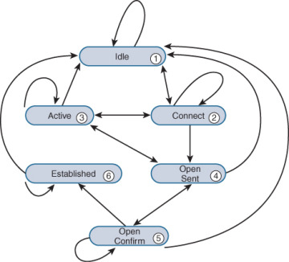

---
[OSPF](#ospf)  
[IS-IS](#is-is)  
[BGP](#bgp)  
[VXLAN](#vxlan)  
[EVPN](#evpn)  
[SR](#sr)  
[MPLS SR](#mpls-sr)  
[SRv6](#srv6)  

---
## OSPF

### Route types
- Intra-Area (O)
- Inter-Area (O IA)
- External Type 1 (E1)
- NSSA Type 1 (N1)
- External Type 2 (E2)
- NSSA Type 2 (N2)

A type 1 route has a metric that is the sum of the internal OSPF cost and the external redistributed cost. A type 2 route has a metric equal only to the redistributed cost.

### Packet
- IP, 89
- 5 Types
  * Hello
  * DD (Database Description)
  * LSR (Link State Request)
  * LSU (Link State Update)
  * LSAck (Link State Acknowledgement)

LSA (Link State Advertisement)
LSDB (Link State Database)

### LSA Types
- Router LSA (Type-1) By Router
- Network LSA（Type-2) by DR
- Network Summary LSA（Type-3） by ABR (Area Border Router)
- ASBR Summary LSA（Type-4) by ABR
- AS External LSA（Type-5） by ASBR
- NSSA External LSA（Type-7） by ASBR in NSSA (Not-so-stubby Area)
- Opaque LSA
  * Type 9 (Grace LSA), for GR (Grace Restart), link local
  * Type 10, flood in area
  * Type 11, flood in AS

### Area
- Backbone area
- Normal area
- Stub area
- Totally Stub area
- NSSA
- Totally NSSA

Virtual link, transit area

### Router Types
- Internal Router
- ABR
- Backbone Router
- ASBR

### Network Types
- Broadcast, 224.0.0.5 (224.0.0.6 for DR/BDR)
- NBMA, unicast
- P2MP, 224.0.0.5
- P2P, 224.0.0.5

### DR/BDR
- DR/BDR
- DR other

### DR/BDR Election
Priority + Router ID
1. Priority > 0
2. Priority higher
3. Router ID higher

### Neighbor States
[OSPF Neighbor States](https://www.cisco.com/c/en/us/support/docs/ip/open-shortest-path-first-ospf/13685-13.html)  
- Down
- Attempt (only in NBMA)
- Init
- 2-Way
- ExStart
- Exchange
- Loading
- Full

### Neighborship on Ethernet
[OSPF NEIGHBOR STATES – OSPF NEIGHBOR FORMING PROCESS](https://www.firewall.cx/networking-topics/routing/ospf-routing-protocol/1142-ospf-adjacency-neighbor-states-forming-process.html)  
Down--->Init--->2-Way---(DR Election)--->ExStart---(DD)--->Exchange(DD)--->Loading---(LSR,LSU,LSAck)--->Full

---

## IS-IS
IS-IS（Intermediate System-to-Intermediate System)  

- IS (Intermediate System)
- ES（End System）
- RD（Routing Domain）
- Area
- LSDB (Link State DataBase)
- LSPDU (Link State Protocol Data Unit)
- NPDU（Network Protocol Data Unit）
- DIS (Designated IS)
- NSAP（Network Service Access Point）

### IS-IS Address (NSAP Address)
[NSAP Addresses](https://sites.google.com/site/amitsciscozone/is-is/nsap-addresses?authuser=0)  
#### IDP + DSP
  
IS-IS Address = IDP + DSP = (AFI + IDI) + (HO-DSP + ID + SEL)  
**IS-IS Address = Area address + System ID + SEL**
Area Address = AFI + IDI + HO-DSP
IDP = AFI + IDI  
DSP = HO-DSP + ID + SEL  

- IDP（Initial Domain Part）
- DSP（Domain Specific Part）
- AFI（Authority and Format Identifier)
- IDI（Initial Domain Identifier）
- HO-DSP（High Order Part of DSP

- SEL, a.k.a. N-SEL（NSAP Selector）
- ID, a.k.a. System ID

### Router Types
- Level-1 Router
- Level-2 Router
- Level-1-2 Router, has two LSDB

  

  
[IS-IS Adjacency and Area Types](https://www.cisco.com/c/en/us/support/docs/ip/integrated-intermediate-system-to-intermediate-system-is-is/200293-IS-IS-Adjacency-and-Area-Types.html) 

### Network Types
- Broadcast
- P2P

### DIS
- Level-1 and Level-2 have their own DIS
- Priority >= 0, not > 0
- Priority > SNPA address
- Highest Priority ---> Largest SNPA(MAC)

SNPA is MAC in Broadcast network

  
[Designated IS](https://sites.google.com/site/amitsciscozone/is-is/designated-is?authuser=0)  
- All routers have adjency with other routers in the same level, **NOT** only with DIS.  
- DIS to sync up LSDB.  
- DIS to create and update Pseudonode.
- All routers on the broadcast network, including the DIS, form adjacencies with the Pseudonode. 
- The DIS assigns the LAN ID (similar to System ID) to the broadcast network. The LAN ID is created by concatenating the System ID of the DIS with its Circuit ID (Pseudonode ID, in this case) for the attached network. All routers on the network will use the LAN ID assigned by the DIS.

### IS-IS Packet

| Type |                     PDU                  |   Abbr.      |
|------|------------------------------------------|--------------|
|  15  |  Level-1 LAN IS-IS Hello PDU             | L1 LAN IIH   |
|  16  |  Level-2 LAN IS-IS Hello PDU             | L2 LAN IIH   |
|  17  |  Point-to-Point IS-IS Hello PDU          | P2P IIH      |
|  18  |  Level-1 Link State PDU                  | L1 LSP       |
|  20  |  Level-2 Link State PDU                  | L2 LSP       |
|  24  |  Level-1 Complete Sequence Numbers PDU   | L1 CSNP      |
|  25  |  Level-2 Complete Sequence Numbers PDU   | L2 CSNP      |
|  26  |  Level-1 Partial Sequence Numbers PDU    | L1 PSNP      |
|  27  |  Level-2 Partial Sequence Numbers PDU    | L2 PSNP      |

- Hello (IS-to-IS Hello PDUs), Level-1 LAN IIH, Level-2 LAN IIH, P2P IIH
- LSP Link state packet (LSP)
- SNP (Sequence Number Packet)
  * PSNP  
  PSNP only lists one or more last received LSP sequence numbers, and confirms multiple LSPs. When detecting asynchronous LSDBs, the system asks neighbors to send new LSPs by PSNPs.
  * CSNP  
  CSNP contains all LSP digest information in an LSDB, synchronizing LSDBs for neighbor routers.

### IS-IS Adjacency States
There are only three adjacency states in IS-IS.  
Down----->Initializing------>Up  
- Down  
This is the initial state. Its means that no hellos have been received from the neighbor.

- Initializing  
This state means that the local router has successfully received hellos from the neighboring router, however it’s not sure that the neighboring router has also successfully received local router’s hellos.

- Up  
Now it’s confirmed that neighboring router is receiving local router’s hellos. 

---

## BGP

### Message Types
- Open  
- Update  
- Keepalive  
- Route-refresh  
- Notification  

### BGP Attributes
[BGP path attributes](https://techhub.hpe.com/eginfolib/networking/docs/switches/K-KA-KB/15-18/5998-8164_mrg/content/ch15s07.html)  
1. Origin (IGP, EGP, Incomplete)
2. AS_PATH (Avoid loop, Route selection, Route filtering)
    - AS_SEQUENCE  
    - AS_SET  
3. NEXT_HOP
4. MED（Multi-Exit Discriminator)
5. LOCAL_PREF (IBGP only, the higher, the better)
6. COMMUNITY (4 bytes)
    - INTERNET      ---        to all BGP neighbors
    - NO_EXPORT     ---        NOT beyond local AS or confederation (OK to sub-as)
    - NO_ADVERTISE  ---        NOT to any BGP neighbors
    - NO_EXPORT_SUBCONFED  --- NOT beyond local AS or confederation (NOT to sub-as)
7. EXTENDED COMMUNITY (8 bytes)
    - VPN target
    - SoO (Site of Origin), avoid loop
      * an 16 bits autonomous system number and an arbitrary number, i.e. 101:3
      * an IP address and an arbitrary number, i.e. 192.168.122.15:1
      * an 32 bits autonomous system number and an arbitrary number, i.e. 65536:1

|Name                     |     Category                 |
|-------------------------|------------------------------|
|ORIGIN                   |  Well-known mandatory        |
|AS_PATH                  |  Well-known mandatory        |
|NEXT_HOP                 |  Well-known mandatory        |
|LOCAL_PREF               |  Well-known discretionary    |
|ATOMIC_AGGREGATE         |  Well-known discretionary    |
|COMMUNITY Optional       |  transitive                  |
|MULTI_EXIT_DISC (MED)    |  Optional non-transitive     |
|ORIGINATOR_ID            |  Optional non-transitive     |
|CLUSTER_LIST             |  Optional non-transitive     |

### Path Selection
[BGP Best Path Selection Algorithm](https://www.cisco.com/c/en/us/support/docs/ip/border-gateway-protocol-bgp/13753-25.html)  
1. Prefer the path with the highest WEIGHT.  
2. Prefer the path with the highest LOCAL_PREF.  
3. Prefer the path that was locally originated via a network or aggregate BGP subcommand or through redistribution from an IGP.  
Local paths that are sourced by the network or redistribute commands are preferred over local aggregates that are sourced by the aggregate-address command.  
4. Prefer the path with the shortest AS_PATH.  
5. Prefer the path with the lowest origin type.  
6. Prefer the path with the lowest multi-exit discriminator (MED).  
7. Prefer eBGP over iBGP paths.  
If bestpath is selected, go to Step 9 (multipath).
8. Prefer the path with the lowest IGP metric to the BGP next hop.  
Continue, even if bestpath is already selected.
9. Determine if multiple paths require installation in the routing table for BGP Multipath.  
Continue, if bestpath is not yet selected.
10. When both paths are external, prefer the path that was received first (the oldest one).  
11. Prefer the route that comes from the BGP router with the lowest router ID.  
12. If the originator or router ID is the same for multiple paths, prefer the path with the minimum cluster list length.  
13. Prefer the path that comes from the lowest neighbor address.  

### BGP Neighbor States
- Idle
- Connect
- Active
- OpenSent
- OpenConfirm
- Established 
  

### BGP Route Advertisement Rules
[BGP route advertisement rules](https://techhub.hpe.com/eginfolib/networking/docs/switches/5930/5200-4579_l3-ip-rtng_cg/content/491335171.htm)  
- When multiple feasible routes to a destination exist, BGP advertises only the optimal route to its peers. If the advertise-rib-active command is configured, BGP advertises the optimal route in the IP routing table. If not, BGP advertises the optimal route in the BGP routing table.
- BGP advertises only routes that it uses.
- BGP advertises routes learned from an EBGP peer to all BGP peers, including both EBGP and IBGP peers.
- BGP advertises routes learned from an IBGP peer to EBGP peers, rather than other IBGP peers.
- After establishing a session with a new BGP peer, BGP advertises all the routes matching the above rules to the peer. After that, BGP advertises only incremental updates to the peer.

---

## VXLAN
### VXLAN Terms
- VXLAN（Virtual eXtensible LAN)  
- MAC in UDP  
- 2^24(16777216) VXLAN  
- Underlay vs Overlay  
- VXLAN ID, a.k.a. VNI (VXLAN Network Identifier)  
- VTEP (VXLAN Tunnel End Point)  
- VXLAN Tunnel  
- VSI (Virtual Switch Instance), 1:1 mapping to VXLAN

### VXLAN Packet Format
- 8-byte VXLAN header—VXLAN information for the frame.
  * Flags—If the I bit is 1, the VXLAN ID is valid. If the I bit is 0, the VXLAN ID is invalid. All other bits are reserved and set to 0.
  * 24-bit VXLAN ID—Identifies the VXLAN of the frame. It is also called the virtual network identifier (VNI).
- 8-byte outer UDP header for VXLAN—The default VXLAN destination UDP port number is 4789.
- 20-byte outer IP header—Valid addresses of VTEPs or VXLAN multicast groups on the transport network. Devices in the transport network forward VXLAN packets based on the outer IP header.
  

---

## EVPN

---

## SR

---

## MPLS SR

---

## SRv6

---

 

#### Did you find this page helpful? Consider sharing it 🙌

