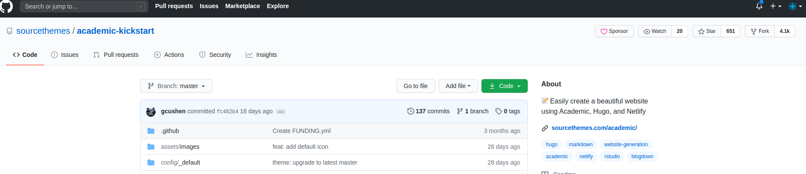
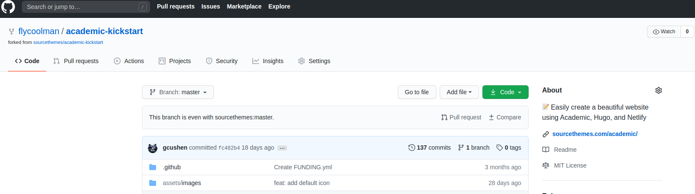
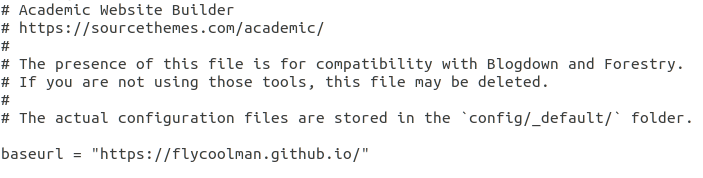
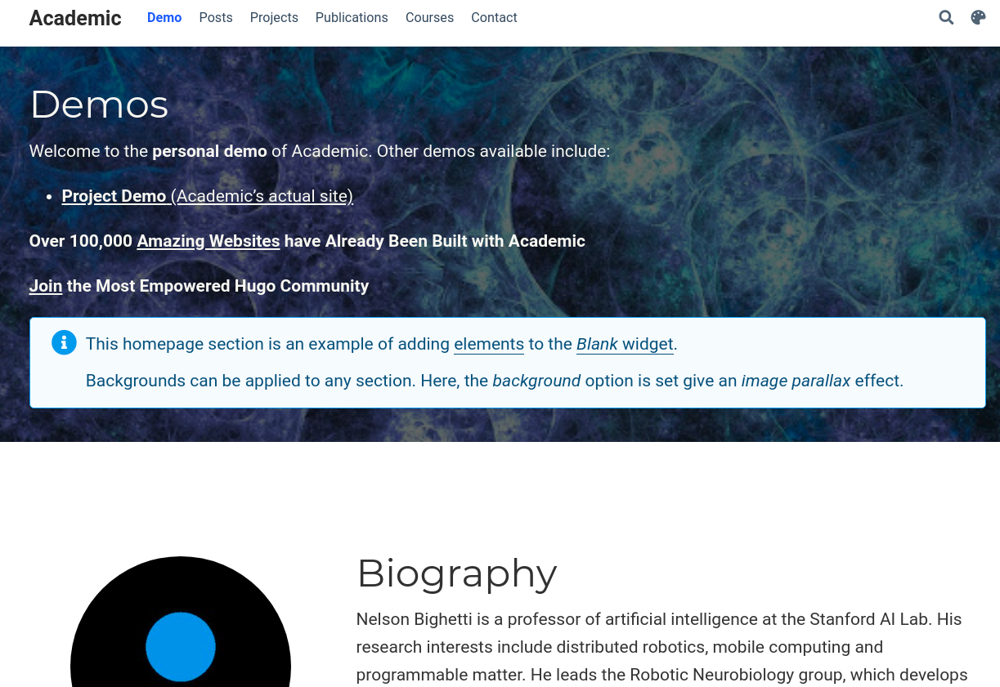

In [Part-1](https://flycoolman.com/post/build-a-free-website-in-minutes-part-1/) and [Part-2](https://flycoolman.com/post/build-a-free-website-in-minutes-part-2/)
 we introduced the basic knowledges of the tools to help understand how they work. From this part, we will focus on building our real website.

## Prerequisites

- [Download and install Git](https://www.digitalocean.com/community/tutorials/how-to-install-git-on-ubuntu-18-04-quickstart)
- Download and install Hugo Extended Version  
Please follow the part of 'Install Hugo Extended Version' in [Part-2](https://flycoolman.com/post/build-a-free-website-in-minutes-part-2/) of this tutorial.

 

## GitHub Repositories

### GitHub Pages Repository

Please follow the guide on [GitHub Pages](https://pages.github.com/) to create the repository correctly.

### Academic-kickstart Repository

Go to the GitHub page of [academic-kickstart](https://github.com/sourcethemes/academic-kickstart) and fork the repository to your GitHub account. The pictures below show the source of academic-kickstart page and the forked repository in my account.  

Academic-kickstart source page
  

The forked repository in my account
  

 

## Local Environment

### Step 1 - git clone &lt;username&gt;.github.io to local  

    git clone https://github.com/your-user-name/your-user-name.github.io.git

### Step 2 - git clone academic-kickstart to local  

    git clone https://github.com/your-user-name/academic-kickstart.git

### Step 3 - Initialize the theme  

    cd academic-kickstart/
    git submodule update --init --recursive

### Step 4 - Set base url in config.toml  

In your config.toml file, set baseurl = "https://&lt;USERNAME&gt;.github.io/", where &lt;USERNAME&gt; is your Github username. Stop Hugo if it’s running and delete the public directory if it exists (by typing **rm -r public/**).  

    vi config.toml

The example for my site
  

### Step 5 - Add .github.io repository into Academic-kickstart

Add .github.io repository as a submodule in a folder named 'public', replacing with your Github username.

    cd academic-kickstart/
    git submodule add -f -b master https://github.com/your-user-name/your-user-name.github.io.git public

### Step 6 - Remove initial index file

Delete the 'index.html' file in the folder of 'public', if there is one.  

    cd public  
    rm index.html

### Step 7 - Build your website

    cd academic-kickstart/
    hugo

### Step 8 - Deploy to GitHub

Add everything to your local git repository and push it up to your remote repository on GitHub.

    cd academic-kickstart/
    cd public
    git add .
    git comment -m "Initial commit"
    git push

    cd academic-kickstart/
    git add .
    git comment -m "Initial commit"
    git push    

Whilst running the above commands you may be prompted for your GitHub username and password.

Once uploading is finished, access https://&lt;USERNAME&gt;.github.io in your browser, substituting with your GitHub username.
You will see a page like below:

  

 

## Build Academic Demo Like Site

To initialise your site with the demo content, copy the contents of the themes/academic/exampleSite/ folder to your website root folder, overwriting existing files if necessary. The exampleSite folder contains an example config file and content to help you get started.

### Step 1 - Replace the content  

    cd academic-kickstart/
    cp -av themes/academic/exampleSite/* .

### Step 2 - Build the site  

    cd academic-kickstart/
    hugo

### Step 3 - Deploy to GitHub  

    cd academic-kickstart/
    cd public
    git add .
    git comment -m "Initial commit"
    git push

    cd academic-kickstart/
    git add .
    git comment -m "Initial commit"
    git push

Once uploading is finished, refresh the page in your browser, the page shows like below picture.

 

Up to now, we have an Academic demo-like website up and running. In next part, we will personalize the website.

 

#### Did you find this page helpful? Consider sharing it 🙌
