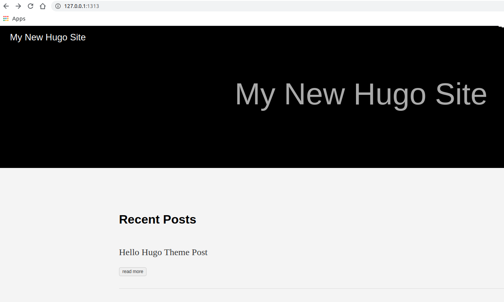
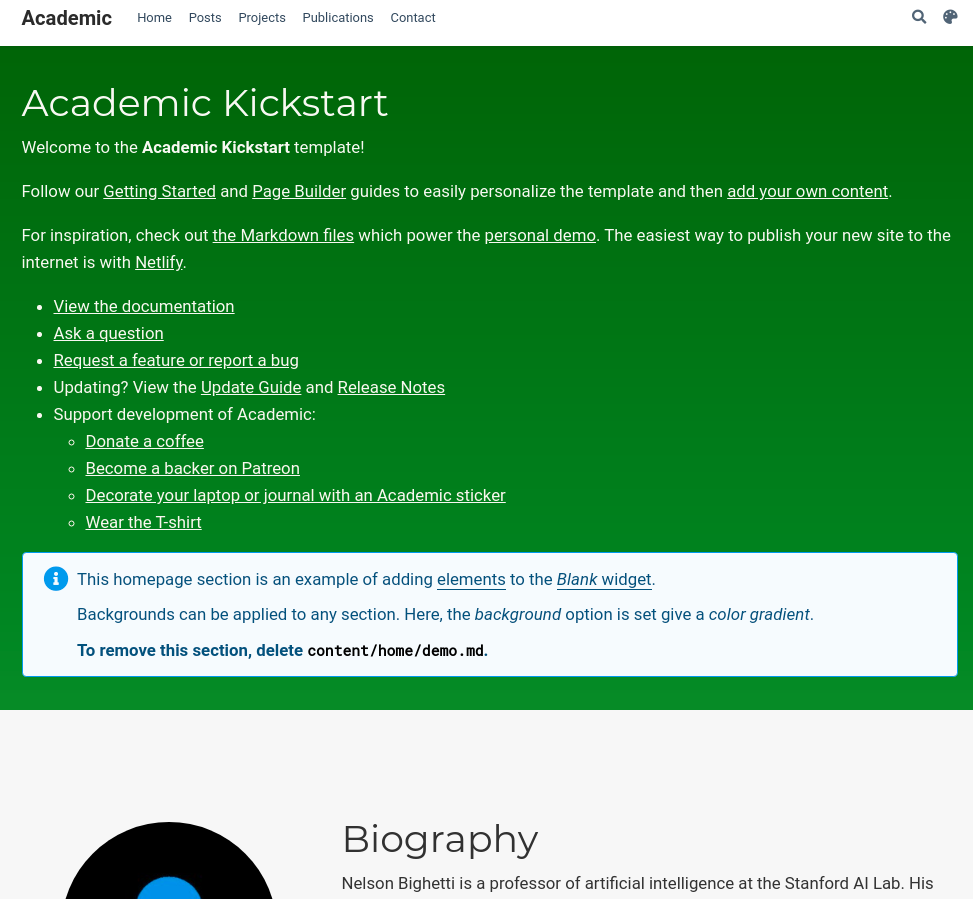

To learn more about prerequisites and tools, please check out the [Part-1](https://flycoolman.com/post/build-a-free-website-in-minutes-part-1/) of this series.

## Hugo Theme

### Step 1 - Create a new site  

    hugo new site hello-theme

### Step 2 - Download the ananke theme  

    wget https://github.com/budparr/gohugo-theme-ananke/archive/master.zip

### Step 3 - Extract that .zip file to get a “gohugo-theme-ananke-master” directory  

    unzip master.zip

### Step 4 - Rename that directory to “ananke”, and move it into the “themes/” directory  

    mv gohugo-theme-ananke-master/ ananke/
    mv ananke/ themes/ananke

### Step 5 - Add the theme to the site configuration  

    echo 'theme = "ananke"' >> config.toml

### Step 6 - Add some content and change the header of the post to say draft: false  

    hugo new posts/hello-hugo-theme-post.md
    vi content/posts/hello-hugo-theme-post.md

### Step 7 - Check the result  

    hugo server

  

 

## Hugo Uninstall

**Use the below command to remove the package of Hugo**

    sudo apt-get remove --auto-remove hugo

>Reading package lists... Done  
>Building dependency tree  
>Reading state information... Done  
>The following packages will be REMOVED:  
>&nbsp; &nbsp;hugo  
>0 upgraded, 0 newly installed, 1 to remove and 0 not upgraded.  
>After this operation, 44.5 MB disk space will be freed.  
>Do you want to continue? [Y/n] y  
>(Reading database ... 252044 files and directories currently installed.)  
>Removing hugo (0.73.0) ...  
>dpkg: warning: while removing hugo, directory '/usr/local/bin' not empty so not removed

{}
As Academic requires Hugo extended version, that's the reason that the standard version is uninstalled.
{}

 

## Hello Academic

{}
Academic is a site builder, it is a hugo site itself.
{}

### Install Hugo Extended Version

    wget https://github.com/gohugoio/hugo/releases/download/v0.73.0/hugo_extended_0.73.0_Linux-64bit.deb
    sudo dpkg -i hugo_extended_0.73.0_Linux-64bit.deb 
    hugo version

The output below shows the information of Hugo extended version.

>Hugo Static Site Generator v0.73.0-428907CC/extended linux/amd64 BuildDate: 2020-06-23T16:40:09Z

### Install Academic

[This linke](https://sourcethemes.com/academic/docs/install-locally/) provides the different ways to install Academic.
In this part, the [Install with ZIP](https://sourcethemes.com/academic/docs/install-locally/#install-with-zip) way is used.

#### Step 1 - Download and extract Academic Kickstart  

    wget https://github.com/sourcethemes/academic-kickstart/archive/master.zip
    unzip master.zip
    rm master.zip

#### Step 2 - Download and extract the Academic theme files from the hugo-academic-master folder to the themes/academic/ folder in Academic Kickstart  

wget https://github.com/gcushen/hugo-academic/archive/master.zip
unzip master.zip
rm master.zip

#### Step 3 - Copy the hugo-academic-master folder to the themes/academic/ folder in Academic Kickstart  

    cp -r hugo-academic-master/* academic-kickstart-master/themes/academic/

#### Step 4 - Check the result  

    cd academic-kickstart-master/
    hugo server

In next part, we will install everything in GitHub.

 

#### Did you find this page helpful? Consider sharing it 🙌
