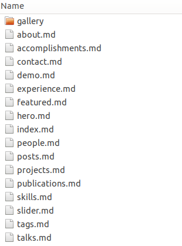
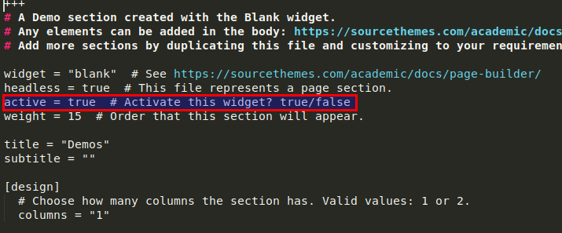
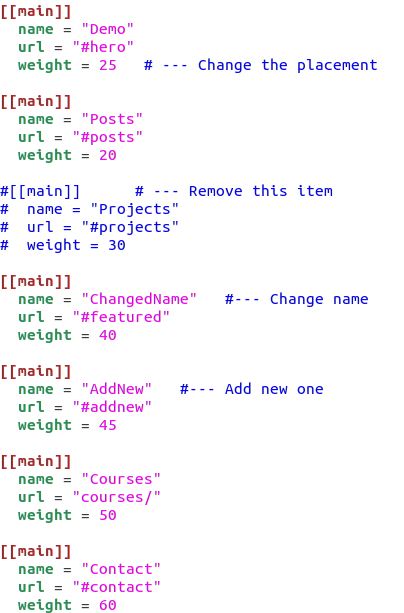
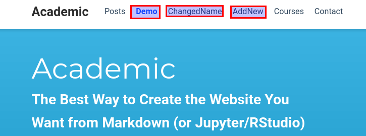
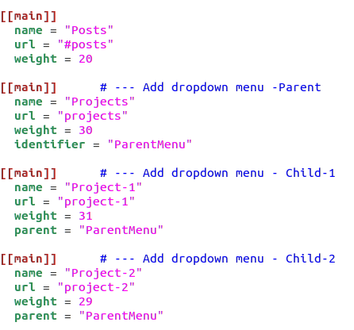
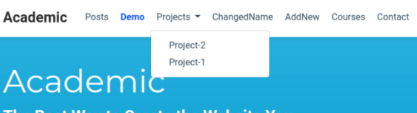

We have the website up and running in [Part-3](https://flycoolman.com/post/build-a-free-website-in-minutes-part-3/). If you have not completed that part, please do so before continuing this part.

## Personalize Academic website

This part will include the following sections:

- Choose the right theme
- Set the site title
- Set the copyright
- Set the site icon
- Select the sections
- Set Google Analytics
- Configure the Menu
- Add dropdown menu
- Add your content

### Choose the right theme

Check out the [available themes](https://sourcethemes.com/academic/themes/) and choose a design you love.
Set the configuration in file 'site_root/config/_default/params.toml'. I leave the default as is.

    theme = "minimal"

{}
Replace the 'site_root' with your site root directory.
{}

### Set the site title

Set the title in file 'site_root/config/_default/config.toml'. In my case, the 'flycoolman' is used.

    title = "flycoolman"

### Set the copyright

Set the copyright in file 'site_root/config/_default/config.toml', i.e.

    copyright = "&copy;{year}  flycoolman.com All Rights Reserved"

### Set the site icon

Save your icon image named icon.png and place the image in your root assets/images/ folder, creating the assets and images folders if they don’t already exist.

### Select the sections

All the sections of the demo home page in the folder 'site_root/content/home'. See the picture below:

  

There is a setting called 'active' in each file/section, just set the value to 'false', if you don't want it in your home page.

### Set Google Analytics

Set the Google Analytics in file 'site_root/config/_default/params.toml' with your Google Analytics Tracking ID.

    google_analytics = "UA-123456789-6"

{}
There are many parameters in the file 'params.toml', set the ones that you want. They are self-explained
{}

### Configure the Menu

The Menu on Navigation bar can be configured by change the settings in file 'site_root/config/_default/menus.toml', i.e.

- Remove current one  by deleting or commenting out the corresponding item
- Rename current one by changing the value of 'name'
- Add new one by adding additional part of '[[main]]'
- Rearrange the order by changing the value of 'weight'

### Add dropdown menu

To create a dropdown sub-menu, add identifier = "something" to the parent item and parent = "something" to the child item.
 The pictures below show how to add dropdown menu in file 'site_root/config/_default/menus.toml'.

### Add your content

Go to the folder 'site_root/content/post/', select one post as template, write your own post. Refer to the links below for markdown syntax.

 

We are all set! Enjoy writing!

 

### Links

#### How-To Academic

<https://sourcethemes.com/academic/docs/get-started/>
<https://sourcethemes.com/academic/docs/page-builder/>

#### How-To Markdown

<https://guides.github.com/features/mastering-markdown/>
<https://www.markdownguide.org/basic-syntax/>
<https://simplpost.com/markdown.html>

 

#### Did you find this page helpful? Consider sharing it 🙌
